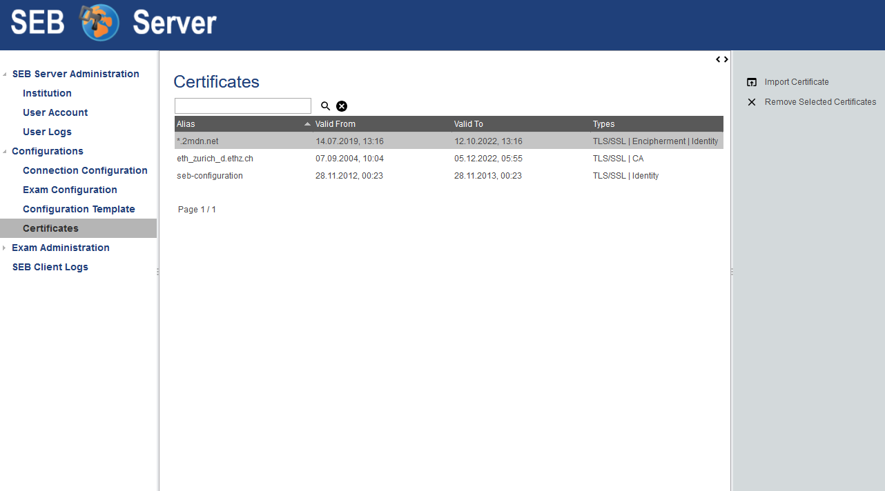

.. _certificates-label:

Certificates
====================

Overview
--------

Import and store X.509 certificates within SEB Server is a new feature since SEB Server version 1.2. This allows an institutional administrator
or an exam administrator to upload and store certificates for further use within SEB Server.

.. note:: 
    Certificates uploaded to SEB Server are stored in a secured certificate-store that is stored within the data base rather then a 
    usual file. The certificated store is password secured and only the binary data of the certificate store is places into the 
    databease for securty reasons.
    
Once a certificate has been uploaded to SEB Server it can be used for various other features of SEB Server where a certificate is needed.
One feature that also comes with the SEB Server version 1.2 is the ability to encrypt a connection configuration with a certificate
that has the right purpose (Identity) to do so. If you need this feature already, please have a look at: :ref:`connection-configuration-label`
Other planed features are the import of certificate encrypted exam configurations as well as to embed certificates within a exam configuration
to allow certificate pinning between SEB and LMS.

There is currently certificate upload support for two version of certificates:

**PEM**

This are usually non password protected certificates in different file-formats. SEB Server currently supports the following PEM file-formats:

- .pem 
- .crt
- .cer

**PKCS12**

This are usually password protected certificates in different file-formats. SEB Server currently supports the following PKCS12 file-formats:

- .p12
- .pfx

Use Cases
---------

**Upload a certificate**

- To upload and store a certificate of supported file type, please open the "SEB Configuration" section and select the "Certificates" page
- You will see the list of known certificates from the SEB Server like in the picture above.
- Choose "Import Certificate" from the right action pane and the upload dialog will open.
- Within the upload dialog, select the certificate file on your local machine that you want to upload.
- If the certificate is password protected, you will need to give the password to upload the certificate.
- Chlick on "OK" to start the import.
- If the import is successful the imported certificate will show up in the list. Otherwise SEB Server will display an error message with the reason of failure.

**Remove / delete a certificate**

- To permanently delete a stored certificate on SEB Server, please open the "SEB Configuration" section and select the "Certificates" page
- You will see the list of known certificates from the SEB Server like in the picture above.
- Please select the certificate you want to remove. 
- Choose "Remove Selected Certificates" from the right action pane and a configuration dialog will appear.
- If you are sure to delete the selected certificate(s), click on "OK" to delete.
- The deleted certificates disappear form the certificates list.

