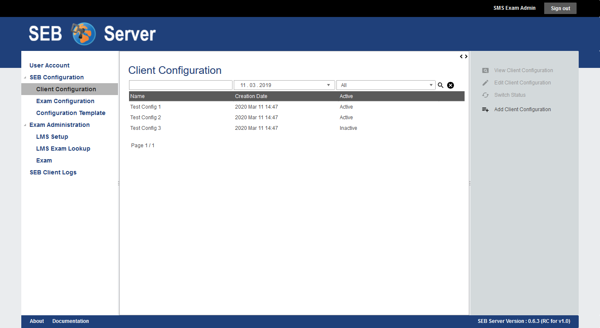
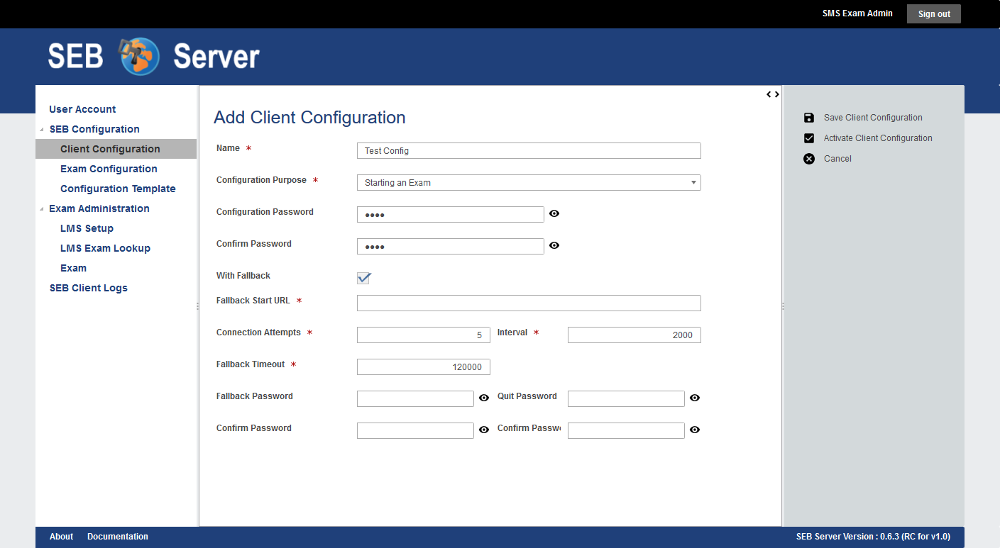

.. _client-configuration-label:

Client Configuration
====================

Overview
--------

A client configuration is needed to configure a SEB client to securely connect to the SEB Server and present a list of available exams
for selection. At least one client configuration is needed for an institution that can be exported and deployed with a SEB on a managed device setup 
or can be made available within a download link on a internal or trusted server. Another scenario would be to send the client configuration to
individual students per mail with instructions on how to install SEB and start it with the configuration to automatically connect to the SEB Server. 
However, since the client configuration is security relevant because it contains sensitive data to connect to SEB Server,
there are different security level one can choose to apply within a internal safe e-assessment strategy.

The lowest level of security is to just have one not encrypted client configuration for the whole institution and for all e-assessments provided
at this institution with SEB Server.
In this case the sensitive data is more exposed to be compromised and misused by others because of the missing password protection and it also takes 
more effort to deal with such an issue while there is only one client configuration used by all e-assessments of the institution. If the one client
configuration has been compromised and a misuse has been detected the concerned client configuration can be deactivated to prevent further misuse. A
new one can be created and delivered or updated but since it is only one configuration used for the institution all actual download links have to 
be updated and all students awaiting a prepared exam has to be informed and supported with the new configuration (link) 

The currently highest level of security is to have encrypted and different client configuration for different e-assessment.
In this case the client configuration is encrypted with a password that can be defined by a institutional- or exam-administrator while
creating the client configuration. Once the SEB loads such a client configuration it will fist prompt the user about the password that must be
given by the student to proceed and connect to the SEB Server.

Usually a client configuration can be created or maintained by an institutional administrator or by an exam administrator. Exam supporter role has
no access to client configurations and a SEB administrator is able to see client configurations of other institutions but not to create or modify them.

You can see a list of all available client configuration for an institution by going to the sub-section "Client Configuration"
of the "Configuration" section on the menu on the left hand side.

    
The list shows the name, the date of creation and the status of the client configurations in a column. With SEB Server administrator role
also an institution column is shown because a SEB Server administrator is able to see all client configurations of all institutions.
As usual, to filter the list use the filter inputs above and click on the lens symbol on the right to apply the filter and to clear the 
filter use the clear symbol right to the lens symbol. See :ref:`gui-label` for more information about the list navigation. 
    
The image below shows the Client Connection form in the edit mode. To view the fallback related attributes, check the "With Fallback" attribute
or remove selection to hide all fallback related attributes.

Short description of all attributes of a client configuration:

- **Name**: The name of the client configuration used to maintain client configurations within the SEB Server application. 
- **Configuration Purpose**: Defines the configuration purpose as described in `SEB Configuration <https://www.safeexambrowser.org/windows/win_usermanual_en.html#configuration>`_ section "Use SEB settings file for".
  **Starting an Exam**; Will cause SEB to use this client configuration settings on startup but won't change local SEB settings.
  **Configuring a Client**; Will cause SEB to use this client configuration settings and also save it as local SEB settings.
- **Configuration Password**: Used to encrypt the client configuration with a password. A SEB client will prompt this password while loading a password protected client configuration.
- **With Fallback**: Select this to see and define a fallback strategy for SEB clients using this client configuration in case of SEB Server service unavailability.
- **Fallback URL**: Defines a start URL that is loaded by the SEB client in a fallback case.
- **Connection Attempts**: Defines the number of attempts a SEB client will try to unsuccessfully connect to the SEB Server service until it switches to the fallback case.
- **Interval**: Time interval (in milliseconds) a SEB client will wait after a unsuccessful connection attempt before starting a next connection attempt.
- **Connection Timeout**: A overall timeout for SEB Server service connection. After this timeout runs out, starting from fist connection attempt, SEB client will switches to the fallback case no matter if number of attempts has exceeded or not.
- **Fallback Password**: If set, a SEB client will prompt for this password before switching into the fallback case.
- **Quit Password**: If set, a SEB client will prompt for this password when a user wants to exit SEB before in fallback case or before the SEB client has loaded an exam.

A client configuration may also contain and define a fallback strategy that takes place when SEB Server service is not available while 
a SEB client tries to connect to the SEB Server.

.. note:: 
    A fallback case only takes place when SEB client is within the connection process (handshake) with the SEB Server and the SEB Server service is unavailable.
    If a SEB client is already connected to the SEB Server and the user has started an exam, the SEB will just proceed with the exam even 
    when the SEB Server connection is (temporarily) unavailable.
    
The fallback strategy contains some connection attributes that define until when a SEB client considering SEB Server service as unavailable as
well as attributes that defines how a SEB client has to proceed in the fallback case. How a SEB client reacts to a fallback case differs on the 
configuration settings in the following ways:

- client configuration with "Configuring a Client" setting and no fallback strategy:
    Show warning message with options "retry" and "quit".

- Client configuration with "Configuring a Client" setting and fallback strategy:
    Show warning with options "retry", "fallback" (load Fallback URL) and "quit".

- Client configuration with "Starting an Exam" setting and no fallback (without local client configuration):
    Show warning message with options "retry" and "quit".

- Client configuration with "Starting an Exam" setting and no fallback (with local client configuration):
    Show warning message with options "retry", "load local settings" and "quit".

- Client configuration with "Starting an Exam" setting and fallback strategy:
    Show warning with options "retry", "fallback" (load Fallback URL) and "quit".

Use Cases
---------

**Create Client Configuration**

As an Institutional Administrator you should create a new secure client configuration for the upcoming semester. The setup shall operate with
secure configurations because the configuration file may be exposed to the public Internet. And the setup shall also have a proper fallback
strategy where SEB clients uses the a given start URL in fallback case.

- Sign in as an Institutional Administrator and select the "Client Configuration" sub-menu of the "SEB Configuration" main-menu on the left.
- Use the "Add Client Configuration" on the right action pane to create a new client configuration. 
- Give the new client configuration a name that not already exists and select "Start an Exam" for "Configuration Purpose".
  This will ensure that a SEB client that uses this configuration will not override the local configuration that then can be used on fallback. 
- Give a password to ensure security and to encrypt the client configuration on export. A SEB client will prompt for the password while loading this configuration.
- Check "With Fallback" to show all the fallback related attributes.
- Define a fallback URL that will be used by a SEB client as start URL in the fallback case.
- Define also fallback case, how many connection attempts on what interval a SEB client shall try before going into fallback mode. You can also define a overall "Connection Timeout" if lapsed a SEB client will also go into the fallback mode. A SEB client will fall-back on either the attempt or the timeout trigger. 
- When a SEB client goes to fallback mode it will prompt the user as described in the case list above. To prevent further fallback options with a password prompt, give a "Fallback Password" and / or a "Quit Password" that a SEB client will prompt on either the fallback- or the quit-option.
- After all details are correctly been entered, use the "Save Client Configuration" action on the right action pane to save the new client configuration.
- Now the new client configuration is created but not active for now and therefore cannot be exported yet. 

**Activate and export Client Configuration**

A client configuration for the upcoming semester has been created so far but was not active until now because of security reasons.
Now we want to activate this client configuration and export it to make it accessible by a download link on a public server.

- Sign in as an Institutional Administrator and select the "Client Configuration" sub-menu of the "SEB Configuration" main-menu on the left.
- Use the list filter and / or the list navigation to find the needed client configuration.
- Double-click on the list entry or use the "View Client Configuration" action on the right for a selected list row, to show the details of a specific Client configuration.
- Then either on the list or in the view mode of the form, use the "Activate Client Configuration" action on the right action pane to activate the client configuration
- Now there is a "Export Client Configuration" action in the detail view of the client configuration. Use the "Export Client Configuration" action to start a download dialog. Choose "Save As" and download the file with the name "SEBServerSettings.seb".
- This file can now be published as download-link within a public server where SEB user can click and start the download and startup of the SEB client automatically. 

**Deactivate a Client Configuration**

The semester has ended and for security reasons we don't want that SEB clients with a client configuration for the ended semester
are able to connect to SEB Server anymore. For this we just have to deactivate the client configuration for that semester. A SEB client
that connects with this client configuration will then receive an HTTP 401 Unauthorized response.

- Sign in as an Institutional Administrator and select the "Client Configuration" sub-menu of the "SEB Configuration" main-menu on the left.
- Use the list filter and / or the list navigation to find the needed client configuration and select the row of this client configuration.
- Now use the "Deactivate Client Configuration" action from the right action pane to deactivate the client configuration.
- The client configuration is now deactivated and SEB client using this client configuration are not able to connect to SEB Server anymore.

