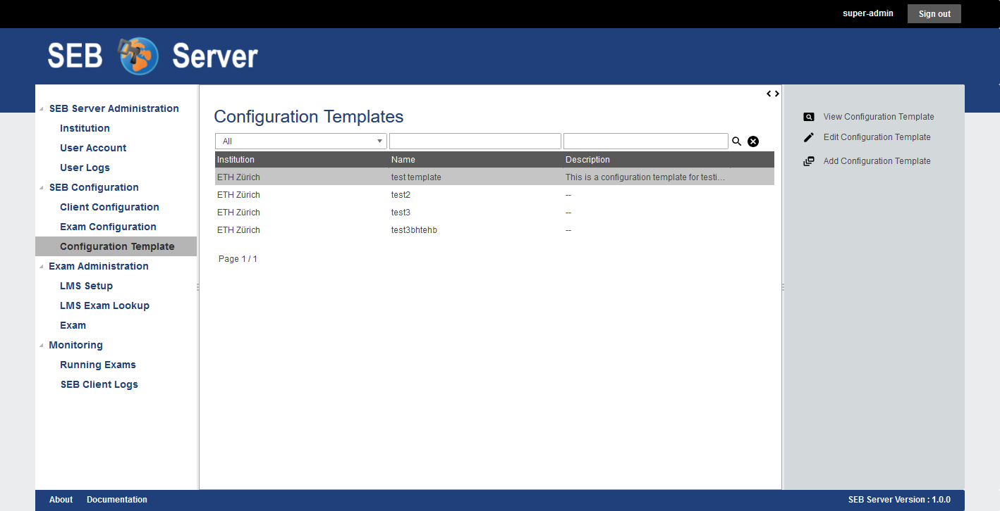
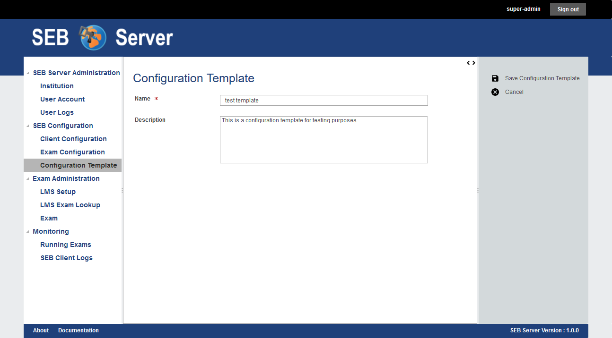
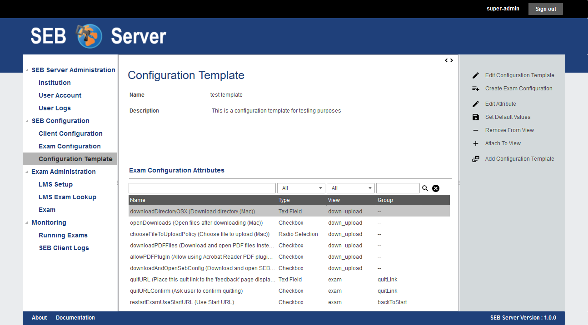
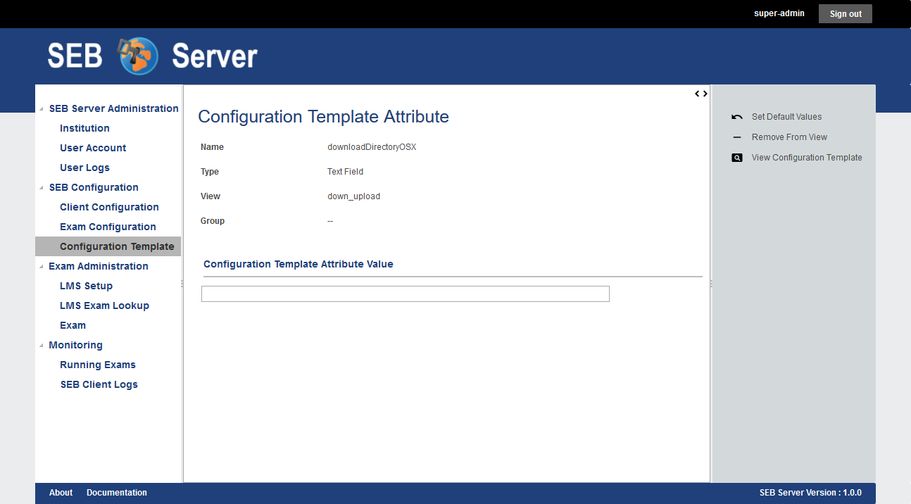

.. _config-template-label:

Exam Configuration Templates
============================

With this feature you can create and manage templates for SEB exam configuration settings. You are able to mainly define default values for each SEB exam 
settings attribute for an exam config and you are also able to define whether the settings attribute shall be viewed on an exam configuration created from 
the template or if it shall be hidden.

.. note::
   The exam configuration template feature is the most experimental feature in SEB Server for now and my change for the upcoming releases.
   
To view all available exam configuration templates go to the "SEB Configuration" section and click on the "Configuration Template" menu entry of the 
left menu pane. SEB Server will then present you a list of all available exam configuration templates. You can filter and sort the list as usual to find
a specific template by name for example.

To create a new exam configuration template use the "Add Configuration Template" action from the right action pane. You will see the creation form
with a name and description for the new template. At least a unique name is mandatory and the description is optional.

    
To create and save the new exam configuration template use the "Save Configuration Template" action from the right action pane. The template will be
created with all default settings attribute and views and you will see the configuration template view page. In the view page you will see the information
of the template within the page header following by a list of all exam configuration setting attributes available for a SEB exam configuration on the 
SEB Server. The name of an attribute is composed of the internal attribute name followed by the display name of the attribute. 

The type of the attribute defines the input field type and cannot be changed in any way. The view defines the tab on which the settings attribute is placed.
And the group defines the named group where a settings attribute belongs to. 

.. note::
    For now the "View" and "Group" properties of an settings attribute cannot be changed, just be set whether the settings attribute shall be shown
    on its defined view (tab) and within its defined position on the tab or if it shall be hidden at all.
    In a future version of SEB Server it may possible to also place a settings attribute to another "View" and/or "Group" and also to a certain position
    of the view grid.
    
To attach or detach a particular settings attribute for the template from the view to show or hide it in the configuration settings, select the specific
settings attribute from the list and use either the "Remove From View" action when you want to remove an attached one, 
or the "Attach To View" action when you want to attach a hidden settings attribute to the default view.

To define a default value for a specific attribute, select the attribute from the list and use the "Edit Attribute" action from the right action pane to open
the settings attribute in edit mode. Or just double click on the specific list entry of the settings attribute.

In the settings attribute edit page you see general information about the attribute on the upper part of the page and on the second part you see the
input field if the settings attribute with the current default value set. To alter the default value just use the input field of the attribute to change
the value and the change will automatically be set as new default value. If you want to reset the default value of the settings attribute to the original 
default value, use the "Set Default Values" action from the right action pane to do so. You are also able to attach or detach the settings attribute from 
the view here by using the "Remove From View" or "Attach To View" actions from the right action pane. To go back to the exam configuration template view
use the "View Configuration Template" action from the right action pane.

    
Back in the exam configuration template view you are able to create a new SEB exam configuration directly from this template by using the "Create Exam Configuration"
action from the right action pane. The application will present you a creation dialog within a pop-up where you can define a name and description for the
new SEB exam configuration. At least a unique name is mandatory.

 .. image:: images/config_templates/createConfig.png
    :align: center
    :target: https://raw.githubusercontent.com/SafeExamBrowser/seb-server/master/docs/images/config_templates/createConfig.png
    
After defines a name and description for the new SEB exam configuration you can click on "OK" to do so an the application will show you the new created 
SEB exam configuration in the usual place.
