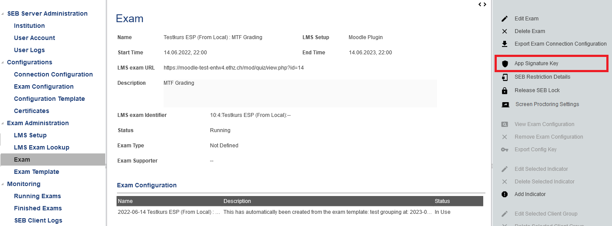
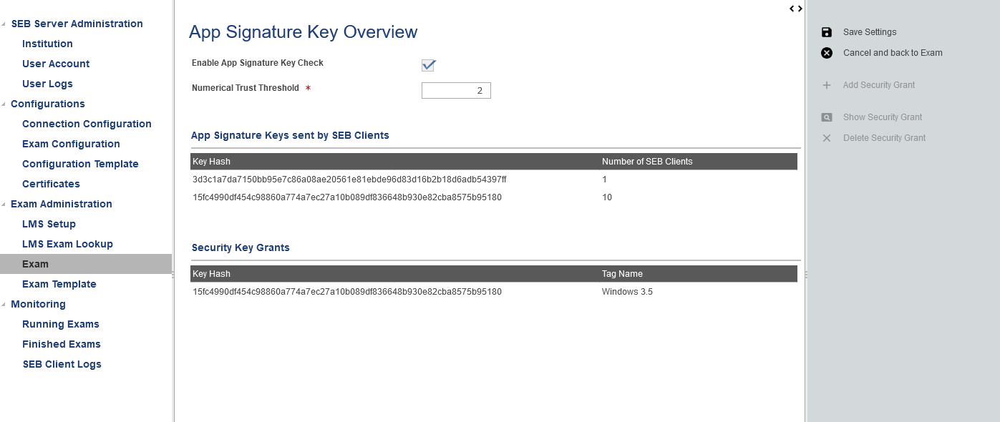
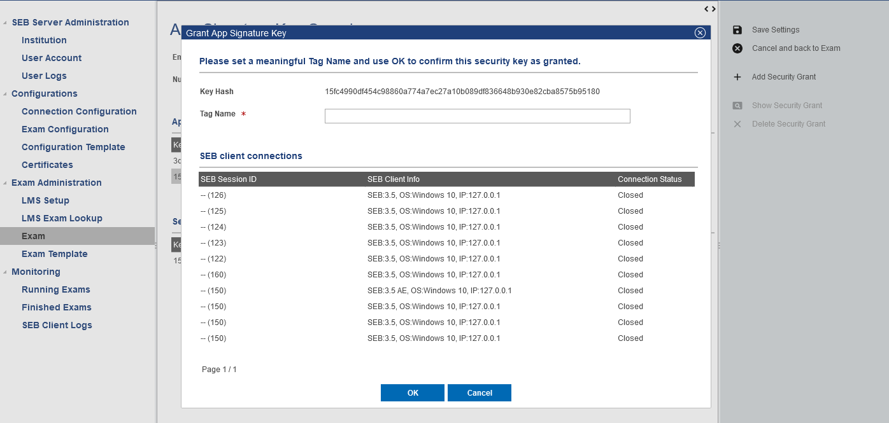

.. _examASK-label:

SEB App-Signature-Key
=====================

The SEB App-Signature-Key (ASK) is a new security key accordingly to the already known Browser-Exam-Key (BEK) used by SEB to restrict access and
ensure SEB client integrity for a SEB Server based setup. This feature is available since SEB Server 1.5 and the respective compatible SEB clients
noted within the SEB Server compatibility section of the SEB Server about page.

The main goal by using ASK for an exam with SEB and SEB Server is to ensure SEB client integrity. Since there is a unique ASK for every official SEB
release and build and the ASK is been created at runtime and securely sent to SEB Server, it will prove the SEBs integrity. Additional to this particular
ASK grant check, SEB Server will also make a heuristic check and considers an ASK as trusted if a particular number of SEB clients with the same 
ASK has been connected to SEB Server. Since manipulation of the SEB application in any way, will change the ASK of that SEB, SEB Server can recognize 
SEB clients with different singular ASKs and mark it as not granted as long as an exam administrator or supporter has not granted this specific ASK.

All explicitly granted ASK on the SEB Server are considered as trusted and SEB connecting with respective ASK will automatically get the grant and are
marked as usual as Active connection.

App-Signature-Key Setup
-----------------------

You can enable ASK grant check per exam within your exam set up page. Use the new "App Signature Key" action on the left action pane to open the settings
for this feature. 

    
Within this settings page you can enable or disable the feature any time also during a running exam. On the exam page you can see if the feature is enabled 
when the shield-icon is not strike-through.

Within the settings "Numerical Trust Threshold" you can set the threshold for the heuristic check that is applied if there is no explicit grant for an 
particular ASK. This means if more SEB clients with the same ASK has been connected to an running exam as this threshold points out, all that SEB clients
will be considered as trusted since one can say, that manipulated SEB clients has also a single unique ASK while official builds of SEB will all have the same
ASK for the same build.

    
In the following list you can see all APK that has been sent to the SEB Server by connected SEB clients. For a particular ASK you can also see
how many SEB Clients has been sent this ASK and has the same signature. 

Within this list you can explicitly grant a particular ASK by selecting the ASK from the list and using the "Add Security Grant" action from the 
right action pane. You will see a pop-up with the specific ASK hash to be granted and all SEB client connections listed that has sent this ASK 
below. You can give a name for the grant and save the grant by using "OK" action of the grant pop-up or cancel.

    
You see all granted ASKs within the second list with the ASK hash and the name that was given on grant. All explicitly granted ASKs from that list are
considered trusted for the exam. And future SEB client connection that connects with one of the ASKs from this list are granted. All SEB clients that
are connecting to the exam with different ASK will apply to the heuristic check using the given "Numerical Trust Threshold".