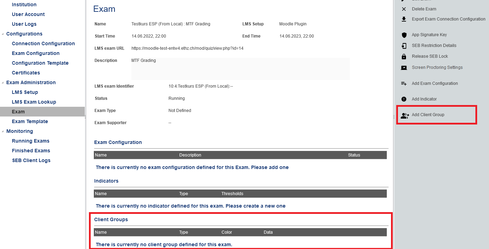
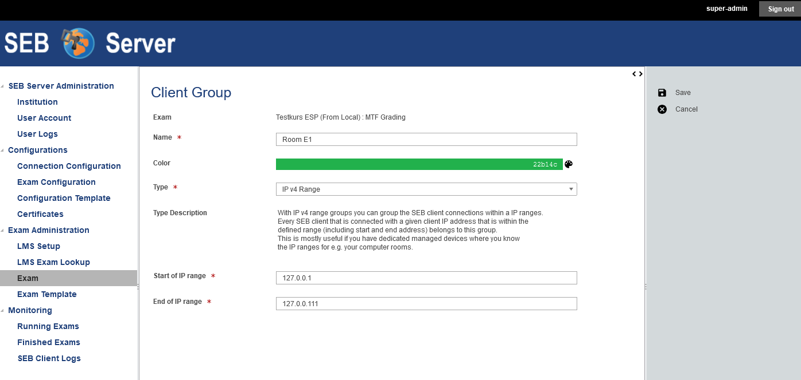
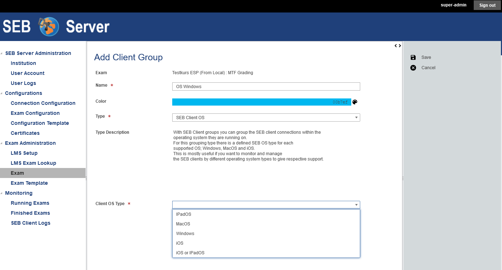
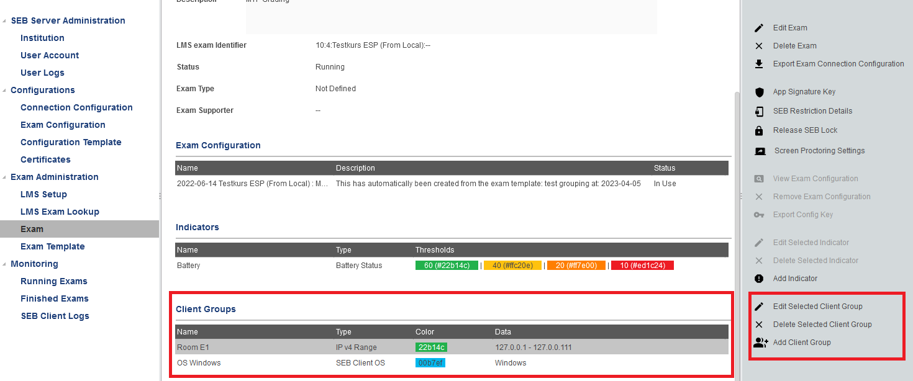
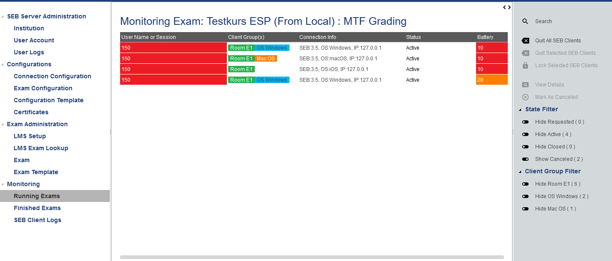
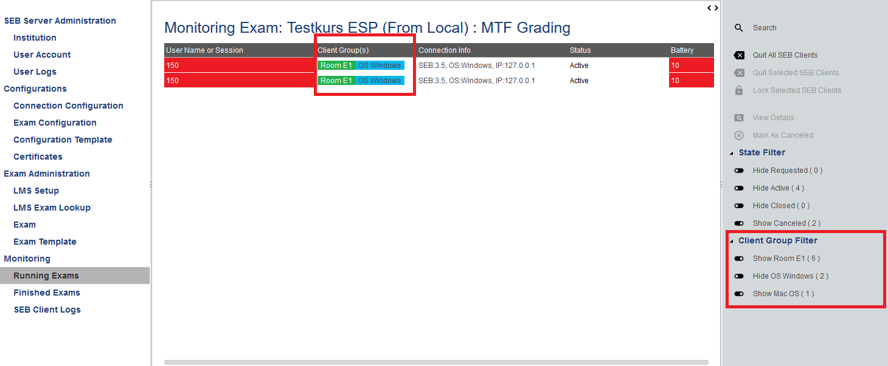

.. _examClientgroups-label:

SEB Client Groups
=================

SEB client groups are a new feature since SEB Server 1.5 release and allows you to group SEB client connection to specified groups that are
graphically tagged in the exam monitoring view and can be shown or hided by usual filter on the exam monitoring view. Currently there are
two different group types to group up SEB clients or SEB users, one is the the IP-Address (Internet Protocol Address) group and a second one
is the SEB OS (Operating System) grouping.

With the IP-Address grouping type you are able to create group SEB clients/users by an IP-Address range. You can make different groups out of
different IP-Address ranges (that ideally not overlap each other) and give them dedicated colors for identification. This group type is useful for example
if your infrastructure is dedicated to exam-rooms with given (W)LAN and static IP-Address ranges for that rooms. In this case you can map the rooms
to SEB groups by the IP Address range of that room and therefore are able to monitor you exam per room. 

With the SEB OS grouping type you are able to group SEB clients/users by the type of the operating system of the device that is used to apply to an exam
with SEB. This is useful if you want to monitor and support your exam and participants by operating system type what make sense since support might be different
for different operating system.

.. note:: 
    Since the grouping is as flexible as possible, it might be that a SEB user applies to no, one ore many groups. For example if you combine the above
    described grouping type for IP ranges and SEB OS then one SEB user will apply to a certain IP range group type and also to a certain SEB OS group type.
    This is possible and will also be displayed respectively within the monitoring view. 
    
    
Setup SEB Client Groups
-----------------------

SEB client groups can be set up with the Exam view on SEB Server. Additionally it is also possible to pre-define SEB client groups for Exam Templates that
would be applied to an Exam while import with template as usual. Creating and managing SEB client groups for Exam Templates is exactly the same as for Exams.

Client groups are located on an Exam setup page after the indicators at the end of the page.

To add a new SEB Client Group use the respective action from the right action pane. You will be presented with the SEB Client Group edit page
where you are able to give the new SEB Client Group a name and choose a type of the client group that you want to create.
You can also choose a color that is applied in the monitoring view within the "Client Group" column where all client groups that matches a 
specified SEB client connection are displayed.

When you select the type of the SEB Client Group you want to create, other type specific inputs will appear together with a short description of
the group type. With the additional, specific inputs, the SEB Client Group can be specified further and finally be saved and applied to the Exam.

    
For the IP range group type you can give a valid IP range defined with a start IP address and an end IP address. This two inputs are mandatory 
and must be valid IPv4 addresses. The range must be a valid range and will be inclusive on the IP match (range-start >= IP <= range-end).

For the SEB OS grouping type you have to choose the OS type from the given types that are available to specify the client group.

    
If you have finished up your SEB Client Group definition you can save it with the "Save" action from the right action pane or cancel the modifications and
go back to the Exam page. You will see your created SEB Client Groups within its respective section on the Exam page and are able to edit them again, or delete
a certain SEB Client group from the list.

    
Monitoring with SEB Client Groups
---------------------------------

When SEB groups are defined within your exam, you will find the SEB groups also in your monitoring view of the running exam. In the additional column
named "Client Groups(s)" after "User Name or Session", you will see the applied SEB client groups of each SEB connection. This can be none, one ore more
depending on what group(s) a particular SEB applies to. 

With the "Client Group Filter" on the right action pane, you are able to show/hide individual groups. With this filtering you can adapt your monitoring view
for specialized monitoring view, to only see SEB client connection from one particular room for example or of one particular client OS.

.. note:: 
    For the Client Group Filter, show has always the higher priority. Since a SEB client can apply to more then one group, all groups that a SEB client
    belongs to has to be hiden (filter) before the SEB client connection is hided from the monitoring view. So if you have two different group types like
    in the example, where a SEB client can belong to Room E1 as well as belong to Windows OS, both groups must be hidden to hide the client connection.
    If only Windows is hidden but Room E1 not, the SEB client connection will still be shown since it belongs to at least one group that is not hided.

