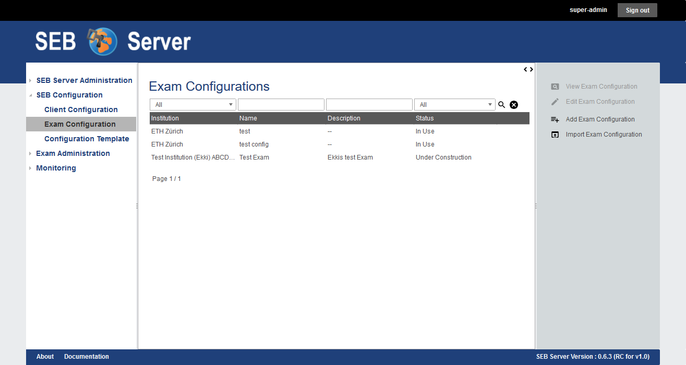
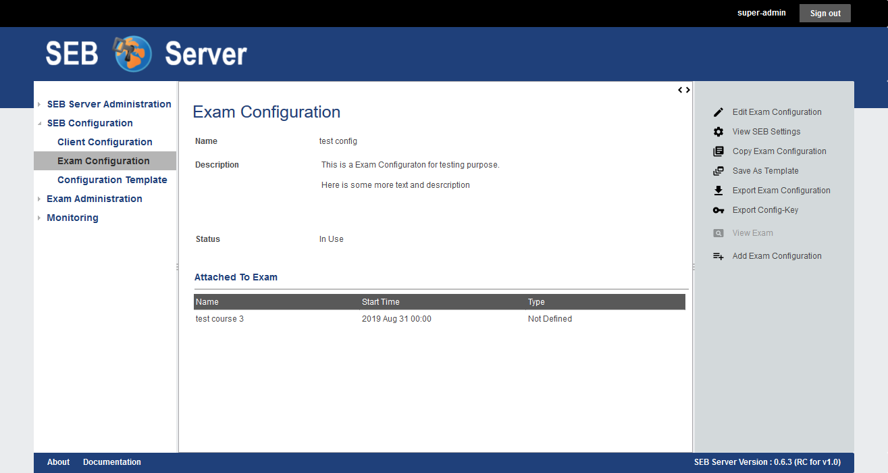
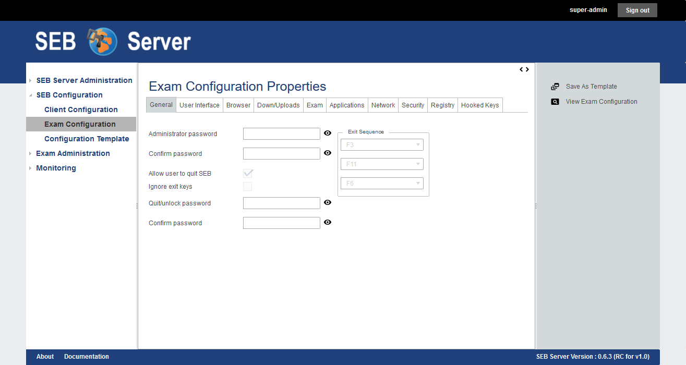

.. _exam-configuration-label:

Exam Configuration
==================

Overview
--------

An exam configuration defines all the SEB settings for an exam. A SEB client that is connecting to SEB Server
and an exam defined by the SEB Server is downloading this exam configuration from SEB Server and reconfigure itself before accessing the
exam on the learning management system (LMS) and present it to the user.

.. note::
    For more information and detailed description of the SEB settings, see `SEB Configuration <https://www.safeexambrowser.org/windows/win_usermanual_en.html#configuration>`_.
    Currently not all settings are available and some has different uses. For details about differences see :ref:`setting-dif-label` 

An exam administrator is able to create, modify and maintain exam configurations while the SEB Server administrator and the institutional administrator 
role have only read access either for all exam configurations or for the exam configurations of the institution. 
A exam supporter role is able to see and modify only the exam configurations to which the user-account is assigned as supporter.

To view the list of available exam configuration go the the sub-menu "Exam Configuration" within the menu "SEB Configurations" on the left
hand side. The list shows the name, the description and the status of the exam configurations in a column. With SEB Server administrator role
also an institution column is shown because a SEB Server administrator is able to see all exam configurations of all institutions.
As usual, to filter the list use the filter inputs above and click on the lens symbol on the right to apply the filter and to clear the 
filter use the clear symbol right to the lens symbol. See :ref:`gui-label` for more information about the list navigation. 

    
To view details of a specific exam configuration either double-click on a list entry or select a list entry and use the "View Exam Configuration"
action from the right action pane. In the detail view all general settings are shown and also a list of exams that uses this exam configuration.
In the current version of SEB Server, an exam configuration can only be assigned to one exam.

.. note:: 
    For the actual SEB Server version it is not possible to assign the same exam configuration to more then one exam. This because it shall be
    possible to change configuration settings for running exams when no active SEB clients are connected within the specified exam. This is 
    manageable for one exam but is going to become confusing if more exams are involved.
    But there is the possibility to copy an existing exam configuration to use the same for another exam.
    
The status of an exam configuration defines its visibility and assignment possibilities. If an exam configuration is still in the creation process 
and shall not be to an exam yet, it should stay in the "Under Construction" status.
This is the default status while creating a new exam configuration. Once a exam configuration is done and ready for assignment, one can change this
status to "Ready To Use". Exam configurations wihtin this status are available for selection and assignment on exams. When a exam configuration
is assigned to an exam the status changes automatically to "In Use" and the SEB settings of the exam configuration will appear only in read mode for default.

An exam configuration has a general settings part (like other domain objects has within SEB Server) that defines the name, description and status
of the exam configuration that are used to maintain the exam configurations SEB Server internally. And a exam configuration has, separated from 
the general settings, the SEB settings that contains most of the SEB setting attributes as they are provided by the SEB.

.. note::
    For more information and detailed description of the SEB setting attributes, see `SEB Configuration <https://www.safeexambrowser.org/windows/win_usermanual_en.html#configuration>`_.
    Currently not all settings are available and some has different uses. For details about differences see :ref:`setting-dif-label` 

The SEB settings differ from the general form-settings also in how they are managed and stored on server-side. Unlike the form-settings,
the SEB settings are arranged like they are in the SEB Configuration Tool for Windows and they are stored while modifying. This means, 
a entered value for an attribute is immediately sent to and stored by the SEB Server. There is no additional save action needed and 
no entered data will be lost. Instead the "Save / Publish Settings" can be used to store the current setting in a new revision in the history 
while also publish them to exams that uses this exam configuration.

.. note:: 
    Changes in SEB settings must be published to be available on exports, exams or other uses. Before publishing they are not
    available for exams and SEB clients that connect to the SEB Server will still receive the last published version of the SEB settings.
    To publish SEB setting changes use the "Save / Publish Settings" action from the right action pane.
    
.. note:: 
    Currently there is an "Undo" function to revert the changed made to the last published state. But there is no possibility yet to 
    maintain the publishing history of a Exam Configuration but may be available in a future release of the SEB Server.
    
Since an exam configuration can only be used by one exam it may be convenient to quickly copy an existing exam configuration that is in use
and use the copy of this exam configuration for another exam or to just change the settings to make a slightly different exam configuration.
The "Copy Exam Configuration" action can always be used no matter in what state the exam configuration may be at the moment. By using this
feature there will be a copy dialog shown as pop-up window where one has to give at least a new unique name for the copy. See :ref:`copy-config-label` 
for detailed step by step guide.

A plain XML text export of the exam configuration may be needed for testing. This is always possible by using the "Export Exam Configuration" 
action from the right action pane. This will start a usual browser download dialog handled by your browser to save or load the file. The default name
of the file of a exam configuration is "SEBExamSettings.seb".

SEB Server supports also the `SEB Config-Key <https://safeexambrowser.org/developer/seb-config-key.html>`_ that is used to validate the SEB configuration
on the LMS adds a higher security level to the exam. This supported if the specific type of LMS supports the automated SEB restriction feature. Anyways
sometimes it may be needed to manually extract the `SEB Config-Key <https://safeexambrowser.org/developer/seb-config-key.html>`_ for a exam configuration.
Therefore one can use the "Export Client-Key" action from the right action pane to generate the Config-Key form the actual saved SEB settings revision
of the exam configuration. The key will be presented by a pop-up dialog where it can be copied for further use.

Use Cases
---------

**Create new Exam Configuration**

For the upcoming semester you have to create several new exam configurations for the different kind of exams your institution is going to provide
during the semester.

- Sign into SEB Server with your exam administrator role account
- Navigate to the "Exam Configuration" menu within the SEB Configuration section on the left hand side.
- You see a list of all available exam configuration.
- Use the "Add Exam Configuration" action on the action pane on the right hand side to create a new exam configuration
- The creation form at least needs a unique name for the exam configuration. You can also add a description or hint to recognize and find this configuration more easily later on.
- In the "Status" field you are able to choose if the configuration is still under construction and cannot be added to exams yet, or if it is ready to use.
- Save the form with the "Save Exam Configuration" action on the right action pane to create the configuration.
- After successfully saved the new exam configuration use "Edit SEB Settings" to open all the SEB settings that can be defined for a exam.
- For more information about the individual SEB settings see `SEB Configuration <https://www.safeexambrowser.org/windows/win_usermanual_en.html#configuration>`_.
- In the SEB settings view use the "Save / Publish Settings" action to save your settings. 

.. note:: 
    Changes in SEB settings are automatically sent to the server and stored within the open working revision of the settings.
    To make a open working revision active and available for export, exams and other uses, you need to save / publish this settings exclusively
    by using the "Save / Publish Settings" action. After using this action all the changes are saved in a historical revision and 
    available for use. A new working revision will be created and all the changes until then will go into the new working revision.
    To revert all the changes done since last save / publish use the "Undo" action.

**Export an Exam Configuration**

You want to test an exam configuration manually with a SEB client. Therefore you need to export a existing exam configuration and load
it with a SEB client or the SEB configuration tool.

- Sign into SEB Server with your exam administrator role account
- Navigate to the "Exam Configuration" menu within the SEB Configuration section on the left hand side.
- You see a list of all available exam configuration.
- Use the Filter above the list to narrow down the number of entries and to find a specific exam configuration.
- Open the exam configuration either by double-click on the list entry or be selecting the list entry and using the "View Exam Configuration" action.
- In the view mode of the exam configuration use the "Export Exam Configuration" action to start the export download.
- Save the file or open it directly with SEB

**Import an Exam Configuration**

There is an existing SEB configuration file once created with the SEB config tool that must be imported to use with SEB Server. 
The SEB configuration files where created with the SEB configuration tool and are all saved with the purpose to start an exam (attribute).

- Sign into SEB Server with your exam administrator role account
- Navigate to the "Exam Configuration" menu within the SEB Configuration section on the left hand side.
- Use the "Import Exam Configuration" action from the right action pane to start an upload dialog.
- Within the upload dialog use the file selector to select the SEB configuration file for importing.
- Give a unique name for the imported exam configuration and a description (optional).
- If the original SEB configuration is password protected, give the password that is needed to decrypt the configuration file.
- Use the OK action on the upload dialog to start the import.
- If the import was successful a new exam configuration with the given name exists.

.. _copy-config-label:
**Copy an Exam Configuration**

Since an exam configuration can only be used by one exam you have  periodically to create a copy of an existing exam configuration
that is already attached to an exam. The copy can then be used to either make first some changes to the settings or add it directly
to another exam that has to be configured for SEB.

- Sign into SEB Server with your exam administrator role account
- Navigate to the "Exam Configuration" menu within the SEB Configuration section on the left hand side.
- You see a list of all available exam configuration.
- Use the Filter above the list to narrow down the number of entries and to find a specific exam configuration.
- Open the exam configuration either by double-click on the list entry or be selecting the list entry and using the "View Exam Configuration" action.
- Use the "Copy Exam Configuration" action from the right action pane to open up the copy dialog.
- Within the copy dialog give a new unique name for the new exam configuration and a description if needed.
- Use "With History" apply the whole history of the original exam configuration to be copied or let it unchecked to just copy the last saved / published revision of the original.
- If all information is correct, use the "OK" button of the copy dialog to create the copy.

.. note:: If there where changes in the working revision of the exam configuration to copy, they will not be included in the copy.
    Only saved / published changes are included in the copy.

**Generate and Export the Config-Key of an Exam Configuration**

Usually the `SEB Config-Key <https://safeexambrowser.org/developer/seb-config-key.html>`_ that is used to validate the SEB configuration
on the LMS is propagated automatically to a LMS by the SEB Server with the automated SEB restriction feature. But For testing purposes you need to generate and export the 
`SEB Config-Key <https://safeexambrowser.org/developer/seb-config-key.html>`_ and set it manually on the LMS. 

- Sign into SEB Server with your exam administrator role account
- Navigate to the "Exam Configuration" menu within the SEB Configuration section on the left hand side.
- You see a list of all available exam configuration.
- Use the Filter above the list to narrow down the number of entries and to find a specific exam configuration.
- Open the exam configuration either by double-click on the list entry or be selecting the list entry and using the "View Exam Configuration" action.
- Use the "Export Config-Key" action from the right action pane to generate the Config-Key and open a dialog that presents this generated Config-Key.
- Mark the Config-Key hash in the dialog with double-click and copy it (ctrl+c) to the clip-board.

.. note:: If there where changes in the working revision of the exam configuration to create the Config-Key from, they will not be included in the generation of the Config-Key.
    Only saved / published changes are included in the Config-Key generation.

**Changing SEB Settings of an Exam Configuration in Use**

There is an already fully configured exam within SEB Server that is currently running with a prepared exam configuration. You have now realized that
some SEB settings are missing or wrong and has to be changed for the exam. This is possible but under some restrictions. See the note below.

.. note:: 
    When a exam configuration is applied to a currently running exam, the exam configuration is in "Used" state and the SEB settings of the exam configuration 
    are in read only mode. Changing the SEB settings of a exam configuration during a running exam that has already connected clients can lead to unexpected 
    behavior. SEB clients that has already been connected and are in a running session will work with the old configuration while SEB clients that are connecting
    after a SEB settings change will work with the new configuration. Also the automated SEB restriction with the changed `SEB Config-Key <https://safeexambrowser.org/developer/seb-config-key.html>`_
    will be updated immediately after saving / publishing the configuration changes. This may also lead to unexpected behavior and eventually blocking of already connected SEB clients.
    Therefore SEB Server restricts the change of SEB settings for configurations that are attached to an exam that is currently running to be only possible if there are no
    active SEB client connections for this exam at the moment when save / publish the SEB setting changes. 

- Sign into SEB Server with your exam administrator role account
- To change the SEB Settings of an exam configuration that is attached to an currently running exam, make sure that there are no active SEB client connections.
  Go to the "Monitoring" section and find and view the concerned exam to make sure there are currently no active SEB client connections.
- Navigate to the "Exam Configuration" menu within the SEB Configuration section on the left hand side.
- You see a list of all available exam configuration.
- Use the Filter above the list to narrow down the number of entries and to find a specific exam configuration.
- Open the exam configuration either by double-click on the list entry or be selecting the list entry and using the "View Exam Configuration" action.
- See that you currently are not able to edit the SEB settings. There is only a "View SEB Settings" action that opens the SEB settings in read-only mode.
- Use the "Edit Exam Configuration" action from the right action pane to open the edit mode of the exam configuration.
- Change the status from "Used" to "Under Construction" to be able to edit the SEB settings again. There will be a message that tells you the implication with changing SEB settings within a exam configuration that is already used by a running exam.
- After saving the exam configuration in "Under Construction" it is now possible to edit the SEB settings for this exam configuration.
- Use the "Edit SEB Settings" action from the right action pane to open the SEB settings form in the edit mode.
- Apply your changes to the settings and use "Save / Publish Settings" to make the settings take affect and trigger a configuration change to the exam. This will check first if there are currently no active SEB clients connected within the running exam that uses this exam configuration. If there is one or more active SEB client connected, the action will deny and inform you about the the active SEB clients.

.. _setting-dif-label:

SEB Setting Differences
-----------------------

In the current version (1.0) of SEB Server, there are some differences to some SEB settings and also some SEB settings that are currently not 
available on the SEB Server.

**SEB settings currently not supported by the SEB Server**

- Start URL: Since SEB Server has already been contacted by a SEB client when downloading the exam configuration this is not used by the exam configuration on SEB Server. But this can be used as fallback URL in the Client Configuration.
- Embedded Resource: There is currently no embedding supported within exam configurations on SEB Server.
- Additional Dictionaries: There are only the SEB client default dictionaries available in the current SEB Server version.
- Additional Resources: Additional resources are currently not available in the current SEB Server version.
- Embedded Certificates: There is currently no certificate management possible on current SEB Server version.
- Browser Exam Key: There is currently no possibility to generate the Browser Exam Key on the SEB Server. But an already generated Browser Exam Key may be used within the SEB restriction feature on the exam configuration if this feature is supported by the LMS in use.

**SEB settings that has a slightly different form or handling in SEB Server comparing to the SEB configuration tool** 

- Download Directory OSX: Since it is not possible within a web-service to choose a local directory on a remote device this is just a text input where one has to give the full-path to the directory on the client device in text form.
- Log Directory OSX, Log Directory Win: Since it is not possible within a web-service to choose a local directory on a remote device this is just a text input where one has to give the full-path to the directory on the client device in text form.
- Permitted Processes / Executable: This is also just a text input field where one can give the name of the process in text form.

**SEB settings from versions before 3.0 that are not supported anymore**

- Permitted Processes / Window Handling Process
    
