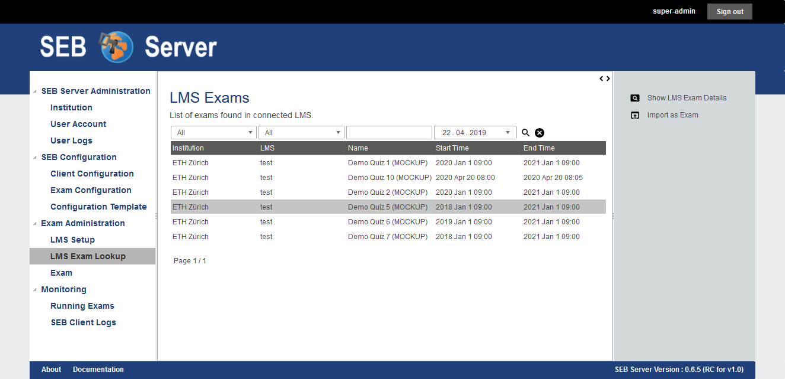
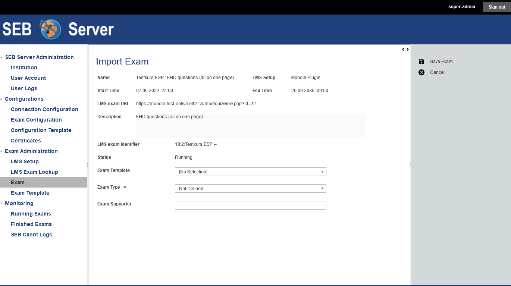
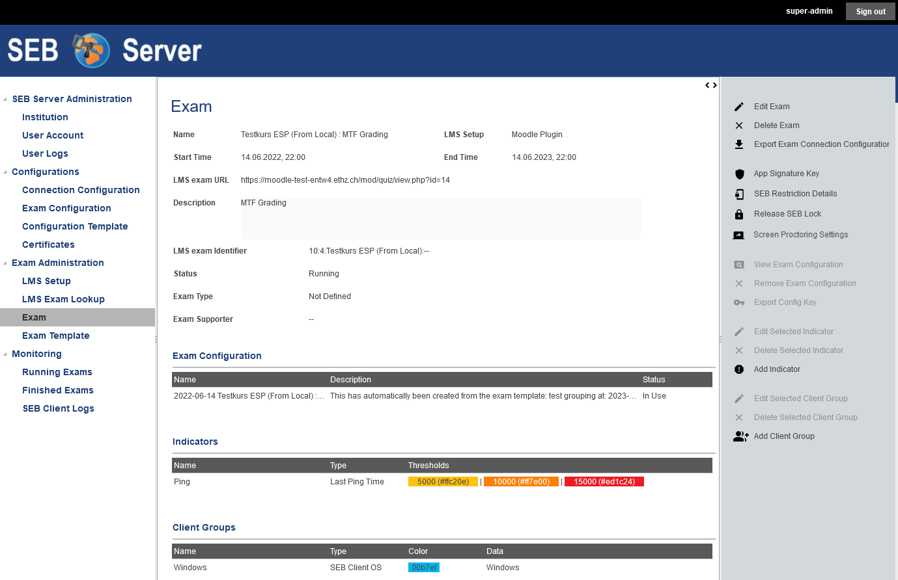

Import LMS Course as Exam in SEB Server
=======================================

To be able to configure and manage a course or parts of a course existing on a LMS as an exam on SEB Server we first need to import
an exam from the one of the available courses from a LMS that has been setup to use within the SEB Server.

.. note::
    If you don't have already set up a LMS binding within SEB Server and your institution, you have to do this first.
    More information about setting up a LMS binding can be found in the chapter :ref:`lms-setup-label`
    
You will find the list of available courses provided form all LMS that are bound within your institution by going to the "Exam Administration"
section on the left hand side and choosing "LMS Exam Lookup". The SEB Server will present you the list of all available courses and you
are able to filter and sort the list as usual to find to right course for import.

.. note::
    The "Start-Time" filter is usually set to the date one year before now or to some other default date in the past. The list shows only 
    the courses that has a start-time after that time. If you have long running courses and it may possible that a course has been stated
    a year or two ago, you habe to adapt this "Start-Time" filter to view those courses that has been started before. 

    
You can view more details of a course by double-click on the specific list entry or by selecting the list entry and click the "Show LMS Exam Details" 
action form the action pain on the right hand side. The application will open a pop-up with available detail information of the course.

To import a course as an exam find the specific course on the list by using the filter and select the list entry. Use the "Import As Exam" action 
from the action pane on the right hand side. 

.. note::
    If a course has already ended (End-Time passed) it is not possible to import this course and an appropriate message is shown.
    
On import, the application is creating an exam on SEB Server with a reference to the imported course on the LMS. All course specific data
like name, description, start-, end-time and course-identifier will not be stored on the SEB Server but always be referenced by the underling course.
This means, that the course data has to be modified on the LMS side as usual and the SEB Server always takes the actual data from the LMS for the 
course. This has the advantages of the principle of single responsibility and prevents synchronization issues. 

You will see the creation page of the new exam with additional information: 

- **Name**: Is the name of the course, defines on the LMS
- **LMS Setup**: Is the name of the LMS Setup on the SEB Server from which the course was imported
- **Start-Time**: Is the date and time when the exam is starting. This is defined on the LMS
- **End-Time**: Is the date and time when the exam ends. This is defined on the LMS
- **LMS Exam Identifier**: Is the identity of the course on the LMS (external identifier/primary key)
- **LMS Exam URL**: Is the start URL of the course/exam

You are now able to initially choose a type for the exam - "Exam Type" - that is currently only used 
for informational purpose and has no further restrictions or consequences on handling on in SEB Server.

    
Furthermore you can select and apply all exam supporter that shall be able to see and support this exam while running. To do so, click in the
input field of the attribute "Exam Supporter" to see a drop down list of all available users for selection. To filter the drop down list, start
typing characters of the name of the user-account you want to apply to automatically filter the list. Click on the drop-down list entry to select the
specified user that will be added to the list below the input field. To add another user to the selection just click again into the input field
and select another user. To remove a selected user from the selection-list, double-click on the specified entry of the selection-list.

.. note::
    At least one user account must be selected for the attribute "Exam Supporter". You are able to change this also later on by editing the exam.
    
To confirm the import use the "Save Exam" action of the action pane on the right hand side or use "Cancel" if you want to abort the import of the
exam and go back to the course list. If you have confirmed and successfully imported the exam, you will see the exam overview page where you are able
to edit the details of the exam, apply SEB restrictions of supported by the LMS, apply a SEB exam configuration for the exam and define indicators
for monitoring the exam later on.

How all this different aspects of the exam are defined and prepared is part of the next chapter.
    

Use Cases
---------

**Import a course as exam**

To start setting up a course or quiz form an existing LMS as e-assessment with SEB and SEB Server you have to find this course or quiz on the 
SEB Server and import it as exam. Define a type and apply exam supporter.

- Login as an exam administrator and go to the "LMS Exam Lookup" page under the "Exam Administration" section. 
- If you are not sure if the LMS that runs your course has already been setup within the SEB server, go first to the "LMS Setup" page and try to find the particular LMS in the list. If you can't find it, please contact an institutional administrator or setup the LMS by yourself as described in :ref:`lms-setup-label`.
- Find your course or quiz by using the filter of the list and the list navigation as usual.
- Double click on the list entries to get all information about a particular course or quiz.
- Once you have found the course or quiz, select it on the list and use the "Import Exam" action on the right action pane.
- The system will lead you to the exam import page where you see all the details of the course or quiz and where you can set a type and apply exam supporter before importing. 
- Choose a type for the imported exam in the "Exam Type" selection. The type of an exam is currently just informative hand will cause no restriction for the imported exam.
- Select as many exam supporter as you want to be able to support the running exam. Read above, how to find and select exam supporter with the drop down multi selection.
- When all is properly set, use the "Save Exam" action on the right action pane to save the exam and complete the task.

