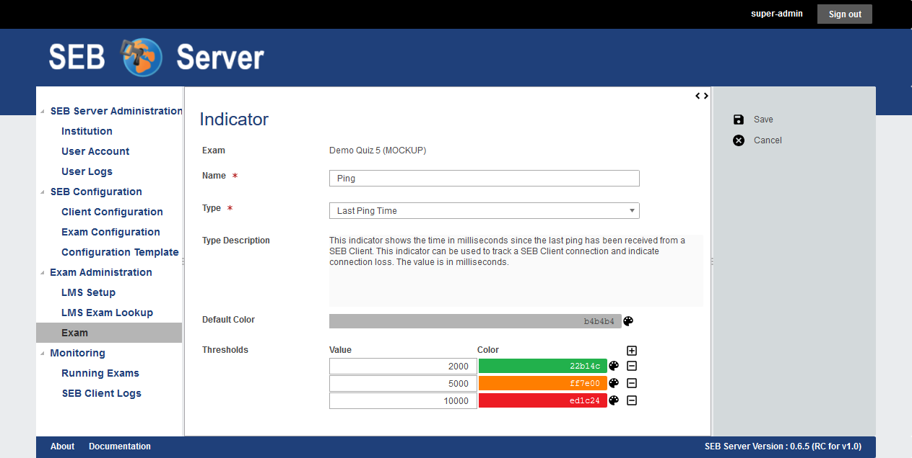

.. _exam-indicators-label:
Monitoring Indicators
---------------------

For monitoring connected SEB clients, SEB server supports some indicators that can be defined within an exam and that are shown and measured during an
exam. When you import, the application automatically creates a default ping-indicator for the exam. You are able to modify this default indicator and also
add some other indicators to the exam to be able to get notified while monitoring a exam session.

The type of indicators are pre-defined within the SEB Server and restricts the number of available indicators that can be used. Currently following
indicators are supported:

- **Last Ping Time**: This indicator measures the time that has passed since the last ping from a specified SEB client was received by the SEB Server in milliseconds.
   This can be used to monitor constant SEB client connections and get notified when a SEB client connection gets lost for some defined 
   time or when a SEB client connection that has been list is back again.
   This indicator is used as default indicator and automatically applied to the exam on import. You are able to modify this indicator 
   and also delete it but we recommend to have this basic indicator in place for every exam.              
- **Errors**: This indicator measures the number of error-logs a specified SEB client is sending to the SEB Server.
- **Warnings**: This indicator measures the number of warning-logs a specified SEB client is sending to the SEB Server.
 
You can define thresholds for each indicator. A threshold is defined by an indication-color and by a threshold-value. On the monitoring side, the 
indicator for each SEB client connection with change to the threshold color when the measured indicator value has reached the threshold-value.

To add a new indicator to the exam you can use the "Add Indicator" action from the right action pane. In the indicator edit page you are able to give the
new indicator a name. This name will be displayed in the SEB client connection table on monitoring section as column name for the column of this
indicator. Then you are able to choose a "Type" that specifies the type of indicator. Choose this from a drop-down selection of supported indicators.
If you have selected one indicator type, a description will be shown just below the "Type" attribute. 

You can define a "Default Color" for the indicator. An indicator which measured value has not reached any defines threshold will be shown in this 
color on the SEB client connection table of the monitoring section.

.. note::
    To select a color click on the brush-palette icon of the color input field to open up a color chooser pop-up window. Within the color chooser
    you can select one of the basic colors provided by the chooser or by defining the red, green and blue part of the color.

    

Below the default color you see a list of thresholds. Use the plus sign icon to add a new threshold to the list and on an existing threshold use
the minus sign icon to remove a particular threshold form the list. A threshold has a threshold-value and a threshold-color. The threshold value
must be set in the format of the measured indicator value that is described within the type description. This is usually an integer or floating-point
number. The color for each threshold can be set using the color chooser tool by clicking on the brush-palette icon on the right side of each threshold.
The color chooser pop-up is the same as for the default color.

.. note::
    In the monitoring section when the exam is running, an indicator will be shown within a column with given name of the indicator in the SEB connection 
    table. For each connection the measured indicator value will be displayed in the cell of the individual SEB client connection rows. If the measured 
    indicator value for a particular SEB client reaches a defined threshold, the cell will be displayed in the defined color of the threshold.

Use Cases
---------

**Add an indicator**

- Login as an exam administrator and go to the "Exam" page under the "Exam Administration" section.
- Use the filter to find the exam on that you have to change the supporter assignments. 
- Double click the list entry of the exam to go to the exam details page. Check if you are on the right exam.
- Use the "Add Indicator" action from the right action pane to create a new indicator. This will lead you to the indicator edit page.
- Set a name for the indicator and choose the type of indicator you want to use. Read the description above to learn more about indicators and supported types of indicators.
- You can also define a default color for the indicator that is displayed on the monitoring page while the exam is running and a particular SEB client has no incidence as defined for this indicator.
- To select a color use the brush-palette icon on the right side of the color input field to open up a color chooser dialog.
- Now you can define some threshold for the indicator that will help you find incidents and get informed about on the monitoring while the exam is running. To do so you can use the plus icon on the threshold list to add a new empty threshold to the list. You can choose a value for the threshold and a color that would indicate an overflow of the given value from the measured value of the indicator.
- To remove a already defined threshold from the list of threshold, use the minus icon on the right side of the particular threshold.
- When everything is set up properly use the "Save Indicator" action to save the indicator and go back to the exam details page.
- Back in the exam details page, you can check if your indicator is in the list and all thresholds are correctly set by going down to the indicators list of the exam.

**Modify indicators**

- Login as an exam administrator and go to the "Exam" page under the "Exam Administration" section.
- Use the filter to find the exam on that you have to change the supporter assignments. 
- Double click the list entry of the exam to go to the exam details page. Check if you are on the right exam.
- Scroll down to the indicator section of the exam details page and find the indicator you want to modify.
- Double click on the indicator entry from the list to open the indicator edit page.
- In the indicator edit page modify the indicator for your new needs. Add / remove thresholds or change the name or type of the indicator.
- To confirm your changes and save the indicator, use the "Save Indicator" action from the right action pane.

**Delete an indicator**

- Login as an exam administrator and go to the "Exam" page under the "Exam Administration" section.
- Use the filter to find the exam on that you have to change the supporter assignments. 
- Double click the list entry of the exam to go to the exam details page. Check if you are on the right exam.
- Scroll down to the indicator section of the exam details page and find the indicator you want to delete.
- Select the indicator from the list ans use the "Delete Indicator" action from the right action pane to delete the indicator.

