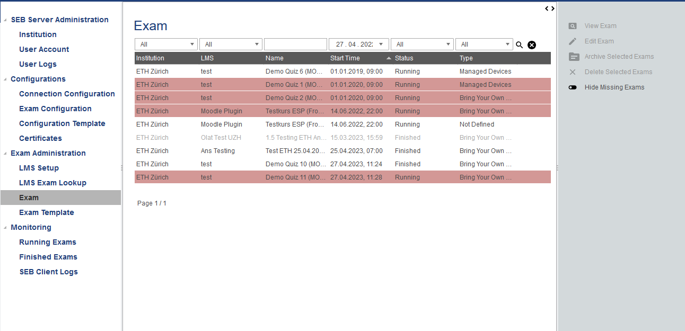
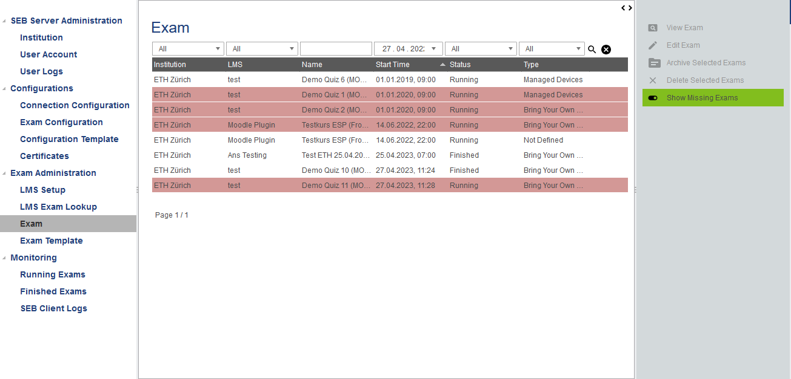
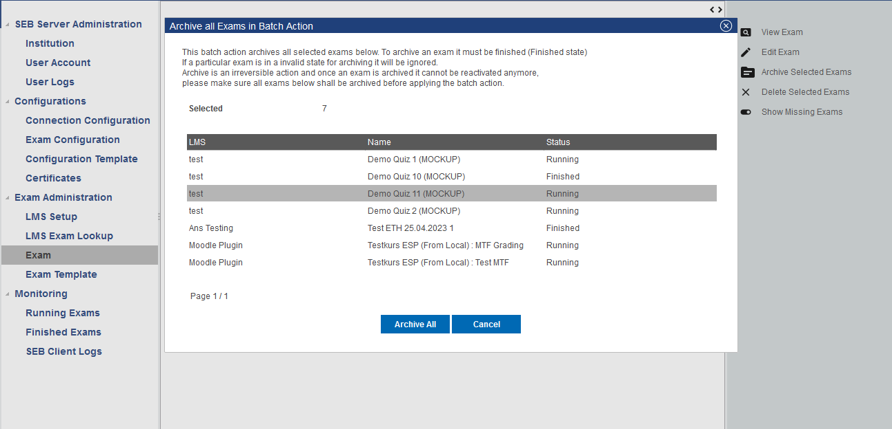

Exam List
=========

The exam list is shown directly within the "Exam" entry of the "Exam Administration" menu. You will have the usual filter and sort functionality
of lists within SEB Server. You can see exams that are running but has not complete setup yet, marked in read in the list. Additionally you see 
Exams that currently has no connection to its origin LMS grayed in the list. This exams are not available on the LMS either because they didn't 
exists anymore on the LMS or the SEB Server cannot connect to the LMS anymore. As soon as the SEB Server is able to get the LMS data again for a
once unreachable exam, the respective exam would change back to normal and is not grayed anymore.

    
Sometimes an entire LMS is not available and a lot of exams are grayed. In this case you can use the new filter "Show/Hide Missing Exams" from the
action pane on the right to filter out this exams from the list.

    
To get more information about what is missing for an exam that is marked in red, just open the exam by select and use "View Exam" or by double-click
on the list entry. In the Exam view page you will see a warning message pointing out all the missing things to setup the exam.

.. note::
    The list in the default filter shows you all exams except the archived ones. If you want to show the archived exams you can use the status
    filter and choose "Archived" from the combo selection. If you want to show all active exams again, you can choose "All" in the status filter. 

Exam Batch Actions
------------------

Since SEB Server version 1.5 there are two new batch action for exams within the exam list page for archiving and deleting exams in a batch.
As usual for batch actions you can select multiple exam list entries while also page through the list. After you have selected all exams that
you want to archive or delete, select the respective batch action on the right action pane to open the batch action pop-up.

    
You see your selection again within a list on the pop-up and when ready you can start the batch action and apply it to every selected exam
that is in a valid state to apply the action. 

.. note::
    For batch-action the same validation is done like for the single action delete and archive. Archive of an exam is only possible if it
    is not currently running but finished or up-coming. Delete is always possible and you habe to be cearfull while deleting exams in batch.
    
After you have started the batch-action the result pop-up of the batch-action will show you the progress and how many has been processed and
also how many as failed due to invalid state for batch-action or due to an error.
