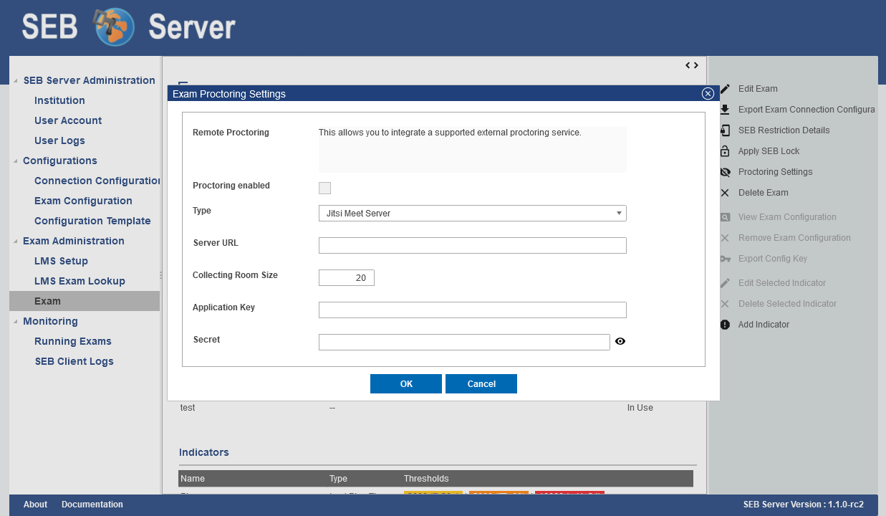
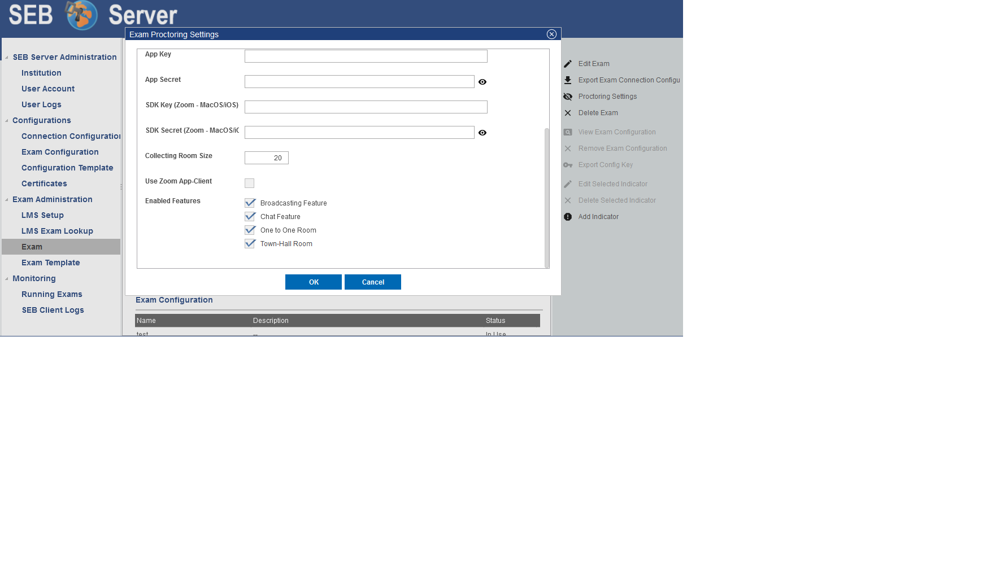
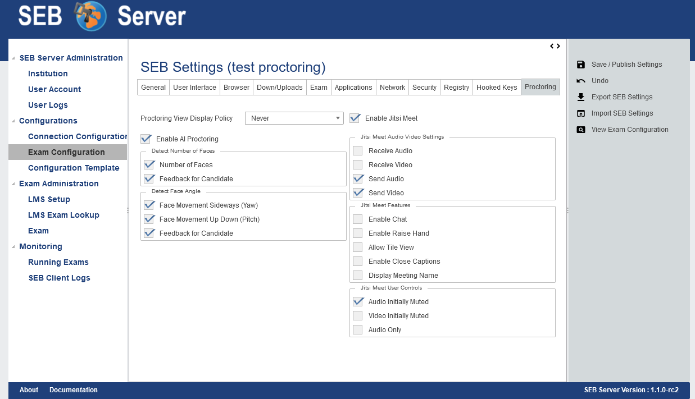
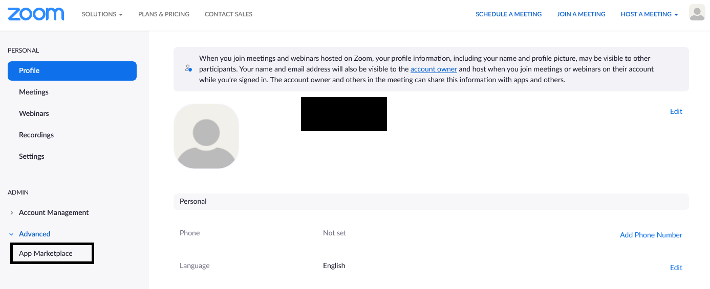
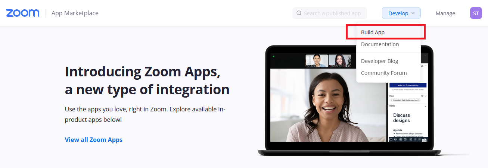
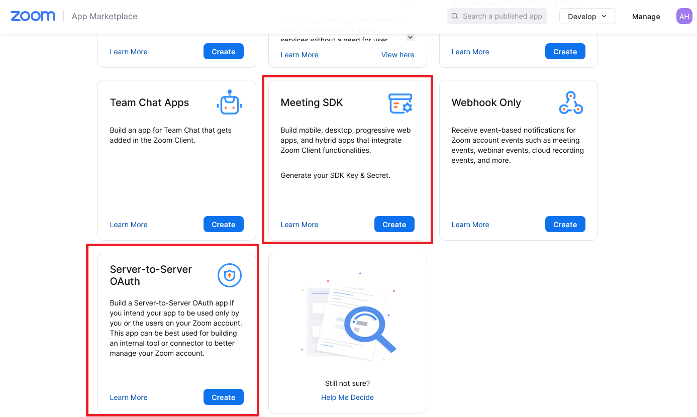
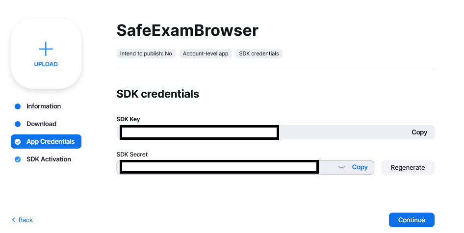

.. _sebProctoringSettings-label:

Live Proctoring
===============

Live proctoring is a new and yet experimental feature of SEB and SEB Server. The main goal of the live proctoring feature is to support the integration
of an external meeting service like Jitsi Meet or Zoom for example, within a SEB and SEB Server setup for an exam.
In this scenario a SEB client is able to join a meeting and send audio and video data to the meeting where a proctor can watch the students during 
an exam within this meeting(s). The role of SEB Server in this scenario is mainly to bind a particular meeting service and automatically create
meeting rooms, instruct connected SEB clients to join a certain meeting room. SEB Server can also instruct SEB clients to participate in the meeting by
allowing connected SEB clients to receive audio and video as well as enabling chat functionality.

.. note::
    This feature is still in a prototype state and not all functionality might work as expected. Basically the meeting features
    are given or restricted by the meeting service that is used and the API and GUI that is given by that meeting service client

To be able to use the integrated live proctoring feature with SEB and SEB Server you need an external meeting service that can be used by the SEB Server to automatically create meetings.
If this feature is enabled, you are able to setup a live proctoring service for a specified exam that can be used in the monitoring later on while the exam is running and SEB clients are connected.

Currently supported meeting services are:
- `Jitsi Meet <https://jitsi.org/jitsi-meet/>`_ with JWT token authentication enabled.
- `Zoom meeting service <https://zoom.us/>`_ with an account plan that fits your need and supports the `Zoom API and Client SDKs <https://marketplace.zoom.us/docs/sdk/native-sdks/developer-accounts>`_.

To bind and setup a live proctoring service in SEB Server for an exam, go to the view page of the exam and use the "Proctoring Settings" action on the right action pain to open up the proctoring settings dialog.

    
Within the proctoring settings dialog you are able switch the service on and off by using the "Proctoring enabled" checkbox. You also see if the proctoring service is enabled within 
the action icon that is either an eye when active or a slashed eye when not active.
To define and bind a service you have to chose a service type from the available service types. And you need to give the API access credentials like "Application Key" and "Secret" for
the external meeting service. SEB Server will then try to connect to the meeting service with these credentials to automatically create meetings/rooms for proctoring.
Within the "Collecting Room Size" field you can define the number of maximal participants that shall be collected within one proctoring room. SEB Server will automatically
create these collecting rooms while SEB clients are connecting to the running exam in the monitoring view.

.. note::
    If you choose Zoom as your proctoring service and you also want to conduct your exam with Mac and/or iOS SEB Clients you will also need a Zoom SDK-Key and -Secret since SEB Mac/iOS uses Zoom SDK for proctoring integration.

Scroll down the Proctoring Settings window to see more settings for SEB Server based proctoring features:

    
- Use Zoom App-Client: Enable this setting to use a Zoom App/Desktop client for the origin proctoring room. This needs an existing Zoom Desktop App installation on the proctor's desktop.
- Broadcasting Feature: Enable this to see the broadcasting features buttons in the opened proctoring windows. E.g. "Enable/Disable Audio" and "Enable/Disable Video" buttons.
- Chat Feature: Enable this to see the "Enable/Disable Chat" feature buttons in the opened proctoring windows.
- One to One Room: Enable this to see the One to One Room feature button during an exam monitoring within a SEB Client detail view
- Town-Hall Room: Enable this to see the Town-Hall Room feature button in the exam monitoring view

To read more about this proctoring features, please have a look at `Exam Monitoring <https://seb-server.readthedocs.io/en/latest/monitoring.html#live-proctoring>`_.

After you have all the settings done, use "OK" to confirm the settings. SEB Server will then try to connect to the meeting service with the given settings and check the access.

.. note::
    Once a proctoring service is integrated for an exam, it is currently not possible to switch it to another service anymore. 
    This is because different services needs different meeting reference data on SEB Server and there is no conversion supported.
    In the future we will make it possible to at least delete a already existing proctoring setup and to start from scratch.

The SEB client settings for proctoring can be found in the "Exam Configuration" "SEB Settings". There is a new tab with the name "Proctoring" where all SEB settings for proctoring are available.
These settings are directly used by a SEB client that supports the proctoring feature. SEB will initialize with this settings when connecting to SEB Server and also will use this settings as default settings during an exam.
    

Since SEB Server version 1.2 there is also an Zoom service section  that let you define the default SEB settings for a Zoom proctoring setup.
Please be aware that not all of the settings are functioning yet. Please refer to the the settings tool-tip to get a actual description of
a particular SEB feature setting

**Jitsi Meet**

To setup and configure a Jitsi Meet service for testing you can refer to the `Docker installation documentation <https://jitsi.github.io/handbook/docs/devops-guide/devops-guide-docker>`_
 
.. note::
    The Jitsi Meet integration works only with JWT authentication. Please refer to the above documentation for how to setup JWT authentication.
    
**Zoom**

To integrate Zoom meetings as a live proctoring service within SEB Server you need to have an appropriate Zoom account with API and SDK access.
`Zoom API and Client SDKs <https://marketplace.zoom.us/docs/sdk/native-sdks/developer-accounts>`_.
Then you need to setup the Zoom account to run with JWT apps as described:

- Login into your Zoom account and use "App Marketplace" to setup an API app account

    
- Within the Zoom Marketplace use "Develop" and select "Build App".

    
- Choose either JWT or SDK or both if needed for exams with different SEB clients

    
- Follow the instructions to create the API account and use the "App Key" and "App Secret" or SDK Key and SDK Secret within the setup in SEB Server

 
