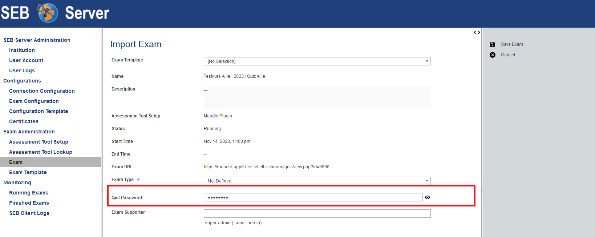
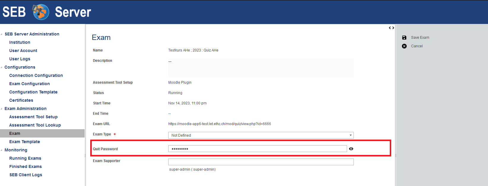

.. _sebExamQuitPassword-label:

(New) Exam Quit Password
========================

Since SEB Server Version 1.6 it is possible to set the quit-password (usually set in the Exam Configuration/SEB Settings) while
creating or importing an Exam as well as for an existing exam. This is convenient if you want to use a different quit password for each exam
and when using Exam Templates to create Exams.

The quit password within the exam corresponds with the quit-password of an applied Exam Configuration. Thies means, if you change the
password on either site, it will be reflected on the other site. And, in the case a new Exam Configuration is applied an already set
quit password in Exam will have prior order against the a quit password set in the Exam Configuration. In any case the there
is no different quit password in the Exam Configuration then in the Exam. SEB Server guarantees that the quit password is always synchronized
within the following rules:

- Exam has no Exam Configuration but defines the quit password
    - An Exam Configuration that is applied to the Exam will get the quit password from the Exam in the SEB Settings.
    - An Exam Configuration that already has a quit password set and gets applied to the Exam will also get the quit password from the Exam with notify the user about the change.
- Exam has no Exam Configuration and no quit password set
    - The Exam will get the quit password from the Exam Configuration if the Exam Configuration has defined such
- Quit Password is changed in the Exam edit view
    - On save of the exam the applied Exam Configuration also gets the new quit-password
- Quit Password is changed in the Exam Configuration SEB Settings
    - On Save / Publish of the Exam Configuration SEB Settings, an applied Exam will get the newly set quit password from the configuration

The quit password can be set on Exam creation or import:

As well as in the Exam edit view:

If the Exam was created from an LMS/Assessment Tool with SEB Server integration that allows to send the quit-password
to the LMS/Assessment Tool for display, SEB Server sends a new quit-password as on save. The LMS/Assessment Tool should
therefore also display always the actual quit password.