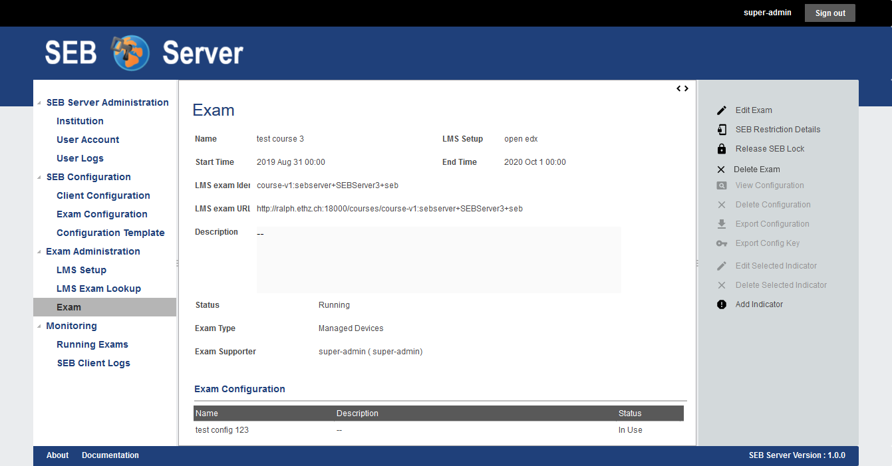
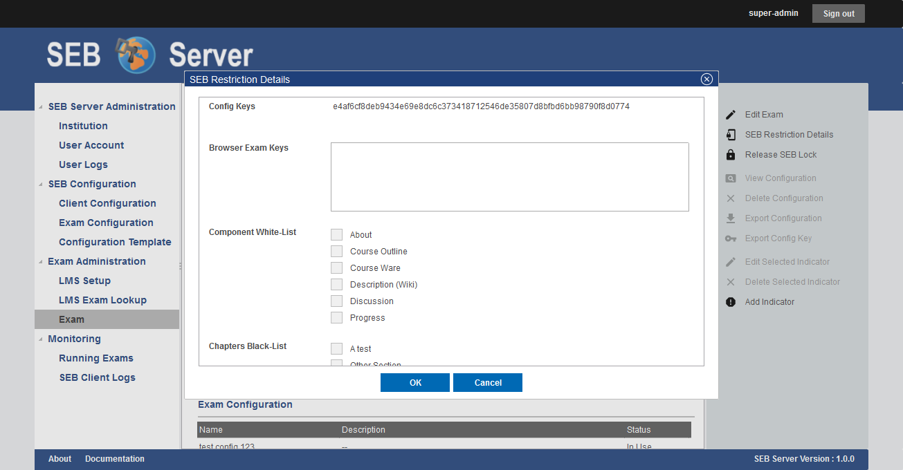

.. _seb_restriction-label:
Automated SEB Restriction
--------------------------

If the corresponding LMS of an exam supports the automated SEB restriction feature, the SEB restriction can be managed within the exam details page.
To navigate to the exam details page of an exam go to the "Exam" page under the "Exam Administration", find the specified exam in the list by using
the list filter and double click on the list entry of the exam you want to open the details page.

In the exam details page you will see two action related to the SEB restriction feature on the right action pane.

    
Use the "Apply SEB Lock" on an exam that has not already locked the course for SEB on the LMS to do apply the restriction and lock the course or quiz
for SEB access only. This will call the SEB course restriction API on the LMS and will send all information to lock the course on the LMS.
On an exam where the restriction lock is already in place, use the "Release SEB Lock" action to remove the restriction in the LMS and unlock the course.

.. note::
    If the exam is already running on import the system will automatically restrict the course on the LMS with the available restriction details.

Use the "SEB Restriction Details" action to open up a dialog to define all SEB restriction details that the LMS of the exam and its SEB course 
restriction API is supporting. There are two global restriction details that are SEB specific and should be supported by every LMS that serves 
a course restriction API for SEB. The `Config Key <https://safeexambrowser.org/developer/seb-config-key.html>`_ and the `Browser Exam Key <https://safeexambrowser.org/developer/documents/SEB-Specification-BrowserExamKey.pdf>`_.
The Config Key is automatically generated by the exam configuration that is applied to the exam. And the Browser Exam Key can be applied within a 
comma separated list if needed.

**SEB restriction on Open edX**

To be able to use the SEB restriction feature with a Open edX LMS, you need to install the `SEB Open edX plugin <https://seb-openedx.readthedocs.io/en/latest/index.html>`_
from eduNEXT. Please consult the documentation for installing the `SEB Open edX plugin <https://seb-openedx.readthedocs.io/en/latest/index.html>`_ as well as for the
use of all additional supported restriction attributes. 

.. note::
    If you change the attached exam configuration either by changing the attachment or by changing the attributes of a attached exam configuration
    for an exam that has the SEB restriction in place, the Config Key generated from the exam config that is also changing, will automatically be
    updated on the LMS. Therefore such an action that triggers an update may take some more time to complete as when the restriction is not in place. 

Use Cases
---------

**Modify SEB restriction details (Open edX)**

- Login as an exam administrator and go to the "Exam" page under the "Exam Administration" section.
- Use the filter to find the exam on that you have to change the supporter assignments. 
- Double click the list entry of the exam to go to the exam details page. Check if you are on the right exam.
- Use the "SEB Restriction Details" action from the right action pane to open the restriction details dialog.
- In the restriction details dialog you will see all supported restriction attributes and you can define the restriction for your needs.
- To apply the new restriction details use the "OK" action of the dialog or use the "Cancel" action to abort and close the dialog.
- When the SEB restriction is active on the LMS, the system will automatically update the SEB restriction with the new details on the LMS.
- If the SEB restriction is not active in this moment, the details will be saved and applied when the restriction is activated.

**Apply automated SEB restriction (Open edX)**

- Login as an exam administrator and go to the "Exam" page under the "Exam Administration" section.
- Use the filter to find the exam on that you have to change the supporter assignments. 
- Double click the list entry of the exam to go to the exam details page. Check if you are on the right exam.
- Use the "Apply SEB Lock" action from the right action pane to activate the SEB restriction lock for this course on the LMS.
- Use the "Release SEB Lock" action from the right action pane to deactivate the SEB restriction lock for this course on the LMS.

.. note::
    If a SEB restriction lock is active on the LMS, every change on the exam or related components that will affect a change on the restriction
    details will automatically be updated on the LMS. You don't have to apply the SEB restriction lock again for update. 
