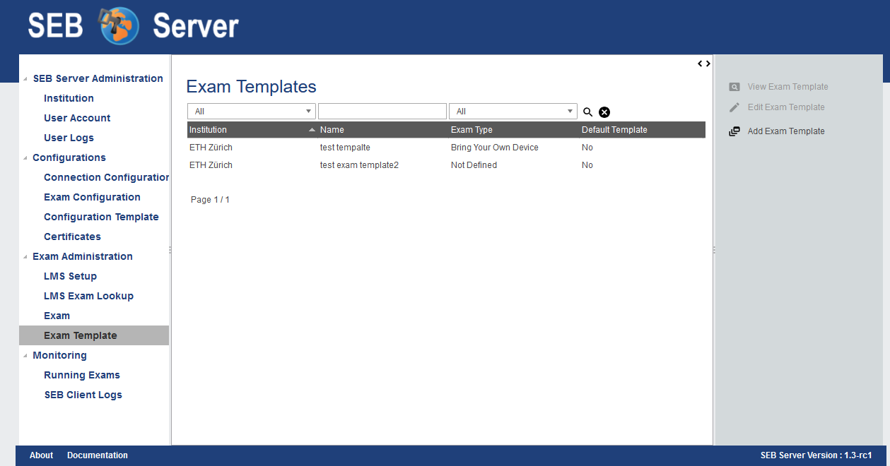
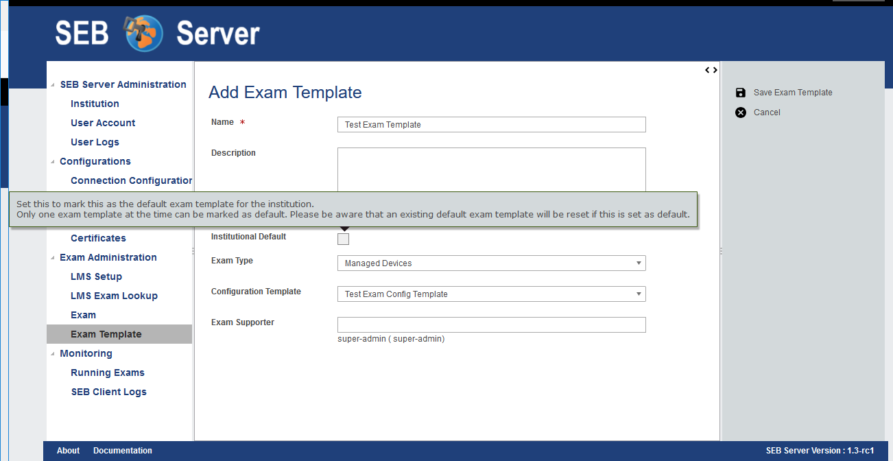
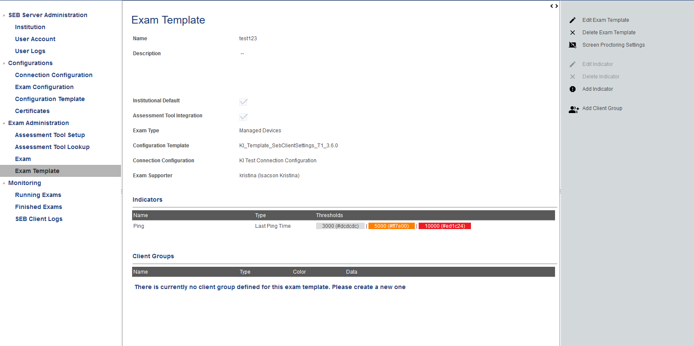
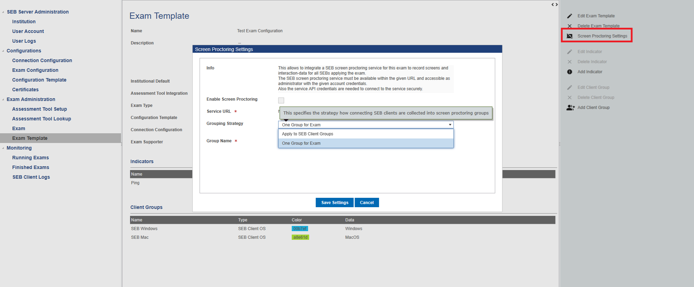
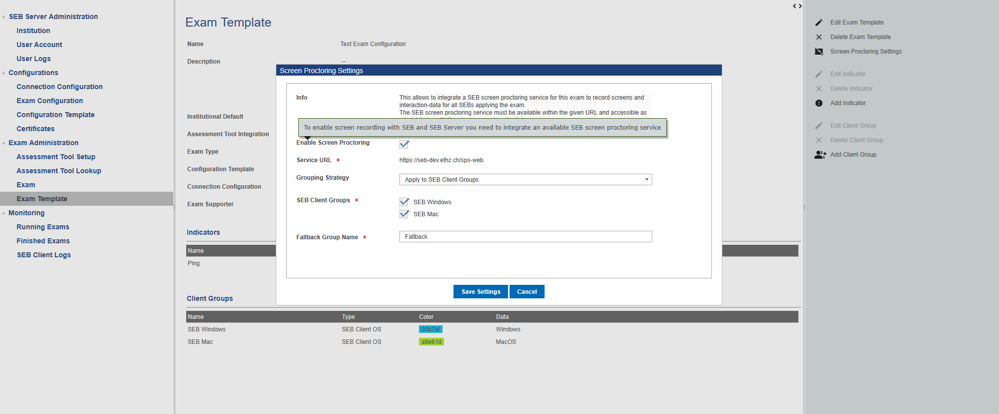
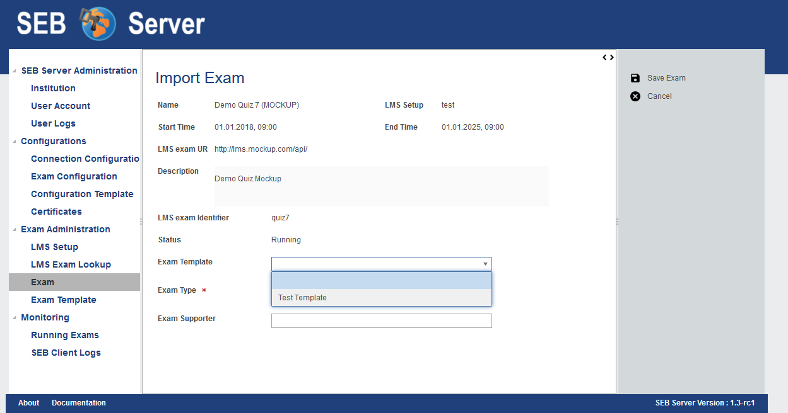

.. _exam-template-label:

Exam Template
==================

Overview
--------

Exam templates are a new, useful feature available since SEB Server version 1.3. Within exam templates it is possible to create specific named templates that can be 
used by an exam import from LMS/Assessment Tool course/quiz and define default settings and indicators that are automatically be applied on the exam import.
Furthermore, exam templates gives you the possibility to map exam configuration template to automatically create and map an exam configuration for an exam on import.
This is very convenient if you have a lot of exams to set up that all have the same or similar settings. In such a case you can create an exam template 
with all the common settings for that exams and use it on exam import.

Exam templates can be created and managed just like other SEB Server documents within its list/library. The list can be filtered by name and type of the exam template
and also shows which one is the default for the institution.

    
.. note:: 
    The "Default Template" flag indicates the one exam template that is the default template for an institution. This just means that this template
    is preselected on the exam import if it exists.

Create new Exam Template
------------------------

To create a new exam template please use the "Add Exam Template" action on the right action pane in the "Exam Template" list view.
SEB Server will then present you the exam template creation view on that some initial settings can be made.

- **Name** The name of the exam template to identify it in the list/library
- **Description** A short description ideally describing the purpose of the exam template
- **Institutional Default** This flag indicated if the exam template shall become the default exam template for the institution.
- **Exam Type** Here you can set the exam type that shall be used when an exam is imported within this template
- **Configuration Template** Select an existing exam configuration template. This template will be used to automatically create and map an exam configuration for an exam that is imported with this template
- **Exam Supporter** Add a list of available exam supporter to the template. These exam supporter will then be assigned to an exam that is imported with this template

After having done all the initial settings, the exam template can be created by saving the settings. SEB Server will then present you the exam template administration
view that looks similar to the exam administration view.

Here you can edit the settings done before by using the "Edit Exam Template" action form the right action pane.
And you can also add some additional settings like in the Exam:

Monitoring Indicators
-------

For monitoring connected SEB clients, SEB Server supports some indicators that can be defined within an Exam and Exam Template and that are shown and measured during an exam. When you define indicators for a Exam Template, they will be automatically applied to an Exam that is imported with this Exam Template. Configuring Indicators for an Exam Template is quit the same as configuring it on the Exam itself. Therefore please have a look to 
:ref:`examIndicators-label` for more information on that topic.

SEB Client Groups
-------

SEB client groups are a new feature since SEB Server 1.5 release and allows you to group SEB client connection to specified groups that are
graphically tagged in the exam monitoring view and can be shown or hided by usual filter on the exam monitoring view. All SEB Client Groups 
that are defined for an Exam Template will be applied to an Exam that is imported within this Exam Template. Configuring SEB Client Groups
for an Exam Template is quit the same as configuring it on the Exam itself. Therefore please have a look to :ref:`examClientgroups-label` for more information on that topic.

Screen Proctoring
-------

SEB Screen Proctoring is an integral component of the SEB Ecosystem, designed to monitor student screens during digital examinations. This tool captures and displays screenshots taken by SEB, ensuring a secure and controlled testing environment.

Configuring Screen Proctoring for an Exam Template is just like configuring it in the Exam itself. By using the Screen Proctoring 
configuration action in the right action pane will open the Screen Proctoring configuration pop-up where you can enable or disable 
the Screen Proctoring for Exams that will be imported with this Exam Template

Since SEB Server version 2.1 you are also able to configure Screen Proctoring groups that shall be created for Screen Proctoring on
Exam import and were connecting SEB clients are scheduled to after they have successfully connected to SEB Server. 
Currently there are two different types of possible Screen Proctoring group generation. The default "One Group for Exam" where
you only generate one Screen Proctoring group for the exam and can give them a name:

The other one is to apply the Screen Proctoring groups to existing Client Groups. When you define some Client Groups within the 
Exam Template an choose "Apply to SEB Client Groups" within the Screen Proctoring configuration pop-up, you are able to select
the needed SEB Client Groups from the list of available SEB Client Groups and additionally can gave a name für the Fallback Group
The Fallback Groups is been used to schedule connecting SEB clients to that do not belong to any of the selected SEB Client Groups

    
For more information about Screen Proctoring and how it is used within Exam Monitoring, please go to: :ref:`screenprocotring-label`

Import Exam with Template
-------------------------

Once one or more exam template exists, you are able to select one while importing an exam from the LMS/Assessment Tool in the "LMS/Assessment Tool Exam Lookup" section. Just as usual
use the "Import as Exam" action for a LMS/Assessment Tool exam that you want to import.

    
Now there is a new selector field named "Exam Template" where you can choose the exam template to use on import. When you select one the template attributes
like "Exam Type" or "Exam Supporter" are automatically applied from the template settings. You are still able to edit the settings e.g. add more or remove supporter.

If all settings are correct, use the "Save Exam" action from the right action pane to finish up the import. On this step, if the template defines some indicators,
this indicators are automatically be created and applied for the exam. The same applies to an exam configuration template that is defined by the exam template, a
new Exam Configuration is automatically created by the system from that configuration template and the new exam configuration is applied to the exam.

.. note:: 
    When an Exam Configuration is automatically be created during an exam import with template, the name for that new Exam Configuration is dynamically 
    generated with the current date and the name of the exam. Also an appropriate description for the Exam Configuration is generated. 
    It is surely possible to just change the name or description of the generated Exam Configuration afterwards.
    
After successful exam import you see the exam administration view just as usual but with auto generated configuration and indicators from the template.
After import you can modify the exam setup as usual by changing, removing or adding settings or indicators to the exam. This will not have any effect to the selected exam template
that is only used and applied within the import process at the moment. But the exam template that has been used on import is always been shown on the exam 
overview as a reference.

.. note:: 
    A Change in a template is not reflected within already existing exams that used that template on import.
    But it will affect all future exams that use this template on import.

Use Cases
---------

**Create an Exam Template for Exams of type XY**

As an Exam Administrator you want to create an exam template that can be used as template for all exams of type XY that are conducted with SEB and SEB Server within your institution.
Since all exams of type XY has the same setup and almost the same settings, the SEB Exam Configuration differ only in some settings, this would be
a of great help while shorten the setup process and reduces the work that must be done to setup such an exam of type XY later on.

- Preparation: `Create a Configuration Template <https://seb-server.readthedocs.io/en/latest/config_template.html#config-template-label>`_ that can later be used with the Exam Template.

- Sign in as an Exam Administrator and select the "Exam Template" sub-menu of the "Exam Administration" section in the left menu pane.
- Here you can see the already existing Exam Template within the usual list.
- Use the "Add Exam Template" action to create a new exam template. SEB Server will then present you template initialization form just like the one for importing an exam.
- Here you can give a common name and useful description to identify the new exam template afterwards. 
- Also select a type tag and add exam supporter to the template that will be applied to an exam that is imported with this exam later on.
- Now select the previously prepared "Configuration Template" that shall be used by this template. On import of an exam with this template, SEB Server will automatically create a Exam Configuration out of this template and assign it to the imported exam.
- After all initial settings are made correctly you can save the exam template with the "Save" action on the right action pane.
- Add additional indicators to the exam template just like you do in a usual exam administration. These indicators will be copied and applied to an exam that is imported with this template.
- You can change the initial settings any-time by edit the exam template. Use the "Edit" action form the right action pane to do so.

**Use an existing Exam Template on Exam import**

- Sign in as an Exam Administrator and select the "LMS/Assessment Tool Exam Lookup" sub-menu of the "Exam Administration" section in the left menu pane.
- Here you can see all exams form the LMS/Assessment Tool that are bound to the SEB Server. Select the specific exam that you want to import.
- Use "Import as Exam" from the right action pane to import that exam from the LMS/Assessment Tool as usual.
- In the exam import initialization step you now have a new selector to select an Exam Template that shall be applied.
- If there is a default Exam Template defined for the institution, this is pre-selected and already applied. If not you have to select the template of your choice.
- By selecting an Exam Template the template attributes are already applied and you see the respective attributes in the exam settings.
- Now you can still change the settings the shall differ to the one from the template.
- While saving the exam, the import will be finished up. SEB Server creates a new exam configuration from the defined configuration template and map it to the exam as well as applying the indicators and the rest of the settings defined within the template.

