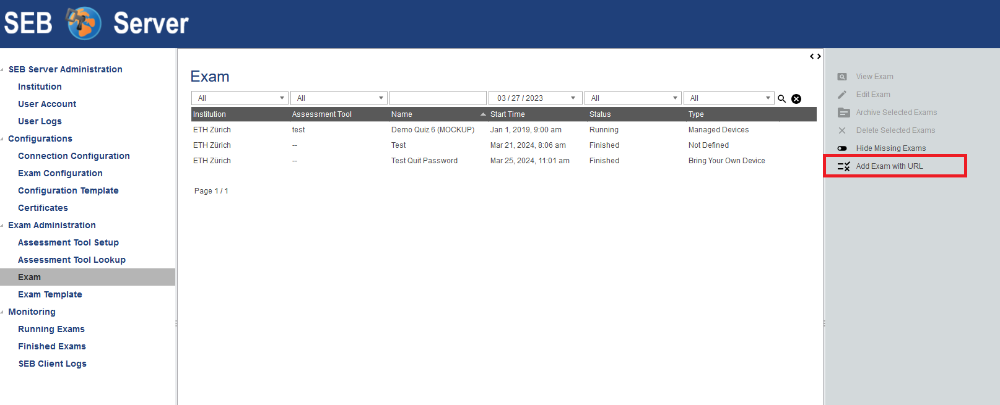
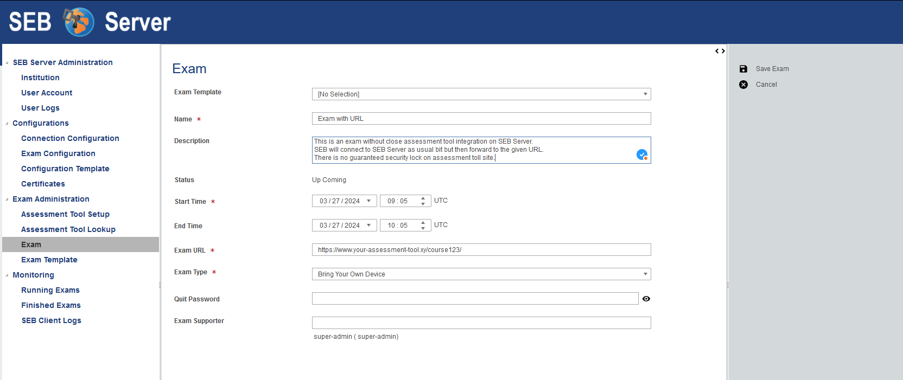
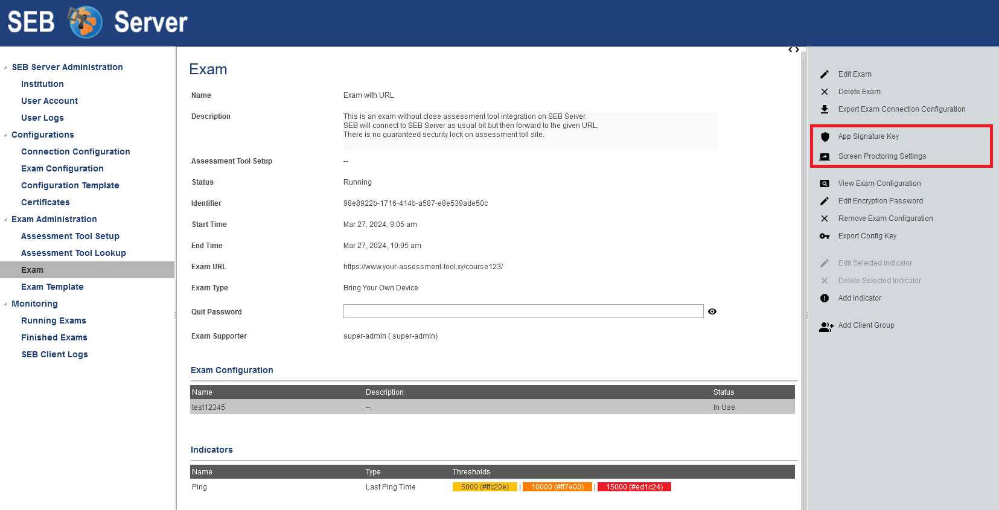

.. _sebExamWithURL-label:

Exam With URL (New)
========================

This is a new feature since SEB Server Version 1.6 and allows to create SEB Server Exams without the need of a
dedicated LMS/Assessment Tool integration but by providing an course URL, start- and end-type by its own.
SEB will then the given URL use as a start URL and just forward to the given URL page as usual. This of course has
some limitations in comparison to a Exam with LMS/Assessment Tool integration that are described at the end of
this chapter.

To create a new Exam with URL please select the Exam tab on the left menu pane and the "Add Exam with URL" Action
on the right action pane. Click on the action to open the creation view. This is the same view as on Exam import
put with some fields you have to provide instead of they coming from LMS/Assessment Tool.

You are now able to either choose an existing :ref:`exam-template-label` to initialize the new exam with the settings defined within the template
or to set the needed settings only for this exam. If you choose a template, the settings from the template will automatically be added to the exam
on creation and you are still able to modify them afterwards.

For this kind of Exam you also have to provide additional data that usually comes from LMS/Assessment Tool.

- The name of the Exam - mandatory
- A description of the Exam - optional
- The start date and time of the Exam - mandatory
- The end date and time of the Exam - optional

Initially also choose a type for the exam - "Exam Type" - that is currently only used for informational purpose and has no further restrictions or consequences on handling on in SEB Server.
Furthermore you can select and apply all exam supporter that shall be able to see and support this exam while running. To do so, click in the
input field of the attribute "Exam Supporter" to see a drop down list of all available users for selection. To filter the drop down list, start
typing characters of the name of the user-account you want to apply to automatically filter the list. Click on the drop-down list entry to select the
specified user that will be added to the list below the input field. To add another user to the selection just click again into the input field
and select another user. To remove a selected user from the selection-list, double-click on the specified entry of the selection-list.

To finally create the new Exam use the save action from the right action pane. New you are in the usual Exam view and can
go one with setting up your Exam.

If you want to edit the Exam settings please use the edit action on the right action pane. Here you can also modify
the data that usually comes from LMS/Assessment Tool. You can change name, start- and end-date directly here within
the Exam on the SEB Server.

**Restrictions**

There are a few restrictions for an Exam with URL. First of all, since there os no LMS/Assessment Tool binding available,
SEB Server cannot call an LMS/Assessment Tool and restrict access for SEB only with either Config Key or Browser Exam key.
If an LMS/Assessment Tool supports such, one is of course be able to put the Config Key from SEB Server to the LMS manually
by copy und past it.

The other restriction is about the student login name resolving that is used and shown in the monitoring view of SEB Server.
Since this login name resolving needs a LMS/Assessment Tool binding to request the students LMS account name by SEB Server
this is not possible with this setup. But SEB Server will display other information within the User Name or Session column
of the SEB Server monitoring. SEB Server will show either the client IP address or the client machine name or the client
user device login, depending on what SEB is able to sends to the SEB Server.

