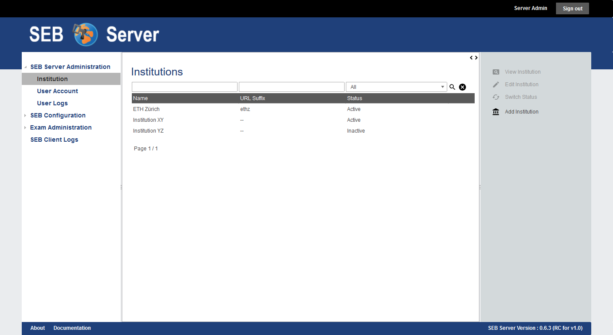
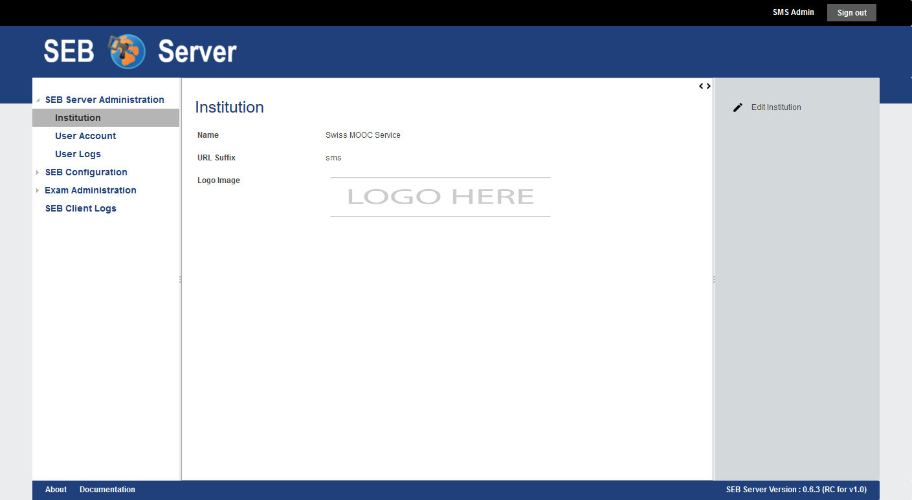
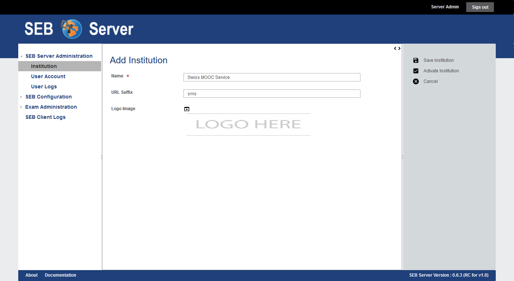

Institution
===========

Overview
---------

The institution section within SEB Server is used to support built-in multi-tenancy functionality to allow using SEB server as a 
light-weight stand-alone server but with the possibility to separate operation completely within different institutions.

.. note:: 
      If a quick use-case based reference suites you better, just forward to the "Use Cases" section of this chapter below

Only the role of SEB Server administrator and institutional administrator are able to see and use this section.
A SEB Server administrator is able to see the whole list of all existing institutions and to create new and maintain every 
institution within a SEB Server, while a institutional administrator is only able to see the belonging institution and
is able to modify this institution but not to change activity or create new institutions.

If a SEB server administrator clicks on the "Institution" section on the left hand menu, the application will show the a list
of all available institutions. The list can be filtered with the filter above and can be sorted by clicking on the column one 
would like to sort the list in. 

.. note:: 
      The possible actions are in the action pane on the right hand side and the actions
      that belongs to a list entry are only active if a list entry is selected.

Currently an institution has a name, an optional url-suffix and an optional logo upload attribute. 

- The **Name** is mandatory and must be unique within the SEB Server application.
- The **URL-Suffix** is optional and defines a suffix that can be used within the browser URL to access the SEB Server within this institution. The institution logo and theme will then be shown.
- The **Logo** upload where a image can be uploaded to be used as logo for the institution. 
  
.. note:: The logo ideally should have a dimension around 300 pixel width and 80 pixel height 
          to fit well into the logo section of the page. Currently only .png, .jpg and .jpeg image-files are supported.

As an institutional administrator only the institution one belongs to can be seen and be modified by the user.
The user will see the institution form in view mode by clicking on the "Institution" section on the left hand menu
and is able to edit the attributes of the institution like changing the name of the institution or upload a
new institutional logo. An institutional administrator is not able to activate or deactivate its own institution, 
therefore a SEB Server administrator role is needed.

Use Cases
---------

**Create a new Institution**

.. note:: To create a new institution one need a SEB Server administrator role. 

The SEB Server application is setup as a single instance but needs to support several institutions with the services that must
be completely separated from each other. It should also be possible for an institution to have a separate, single start URL to 
access the application with a web-browser and have the own logo.

- Login as a SEB Server administrator and select the "Institution" menu-item from the left hand side menu.
- A list of all existing and available institutions will be shown.
- Select "Add Institution" form the right hand side action pane to create a new institution.
- The creation form will be shown and the user is able to define a name, url-suffix and or upload a logo for the new institution.
- After giving all information, the new institution can either be saved and remains inactive until activation or can be saved and automatically be activated within the same step. Use the "Save Institution" action on the right side to just save the institution or the "Activate Institution" action the save and activate within the same step.
- In either case the form input will first be verified and if there is missing something or has wrong input, the save action will be postponed and the edit form will present the missing input within a red box and some inform text right below the input field for correction.
- If successfully saved, the application will show the form of the newly created institution in read only mode and if already activated other user, that are allowed to, can see the institution now.
  

  
  
**Change the name/logo of an existing or own Institution**

.. note:: This scenario differs in case of having a SEB Server administrator or institutional administrator role

*As SEB Server administrator*

- Login as a SEB Server administrator and select the "Institution" menu-item from the left hand side menu.
- A list of all existing and available institutions will be shown. Use the filter above to find the institution to change.
- Select the institution and use the "Edit Institution" action on the right side action pane to open the institution in edit mode.
- To upload a new logo, click on the upload-icon just beside the logo input field. The application will show a file-picker dialog. Use the file-picker dialog to search and select the logo file. Use the "Upload" action-button to upload the selected file. The selected logo should appear as an image within the image upload input field of the institution form.
- Apply the changes and save the institution. If all given information is correct and nothing is missing, the application will. show the changed institution form in read only mode.
  
*As an institutional administrator*

- Login as an institutional administrator and select the "Institution" menu-item from the left hand side menu.
- The form of the own institution is shown in read-only mode. Use the "Edit Institution" action from the action pane.
- The form of the own institution is now shown in the edit mode and the name or logo of the institution can be modified.
- To upload a new logo, click on the upload-icon just beside the logo input field. The application will show a file-picker dialog. Use the file-picker dialog to search and select the logo file. Use the "Upload" action-button to upload the selected file. The selected logo should appear as an image within the image upload input field of the institution form.
- Apply the changes and save the institution. If all given information is correct and nothing is missing, the application will show the changed institution form in read only mode.
  

  
  
**Activate / Deactivate an existing institution**
  
An institution is shown to other users and ready for applying user-accounts and other entities only if it is active. An inactive
institution can only be seen by a institutional administrator of this institution or by a SEB Server administrator that are able to 
see all institutions.

To activate an institution for the first Time one can either use the "Activate Institution" action form the action pane on the right side
within the read only mode of the institution form or with the same action on the edit mode while also saving the applied modifications of
the form. 

To deactivate an institution one can use the "Deactivate Institution" action form the action pane on the right side.
When an institution is been deactivated, also all existing and active entities that belongs to this institution are deactivated too.
This affects user-accounts, configurations and LMS Setups. On deactivation action, the application will search the affected entities
and will inform the administrator about the number of the affected entities and asks for confirmation.
After Confirm the deactivation the institution and all affected entities will be deactivated. This means also the user-accounts that has
not a institutional role or the SEB Server administration role, will not be able to login anymore.

