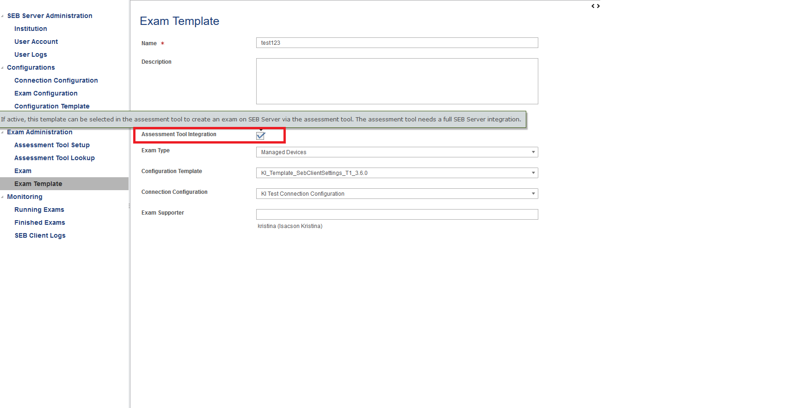

SEB Server Moodle Integration
===============================

SEB Server has two different Moodle integration methods or features. One for bare Moodle without any additional Plugin
installed and one for Moodle instances that has the SEB Server Moodle Plugin installed.

For more information about the Moodle standard Rest API, please also have a look at: `Moodle REST API <https://docs.moodle.org/dev/Web_service_API_functions>`_

Moodle without SEB Server Plugin
---------------------------------

Without any plugin, Moodle supports the following standard integration features:

- Course Access
- SEB Course Restriction

.. note:: 
    If you want to use Moodle with SEB Server, we recommend to install the new Moodle Plugin for SEB Server for better integration with Moodle.
    This plugin comes with the common SEB Server integration features and improved Moodle binding. For more information see the section below.
    
** Moodle Client API Account**

To be able to create an Assessment Tool Setup for Moodle you need a Moodle API client account. You can then use this account in the Assessment Tool Setup to connect to the Assessment Tool.

Since SEB Server uses some functions from the Moodle's mobile API, you have to make sure the web services for mobile apps are enabled within your Moodle setup.
To do so please login to Moodle with an administrator account and go to "Side Administration", scroll down to "Mobile App" and choose "Mobile Settings.

.. image:: images/lmssetup/moodle_mobile.png
    :align: center
    :target: https://raw.githubusercontent.com/SafeExamBrowser/seb-server/dev-2.0/docs/images/lmssetup/moodle_mobile.png
    
If you have a restrictive Moodle setup and troubles with the Moodle API account to use with SEB Server, please try to import the following 
Moodle role profile within your Moodle instance. This profile will create a SEB Server role within Moodle that can be used to apply to an 
API account to be used with SEB Server. The role defines only the necessary privileges and functions needed for SEB Server communication.

Moodle role and account settings: :download:`XML <files/webservice_seb-server.xml>`

Moodle with new SEB Server Plugin 2.0
--------------------------------------

For SEB Server version 2.0 there is also a new version of the Moodle SEB Server Plugin 2.0 that can be installed on Moodle
and has many new features to integrate even more with SEB Server as the existing version 1.0.the

.. note:: 
    We strongly recommend to update to the newest Moodle SEB Server Plugin version 2.0 for SEB Server version 2.0. The older
    plugin version 1.0 might still work as expected but we cannot guarantee that and also version 1.0 will not be supported
    anymore. If you still have the old version of Moodle SEB Server Plugin 1.0 installed, SEB Server would recognize this and
    inform you about this when testing or creating a new Assessment Tool Setup for Moodle with Plugin. 
    
    We also recommend to make a transition from existing Assessment Tool Setups with old Plugin to new Assessment Tool Setup with new Moodle Plugin.
    This would mean that you delete all existing Assessment Tool Setups with Moodle (after archived your Exams you want to hold on SEB Server).
    And after deletion of old Assessment Tools Setup with Moodle Plugin, install the new Moodle Plugin on Moodle site and setup
    the Assessment Tool Setup for it in SEB Server.

The SEB Server Moodle Plugin 2.0 still supports the usual functionality:

- Course Access
- SEB Course Restriction
- Login Name Resolving

Additionally the full Moodle integration also comes with the following new features:

- SEB Server Admin can prepare Exam Template that can be used by Moodle Teacher Account to import Exams from Moodle site
- Moodle Teacher Account can automatically import an Exam on SEB Server from Moodle without having to go the SEB Server
- Moodle Teacher Account can automatically login to SEB Server Monitoring for a running quiz from Moodle site
- Moodle Teacher Account can also monitor the screen proctoring of a running quiz if available

To create or get a proper Moodle API Client account that is needed to connect SEB Server to Moodle, please have a look
at the above chapter ** Moodle Client API Account**

.. note:: 
    One important change with Moodle SEB Server Plugin 2.0 comes with the fact that for this version it is only possible 
    to bind a Moodle instance to one SEB Server instance. It is not possible anymore to bind to the same Moodle from 
    different SEB Server instances or to bind the same Moodle instance twice for a singe SEB Server instance. This is due
    to the full integration of SEB Server to Moodle and that Moodle can operate on a bound SEB Server.
    
For more information about the SEB Server Moodle Plugin and installation, please visit the following sites:

   - `Documentation <https://github.com/ethz-let/moodle-quizaccess_sebserver>`_
   - `Repository <https://github.com/ethz-let/moodle-quizaccess_sebserver>`_

**Usage of new SEB Server Moodle integration features**

After you have successfully applied a Assessment Tool Setup for Moodle with Plugin 2.0, you can now use the new integration 
features among the other usual features like Course Access, SEB Client Restriction and Login Name Resolving.Plugin

A SEB Server Exam Admin can now create and mark Exam Templates that are then recognized by Moodle for later selection.
So a Exam Administrator is able to create a set of Exam Templates that then will be able to choose from a Moodle Teacher
when he/she sets up a quiz in Moodle. The following images shows the setting that indicated a Exam Template for use with
Moodle integration: 

On the Moodle site, a Teacher can then create a new quiz within a course:

    
An within the quiz settings a Moodle Teacher should see a new settings sections "SEB Server" among with the already known 
"Safe Exam Browser" section:

    
If a Moodle Teacher wants to setup an Exam with SEB Server for the quiz, he/she can now activate SEB Server integration 
for that quiz by selecting "yes" for "Enable SEB Server". The "Safe Exam Browser" section will then automatically switch 
to the right settings to use with SEB Server.with

    
Now the Moodle Teacher can select from the available Exam Templates that has been prepared and marked for Assessment Tool
use on SEB Server site. The Moodle Teacher can also enable a SEB quit button or quit-link and set a SEB quit password for the Exam.

After saving all the settings, this might take a while, Moodle automatically imports the Exam for the quiz within SEB Server
and applies all the presetting from the selected Exam Template. When the Exam is running also the SEB Client Restriction 
is automatically set on the Exam. If the Exam is not running yet, the SEB Client Restriction will be set from SEB Server 
as soon as the Exam becomes running.

After all this has successfully been created and applied, the Moodle Teacher can go to the quit preview and sees the following
features:

    
In the students view, the student will only see the two buttons: 

- Start Safe Exam Browser: This installs and starts the SEB Client for the student
- Download SEB Server configuration file: This will download the SEB Server configuration file and start it with SEB

Only the Moodle Teacher is able to see the third button:

- SEB Server monitoring: This opens up an autologin for the Teacher to SEB ServerMonitoring within a new browser tab.student
SEB Server therefore creates an ad-hoc teacher role account on SEB Server site for this teacher. The Teacher is able to see
the monitoring if its exams as well as screen proctoring monitoring and search for all the exams he/she has created from 
Moodle site.

An already imported Exam can also be deleted either from the SEB Server side or from the Moodle side. On the SEB Server
site, a Exam Administrator can just delete the Exam as usual and SEB Server would reset all the integration settings 
in Moodle for the respective quiz.

While on the Moodle side, a Moodle Teacher can disable SEB Server for a particular quiz and Moodle will trigger a deletion
of the Exam on SEB Server and also reset all SEB Server settings on Moodle side.

