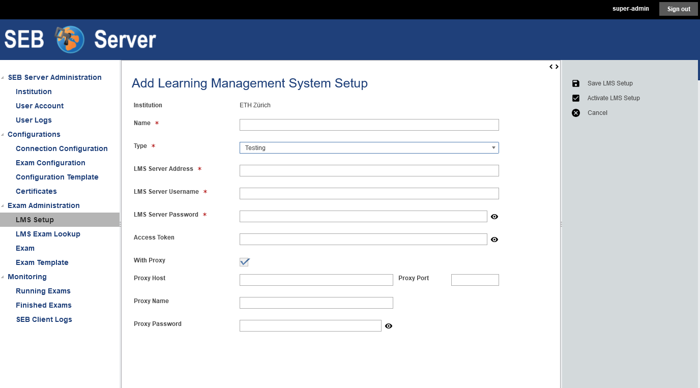
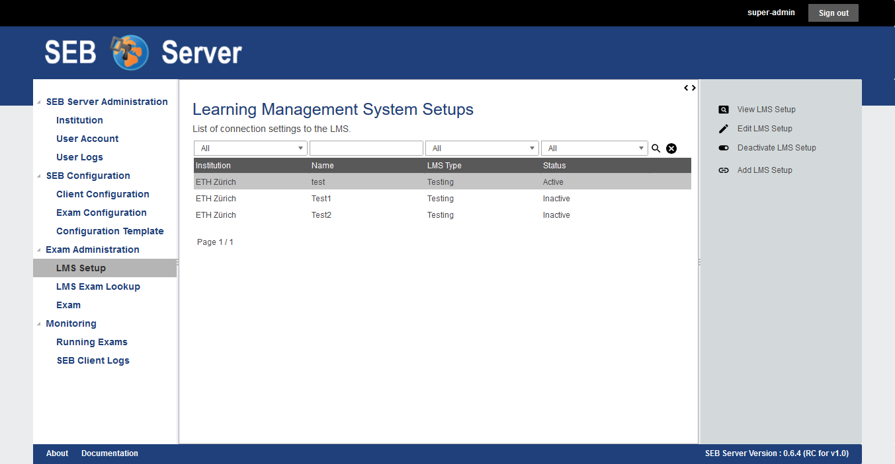
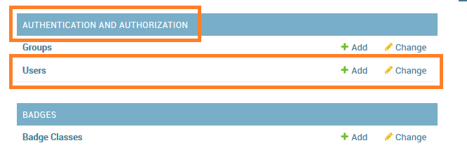
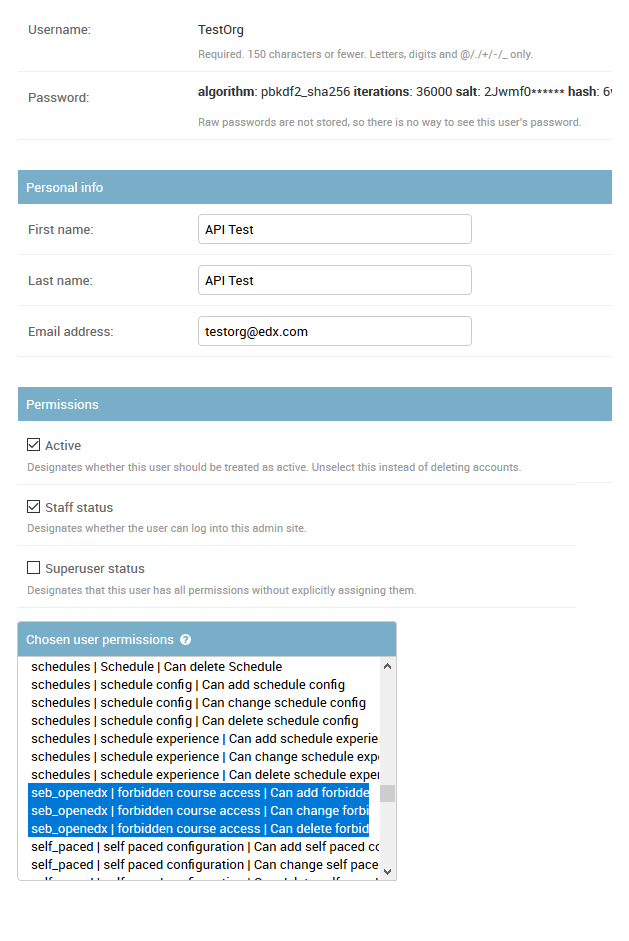
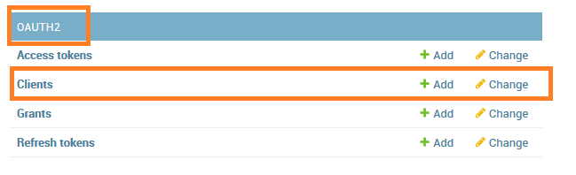
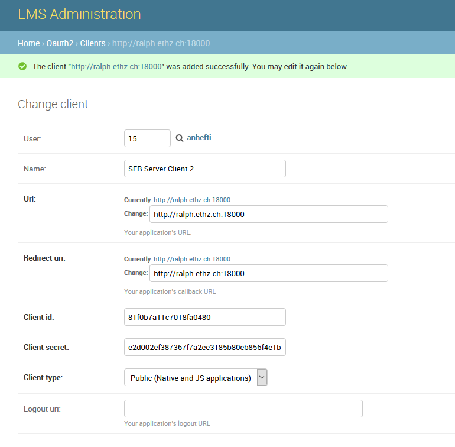
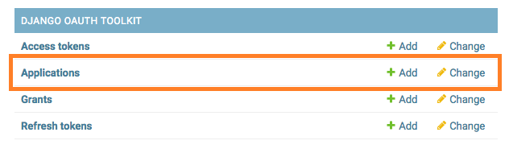
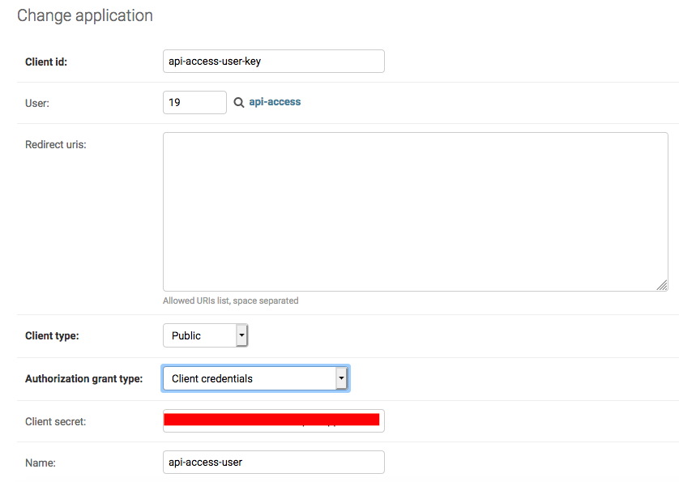
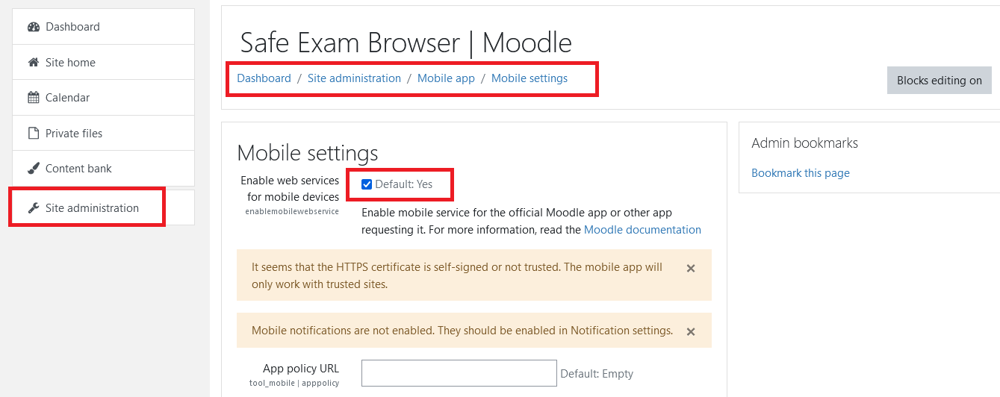

.. _lms-setup-label:

Learning Management System Setup
================================

Overview
--------

To be able to connect to a learning management system (LMS), to view and manage the courses provided by a LMS is an essential feature of the SEB Server.
To setup an exam or e-assessment for SEB on SEB Server that is based on a course from a LMS, we have to make a binding to the course on the LMS.
This is also used to always get the actual course data from LMS like start- end-time, name and others. 
Another feature of SEB Server that needs a LMS communication is the SEB restriction. A SEB restriction will restrict course access on the LMS only 
for connection with Safe Exam Browser and will also check if a Safe Exam Browser of trust is used and the right configuration is used by the
Safe Exam Browser that was defines for the exam on the SEB Server.

**Course API** 

This API, provided by the LMS, is used by the SEB Server to query the available courses and the needed data for each course. This API
is needed to be able to import a course from the LMS as an exam into SEB Server and configure the course as an e-assessment with SEB.
Usually this API comes as a REST or SOAP API with the core LMS implementation or a plugin.

SEB Server supports this course API's so far:
 - Open edX: The standard system `Open edX REST API <https://courses.edx.org/api-docs/>`_. The SEB Server uses the "courses" endpoints to get course data.
 - Moodle (Course Access): The standard system `Moodle REST API <https://docs.moodle.org/dev/Web_service_API_functions>`_. The SEB Server uses the standard Moodle rest endpoints to get course data. 
   Please note that a second Moodle integration part for SEB access restriction with Config-Key will follow together with a Moodle plugin in a future version of SEB Server  

**SEB Restriction API** 

If the automated SEB restriction functionality is available for a LMS depends on the following requirements:

- There must exist a SEB integration plugin that offers an API to put and pull SEB restrictions in the form of Config-Keys and/or Browser-Exam-Keys
  To the LMS and a specific course on the LMS to restrict the access. Such a plugin may also offer additional restriction features like restricting
  on course section or course components or only for specified user roles.
- The SEB integration plugin must be installed on the LMS that is used by the SEB Server.

For more information about known SEB integration plugins that are supported by the SEB Server see :ref:`lms-setup-rest-plugin-label`

Regardless if a supported LMS is missing the SEB integration plugin installation, the LMS can be used with the Course API and an exam
setup will be possible but without automated SEB restriction feature.

To be able to connect to an LMS from SEB Server, we need to create an API access account on the LMS side that can be used by the SEB Server to 
access the API of the LMS. How to do this for the different supported types of LMS see :ref:`lms-api-account-label`.
After such an account was created, the account credentials, username and password, can be used by the SEB Server to connect to the LMS.
Therefore we need to create a LMS Setup on the SEB Server.

    
A SEB Server administrator role will be able to see the institution to which the LMS Setup belongs to while an institutional administrator
is only able to see and create LMS Setup for its own institution. The name of the LMS Setup should be unique and is to identify a LMS
SEB Server internally. Use the **"Type"** selector to specify the type of the LMS to bind to the SEB Server within the LMS Setup. Currently supported are:

- **Testing**: This is for testing purposes only and can be used to mock a LMS to test exam settings. This type provides some mock-up courses within the 
  LMS API of the SEB Server that can be seen in the LMS Exam Lookup once the LMS text setup is active. This mock-up courses can be imported and configured
  as exams like they would exist. But note the a SEB client that is trying to connect to such a course would not be able to connect to the LMS since it
  is not existing. But a SEB client is able to download the defined exam configuration for testing.
- **Open edX**: This type is to bind an existing `Open edX <https://open.edx.org/>`_ LMS system that is available on the Internet or intranet. The SEB
  Server tries to make use of the above described API's of the Open edX system. 

    .. note:: 
      If you want to use the automated SEB restriction feature too, the `Open edX SEB Plugin <https://seb-server.readthedocs.io/en/latest/lmssetup.html#lms-setup-rest-plugin-label>`_ must be installed properly on the LMS.
  
- **Moodle**: This type is to bind an existing `Moodle <https://moodle.org//>`_ LMS system that is available on the Internet or intranet. The SEB
  Server tries to make use of the described API's of the Moodle system but there is currently no SEB restriction plugin available that works
  with SEB Server. Note that Moodle integration is implemented partially within SEB Server version 1.1.x. Only the course access feature is implemented and the course restriction feature will come with a future SEB Server release

- **Moodle with SEB Server Plugin**: The `SEB Server Plugin for Moodle <https://github.com/ethz-let/moodle-quizzaccess_sebserver>`_ is new and supported by SEB Server since version 1.5.
  With this plugin installed on Moodle side, SEB Server is able to more efficiently communicate with Moodle to fetch course data as well as restricting the quiz on Moodle side 
  For SEB only access, using a auto-generated Browser Exam Key (BEK) for SEB restriction. Also the Moodle user name resolving for SEB Server monitoring is less error prone especially
  if Single Sign On some kind of login provider for Moodle is involved. Furthermore the new SEB Server Plugin for Moodle will be constantly extended and improved with new features in the future.

- **Ans Delft**: This type is to bind SEB Server with an `Ans Delft <https://ans.app/>`_ LMS. With the API credentials from an Ans Delft instance, SEB Server is able
  to connect to the Ans LMS and provide the common features for Course-Access, SEB Restriction and LMS User Session resolving.
  
- **Open Olat**: This type is to bind SEB Server with an `Open Olat <https://www.openolat.com/>`_ LMS. With the API credentials from an Open Olat instance, SEB Server is able
  to connect to the Olat LMS and provide the common features for Course-Access, SEB Restriction and LMS User Session resolving. For more information please contact the Olat Development-Team at `OpenOLAT UZH <https://www.zi.uzh.ch/en/teaching-and-research/software-elearning/olat.html>`_

The **"LMS Server Address"** is the root URL to connect to the LMS server with HTTP over the Internet or intranet. This is usually the URL that is 
also used with the Browser to connect to the main page of the LMS system. And additionally the credentials that have been created with the creation of the :ref:`lms-api-account-label` has to be set in the LMS Setup the make the SEB Server
able to securely connect to the LMS. The API credentials that consists of a client-name and a client-secret must be used with the **"LMS Server Username"** 
and the **"LMS Server Password"** fields of the LMS Setup form on SEB Server.

Alternatively to **"LMS Server Username"** and **"LMS Server Password"** you can use a direct **Access Token** to connect to the LMS API if the respective LMS allows to
generate and use an access token directly.

If the SEB Server running behind a proxy server or a firewall between SEB Server den LMS, the additional proxy settings can be used to setup the proxy-connection.

.. note:: 
    To Setup a Test LMS Setup (of type "Test") only a correct URL pattern must be set like "http://test" for example. And API credentials can be anything but must be set.

After all the settings for a LMS Setup have been set, one can use either the "Save LMS Setup" action to save the LMS Setup without activation or the 
"Activate LMS Setup" action to also activate the settings right after they has been successfully saved. Anyway, for both action there is an initial test
that, additionally to the usual field validation that takes place first, tries to connect to the LMS with the given API details. If the connection 
wasn't successful, the SEB Server will inform the user about a possible reason of failure. Otherwise SEB Server shows a success message and the created
LMS Setup can be used. 

Use the "Activate / Deactivate LMS Setup" action to activate an inactive LMS Setup or the deactivate an active LMS Setup. 

.. note:: 
    On deactivation of an LMS Setup, the system checks on depending object and will show a confirmation to the user asking that all depending 
    objects will also been deactivated. Depending objects of an LMS Setup are exams that has been imported from the specified LMS Setup in the past.

Use Cases
---------

**Create a new LMS Setup for Open edX**

A new Open edX system has been installed within your institution and to be able to use the system also for e-assessments with SEB and SEB Server,
you have to bind the LMS to the SEB Server. 

- If not already done, install the `Open edX SEB Plugin <https://seb-server.readthedocs.io/en/latest/lmssetup.html#lms-setup-rest-plugin-label>`_  on the Open edX system first.
- If you don't already have an API access account on Open edX side, `create one <https://seb-server.readthedocs.io/en/latest/lmssetup.html#lms-api-account-edx-label>`_
- Sign into SEB Server with your institutional administrator role account.
- Navigate to "Exam Administration" / "LMS Setup" within the navigation on the left hand side.
- Use the "Add LMS Setup" action from the right action pane to open a LMS Setup creation form.
- Give a unique name to the new LMS Setup for internally identification.
- Set the main URL that points to the new LMS system. This is usually the URL that is also used with the Browser to connect to the main page of the LMS system
- Set the API credentials that has been creates within step two (client-id, secret).
- Use the "Activate LMS Setup" action on the right action pane to test, save and activate the new LMS Setup within one step.

.. note:: 
    If some form attributes are missing or not correct, the SEB Server system will respond with the usual form validation errors.
    If the connection to the LMS is failing because of missing or wrong credentials or for any other reason the system is not able to connect to the LMS
    the SEB Server will notify an error dialog to the user.

**Change API Credentials of an Active LMS Setup**

The API access account on the LMS has been expired and you have to create a new one or update the old one which both result in new API access credentials
that has to be set on the existing LMS Setup on the SEB Server.

- Sign into SEB Server with your institutional administrator role account.
- Navigate to "Exam Administration" / "LMS Setup" within the navigation on the left hand side.
- Use the Filter above the list to find the specified LMS Setup.
- Select the LMS Setup from the list and use the "Edit LMS Setup" action from the right action pane to open the LMS Setup in edit mode.
- Set the new credentials and make sure, the LMS Setup is still active. 
- Use the "Save LMS Setup" action form the right action pane to save the changes and test the connection.

.. note:: 
    If some form attributes are missing or not correct, the SEB Server system will respond with the usual form validation errors.
    If the connection to the LMS is failing because of missing or wrong credentials or for any other reason the system is not able to connect to the LMS
    the SEB Server will notify an error dialog to the user.

**Deactivate LMS Setup**

A LMS system that was running on your campus to provide e-assessment with SEB and SEB Server has been shut down and you need to also deactivate
the setup and exams on the SEB Server for this LMS.

- Sign into SEB Server with your institutional administrator role account.
- Navigate to "Exam Administration" / "LMS Setup" within the navigation on the left hand side.
- Use the Filter above the list to find the specified LMS Setup.
- Select the specified LMS Setup from the list and use the "Deactivate LMS Setup" action from the right action pane.
- Alternatively you can also double-click on the LMS Setup to fist go into the detailed view of the LMS setup and use the "Deactivate LMS Setup" action there. 
- The system informs you about the number of depending exams that also will be deactivated within the deactivation of the LMS Setup.
- Confirm the deactivation and notify that the LMS Setup now is listed as "Inactive" in the list.
- Navigate to "LMS Exam Lookup" to make sure the courses form the deactivated LMS Setup are not available anymore.
- Navigate also to "Exam" and make sure that all previously imported exams from the deactivated LMS Setup are not available anymore.

.. _lms-api-account-label:

API Access Account on LMS
--------------------------

.. _lms-api-account-edx-label:

**Create Open edX API Access Account**

To be able to create an API access-account on Open edX you need a user-account with staff and administration privileges.

**For Open edX Hawthorn and Ironwood versions following the steps below::**

- Login to Open edX LMS Administration with an appropriate user-account that has administration rights. And find the Users section:

    
- Create a new User-Account that acts as an API account. The account must at least have the permissions to query the course API of Open edX and to access the seb_openedx plugin permission.
- Make sure that "Staff" status is checked for the account.

    
- Back in the administration homepage, find the OAUT2 - Client section and create a new API Client Access for the given User-Account. The Client id and Client secret are automatically generated by Open edx.

    

Once the client registration was successful the client id and client secret can be used within the SEB Server to access the course- and SEB-restriction API of Open edX as described in the next step section

.. note:: 
    Since Open edX Juniper is using Django Oauth Toolkit instead of Django Oauth Provider the last step in the above guide looks slightly different. Please see below the last step for setting up on an Open edX Juniper version.
    
- Back in the administration homepage, find the DJANGO OAUTH TOOLKIT - Applications section and create a new API Application Access for the given User-Account. The Client id can be defined and the Client secret is automatically be generated by Open edx.

    

    
    
    
**Create Moodle API Access Account**

To be able to create an LMS Setup for Moodle you need a Moodle administrator or manager account. You can then use this account in the LMS Setup to connect to the LMS.

Since SEB Server uses some functions from the Moodle's mobile API, you have to make sure the web services for mobile apps are enabled within your Moodle setup.
To do so please login to Moodle with an administrator account and go to "Side Administration", scroll down to "Mobile App" and choose "Mobile Settings.

    
If you have a restrictive Moodle setup and troubles with the Moodle API account to use with SEB Server, please try to import the following 
Moodle role profile within your Moodle instance. This profile will create a SEB Server role within Moodle that can be used to apply to an 
API account to be used with SEB Server. The role defines only the necessary privileges and functions needed for SEB Server communication.

Moodle role and account settings: :download:`XML <files/webservice_seb-server.xml>`

.. note:: 
    If you want to use Moodle with SEB Server, we recomend to install the new Moodle Plugin for SEB Server for better integration with Moodle.
    This plugin comes with the common SEB Server integration features and improved Moodle bining. For more information see :ref:`lms-setup-moodle-plugin-label`

.. _lms-setup-rest-plugin-label:

Install SEB restriction API plugin
----------------------------------

.. _lms-setup-edx-plugin-label:

**Open edX SEB Plugin**

    There is a SEB integration plugin developed and supported by `eduNEXT <https://www.edunext.co/>`_. 
     - `Documentation <https://seb-openedx.readthedocs.io/en/latest/>`_
     - `Repository <https://github.com/eduNEXT/seb-openedx>`_

.. _lms-setup-moodle-plugin-label:

**Moodle Plugin for SEB Server**

    There is a new SEB Server integration plugin for Moodle available since SEB Server 1.5 that can be used with the LMS Setup type Moodle with SEB Server Plugin.
    This Plugin supports and improves all common SEB Server LMS binding features such as Course-Access, SEB Restriction and LMS Session Name Resolving. 
    It is also planed to extend and improve this plugin with new Moodle specific feature for further releases of SEB Server.
     - `Documentation <https://github.com/ethz-let/moodle-quizzaccess_sebserver>`_
     - `Repository <https://github.com/ethz-let/moodle-quizzaccess_sebserver>`_

