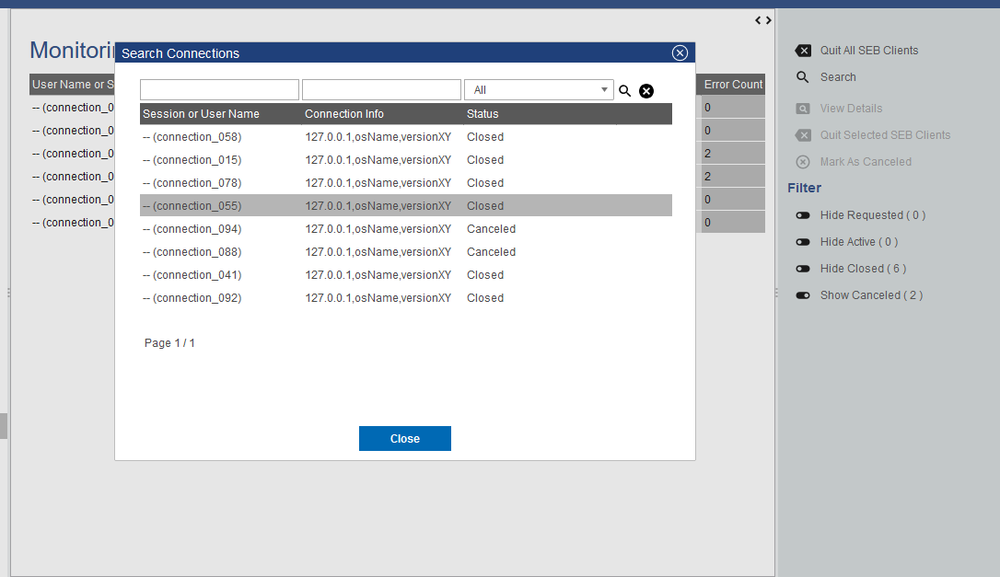
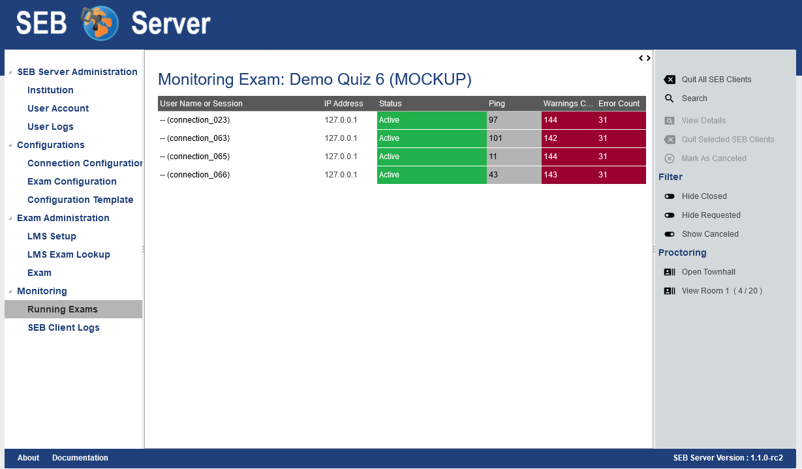
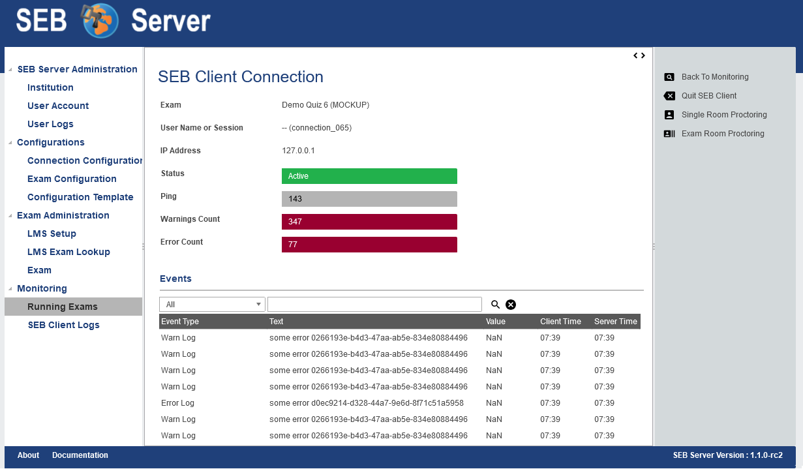
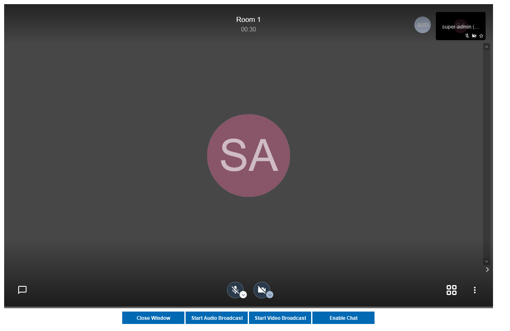

Exam Monitoring
===============

A key feature of the SEB Server is the ability to overview and monitor SEB clients that are connected to the SEB Server and participate in a running exam.
It is also possible to interact with individual SEB clients that are connected and send them instructions, e.g.: to quit and reload for example.
But the main focus lies on monitoring and the SEB Server don't take automated actions but always only shows incidents as they are defined by
indicators to a exam supporter. A exam supporter then can take action.

As an exam supporter you see all running exams where you have been assigned to by an exam administrator in a list. 

.. image:: images/monitoring/runningExams.png
    :align: center
    :target: https://raw.githubusercontent.com/SafeExamBrowser/seb-server/master/docs/images/monitoring/runningExams.png
    
To navigate to this list click on the "Running Exams" menu within the "Monitoring" category. And you will see the list with the name of the
exam, the type and start- and end-time of the exam. If the exam you looking for is not on the list, please check the start-time filter 
and make sure that it is set before the start-time of the exam. If not, use the filter to set the date before the exams start-date and
use the lens-symbol on the right to apply the new filter. If the exam you are looking for is still not on the list, please contact a 
exam administrator of your institution to get help and check if you are correctly assigned to the exam as an exam supporter.

To monitor an exam either double-click on the list entry of the exam or select the list entry and use the "Monitoring" action form the
right action pane to navigate into the main page of exam monitoring.

On the the main page of exam monitoring you find a heat-map list of all SEB client connections that are connected to the exam since the
exam is running. There are state filter switches on the right action pane that allows to show/hide SEB client connection of specified states.
As default you should see at least all active connections instantly.

.. image:: images/monitoring/examMonitoring.png
    :align: center
    :target: https://raw.githubusercontent.com/SafeExamBrowser/seb-server/master/docs/images/monitoring/examMonitoring.png
    
The list is automatically sorted in the way that SEB connections with incidents came to the top of the list and are then sorted by the 
"User Name or Session" identifier criteria. The general SEB client connection attributes are:

- **User Name or Session** The user account or user session identifier sent by the LMS to the SEB client and from SEB client to the SEB Server. This identifier may vary depending on the LMS that is involved. For Open edX it is the user account identifier (username). 
- **Connection Info** The IP address of the device the connected SEB client is running plus some additional information about the operating system and the SEB version.
- **Status** The status of the SEB client connection.

The following SEB connection states are defined:

- **Connection Requested** This state appears from when a SEB client contacted to SEB Server the first time until the SEB client has finished up the hand-shake protocol with the SEB Server and the student has logged into the LMS.
- **Active** This state appears after successful hand-shake and login into LMS and stays as long as the SEB connection is available and not closed or terminated
- **Missing** This state appears when a SEB connection is currently in active state but has missing ping (last ping last longer then the highest ping threshold of the ping indicator).
- **Closed** This state marks a closed SEB connection that was once active.
- **Canceled** This state marks a SEB connection that has been canceled.

This general connection attributes are followed by the indicator attributes of all indicator defined by the exam. The column name of an indicator is
the name of the indicator defined in the exam. The cell shows the measured value of the indicator for each SEB client connection and
the cell is tinted in the color of the reached threshold also defined for each indicator on the exam administration.

**Search**

Since the monitoring heat-map list is automatically sorted and cannot be filtered except on connection status, there is a search feature to find a
particular connection or a set of connections. To search connection on a running exam, please use the "Search" action from the right action pane.
A search pop-pup will appear with all connection is a usual list with the possibility to filter and sort the entires.
Double-click on an entry to go to the detail view of the specified SEB client connection.

    

**Instructions**

Instructions are actions applied to one or more SEB client connections that also can apply a signal to a active SEB Client connection to
instruct the SEB client to do a particular action on client side. In the monitoring view you can select one ore more list entries
with usual list (multi)selection by holding Ctrl or Shift key plus right mouse click(s). Currently there are two instructions.

- **Quit SEB Client** Sends a quit instruction to the SEB Client to quit the session. This can be applied to all active SEB client connection with the "Quit all SEB Clients" action from the right action pane or to all selected SEB client connections with the "Quit Selected SEB Clients" action. 
- **Mark As Canceled** Can be applied to all inactive SEB client connections to enforce the inactive SEB client connection to "Canceled" state. This can be used to mark and remove inactive SEB client connection you don't want to have on the main monitoring board anymore when the filter for canceled SEB client connections is set to hide.

**Filter**

There are connection state filter to hide/show SEB client connection in particular states. These are located in the right action pane hand has the name of the
filter action that will be performed on click (hide/show) and the name of the affected connection status. With this actions you are able to toggle between
hide and show SEB client connection of a particular state.

- **Show/Hide Requested** Use this to show or hide all SEB client connections that are currently in the "Requested" state and are not responding anymore.
- **Show/Hide Active** Use this to hide SEB client connections in active state that has no incident and are not missing. If this filter is enabled and an active SEB connection gets an incident or is marked as missing it suddenly appears in the list. So no incidences are accidentally hidden. This feature is best used for exams with a lot of participants to keep a good overview.
- **Show/Hide Closed** Use this to show or hide all SEB client connections that are currently in the "Closed" state.
- **Show/Hide Canceled** Use this to show or hide all SEB client connections that are currently in the "Canceled" state.

Since SEB Server version 1.3 each filter also shows the current number of connection in the particular state. Now one has an overview of how many connections 
are there for an exam and in witch state.

.. note::
    When a certain state filter is set to hide and a particular SEB client connection switches into that state, it will automatically disappear from the list.

Detailed View
-------------

To view more details of a particular SEB client connection either select the SEB client connection entry from the list and use the "View Details" action
from the right action pane or just double-click the SEB client connection entry from the list. In the details view you also see all the attributes
in a form and additional a list of all events and logs the SEB client has sent to the SEB Server for this session so far. 

.. image:: images/monitoring/clientMonitoring.png
    :align: center
    :target: https://raw.githubusercontent.com/SafeExamBrowser/seb-server/master/docs/images/monitoring/clientMonitoring.png

The table shows the event type that for all log-events is the log-level, The text and a value that has been sent with the event. The Value may be empty
and marked as "Not a Number" (NaN). In this table we also have the client- and the server-time of the event. The client-time is the time the SEB client
sends along with the event to the SEB Server and the server time is the time the SEB Server got the event. With this it is also possible to see or 
overview temporary network latency or other irregularities, when this two time values differs much.

In the detail view you are also able to use the instructions "Quit SEB Client" and "Mark as Canceled" for the selected SEB client connection.

Live Proctoring
---------------

.. note::
    This feature is still in a prototype state and not all functionality might work as expected. Basically the meeting features
    are given or restricted by the meeting service that is used and the API and GUI that is given by that meeting service client

    
**Proctoring (Collecting) Rooms**

When the exam live proctoring feature is enabled for the running exam (see :ref:`sebProctoringSettings-label`), SEB Server will automatically create and collect 
connected SEB clients into so called collecting rooms. The size of this collecting rooms can be defined within the proctoring settings in the exam.
One proctor can then open such a collecting room by left-clicking on the room action. 
SEB Server will then open a proctoring window and join the proctor to the meeting where the participants of this room can be seen.

    
A proctor is also able to view the names of all participants of a room by right-clicking on the specified room action.
SEB server will then open a dialog with a list of all participants. Double-clicking on a particular participant will automatically
load the detailed monitoring view of that participant.

.. note:: 
    A collecting room, once created will live as long as the exam is running and not has been deleted. When the exam ends or is been deleted,
    the collecting room will automatically get deleted on the SEB Server's persistent storage as well as on the meeting service side if needed.
    
**Town-Hall Feature**
    
Beside the usual collecting room, there is a town-hall room feature. By using the "Open Townhall" action from the right action pane, SEB Server enforce all SEB clients that
are in collecting rooms as well as new connecting SEB clients to leave their current meeting and join the town-hall meeting for as long as the town-hall is active.
Within the town-hall a proctor has the same features as in the collecting room but can connect to all participants at the same time.
When the town-hall is closed all connected SEB clients are enforced to leave the town-room and go back to its collecting room meetings again.

.. note:: 
    This feature is only available if it is enabled within the exam proctoring settings in the exam administration.
    
**Single Room or One-to-One Room Feature**

Another live proctoring feature can be found in the detailed monitoring view of one particular SEB client connection. The single room features allows a proctor to connect to a single
participant and being able to view or communication with just this one participant. You can initiate this single room connection by using the "Single Room Proctoring" action on 
the right action pane. SEB Server will then enforce the involved SEB client to leave its collecting room and join a newly created room with the proctor. 
Within the single room a proctor has the same features as in the collecting room to communicate with the student or participant.
When the single room is closed the connected SEB clients is enforced to leave the single room and go back to its collecting room meetings again.
    

.. note:: 
    This feature is only available if it is enabled within the exam proctoring settings in the exam administration.

**Boradcast Features**

Within a live proctoring window a proctor can use the enabled features of the integrated meeting service. And is able to communicate with the SEB clients by using one
of the following features if available for the service:

- **Start Audio Broadcast** Will enforce the SEB clients within the particular room to enable receive audio and a proctor can speak to the students that are in the meeting.
- **Start Video Broadcast** Will enforce the SEB clients within the particular room to enable receive audio and video and proctor is shown to the students that are in the meeting and can speak to them as well.
- **Enable Chat** Will enforce the SEB clients within the particular room to enable the chat feature and a proctor is able to chat with all students in the meeting.

While a broadcast feature is enabled by a proctor, the SEB Server sends an instruction to each SEB client that is within the same meeting to display the meeting client.
A Student as well as a proctor is then able to use all the features of the meeting client of the integrated meeting service.

.. note:: 
    Each of this features is only available if it is enabled within the exam proctoring settings in the exam administration.

**Known Issues with Live Proctoring**

- Within the Zoom service it often happens that a participant appear twice in a room or meeting. This is probably caused by SEB clients rejoining the meetings while rooms or feature settings are changed.
- In Zoom it is not possible to fully control a participant microphone. Therefore it may happen that participant can hear each other even if no proctor is in the meeting.
- Within Jitsi Meet service when a proctor leaves the room it currently happens that a random participant became host/moderator since it is not possible in Jitsi Meet to have a meeting without host. We try to mitigate the problem with the `moderator plugin <https://github.com/nvonahsen/jitsi-token-moderation-plugin>`_ or `Jitsi Meet SaS <https://jaas.8x8.vc/#/>`_
- In both services while broadcasting, it is not guaranteed that a student always see the proctor. Usually the meeting service shows or pins the participant that is currently speaking automatically.
 

All SEB Client Logs
-------------------

As an exam administrator as well as an exam supporter, you are able to search SEB client events for all exams that have been run on the SEB Server and that
you have access to within your user-account privilege settings. As an exam supporter you will only see the SEB client logs of the exams you are assigned to.
To search all SEB client log events, go the the "Monitoring" section and click on the "SEB Client Logs" menu on the left menu pane. The SEB Server will show
you a list of all SEB client logs ever happen and you have access to. You can filter and sort the list as usual by using the filter above to find all logs
of an exam for example.

.. image:: images/monitoring/sebClientLogs.png
    :align: center
    :target: https://raw.githubusercontent.com/SafeExamBrowser/seb-server/master/docs/images/monitoring/sebClientLogs.png

To show a detailed view of a specific SEB client log, just double click on the list entry or select the specific list entry and use the "Show Details"
action form the right action pane to open up a pop-up containing all related information about the SEB client log event.

.. image:: images/monitoring/sebClientLogDetail.png
    :align: center
    :target: https://raw.githubusercontent.com/SafeExamBrowser/seb-server/master/docs/images/monitoring/sebClientLogDetail.png

Currently there is no export functionality to export all interessting SEB client logs to a CSV table for example. But such a feature will probably come
with a next version of SEB Server.

**Export filtered client logs**

To export all currently filtered client logs in CSV format, please use the "Export CSV" action form the right action pane. SEB Server will then convert and download
all client logs for you. This might take some time if there are a lot of logs to export.

.. note:: 
    Please avoid exporting of huge log files while one or more performance intensive exam are running to not stress the service unnecessarily.

**Delete filtered client logs**

To delete all currently filtered client logs, please use the "Delete Logs" action form the right action pane. 

.. note:: 
    On deletion, all available logs will permanently be deleted from the persistent storage. So please make sure you want to delete all
    logs that are currently displayed in the list before deleting.
    
    
