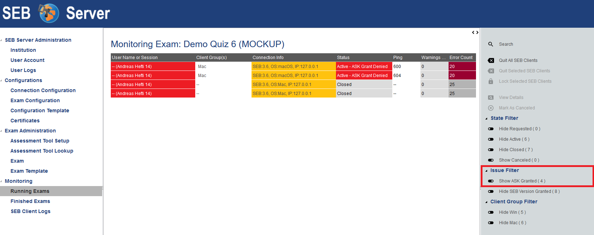
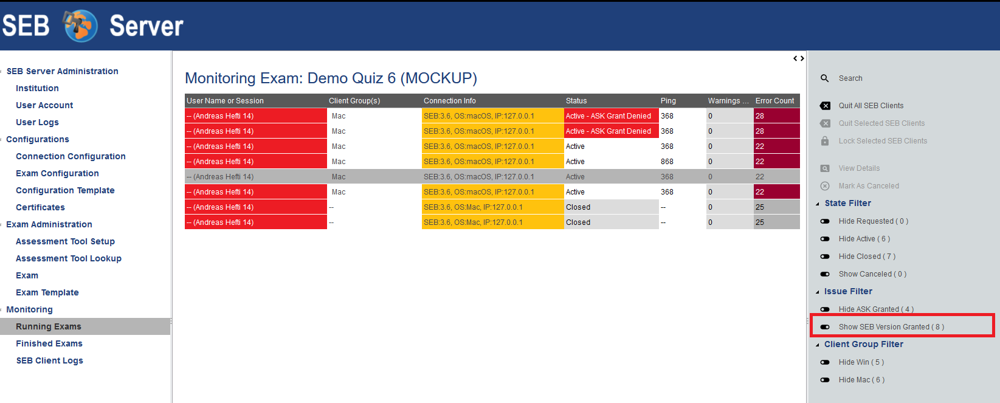
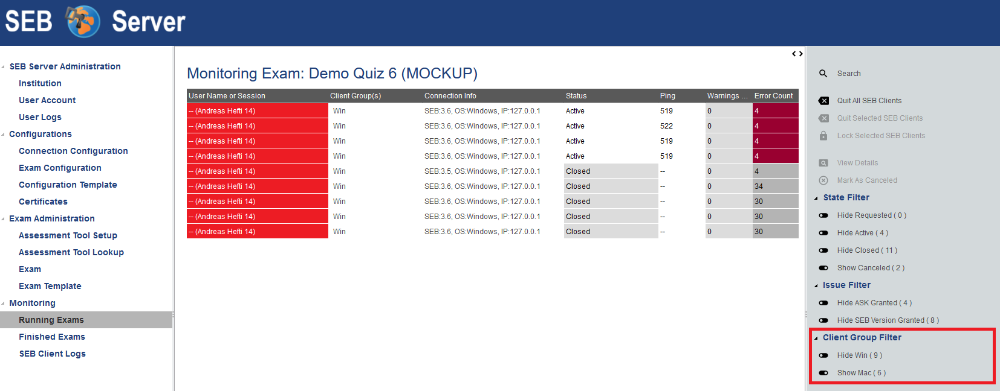
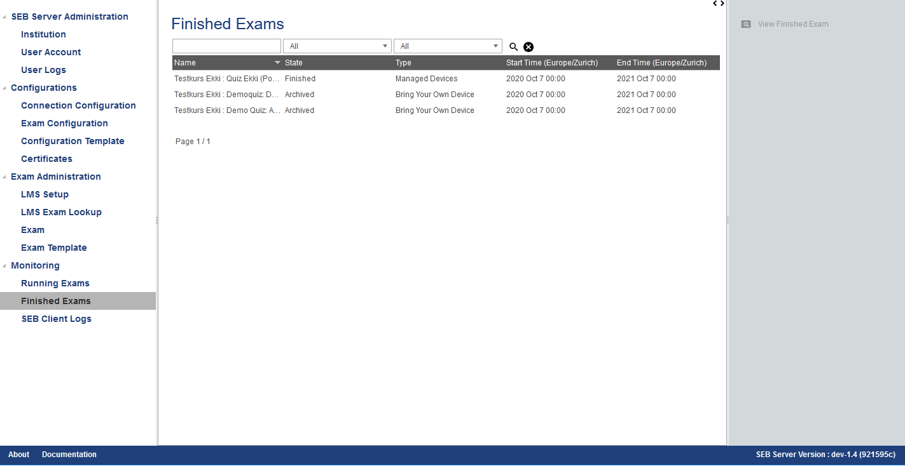
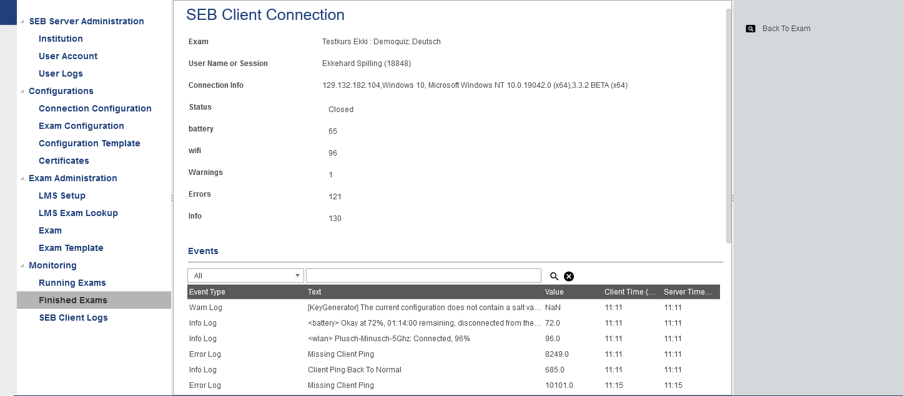

Exam Monitoring
===============

A key feature of the SEB Server is the ability to overview and monitor SEB clients that are connected to the SEB Server and participate in a running exam.
It is also possible to interact with individual SEB clients that are connected and send them instructions, e.g.: to quit and reload for example.
But the main focus lies on monitoring and the SEB Server does not take automated actions but always only shows incidents as they are defined by
indicators to an exam supporter. An exam supporter then can take action.

As an exam supporter you see all running exams where you have been assigned to by an exam administrator in a list. 

.. image:: images/monitoring/runningExams.png
    :align: center
    :target: https://raw.githubusercontent.com/SafeExamBrowser/seb-server/dev-2.1/docs/images/monitoring/runningExams.png
    
To navigate to this list, click on the "Running Exams" menu within the "Monitoring" category. And you will see the list with the name of the
exam, the type and start- and end-time of the exam. If the exam you are looking for is not on the list, please check the start-time filter 
and make sure that it is set before the start-time of the exam. If not, use the filter to set the date before the exams start-date and
use the lens-symbol on the right to apply the new filter. If the exam you are looking for is still not on the list, please contact an 
exam administrator of your institution to get help and check if you are correctly assigned to the exam as an exam supporter.

To monitor an exam either double-click on the list entry of the exam or select the list entry and use the "Monitoring" action form the
right action pane to navigate into the main page of exam monitoring.

On the main page of exam monitoring, you find a heat-map list of all SEB client connections that are connected to the exam since the
exam is running. There are state filter switches on the right action pane that allows to show/hide SEB client connection of specified states.
As default you should see at least all active connections instantly.

.. image:: images/monitoring/examMonitoring.png
    :align: center
    :target: https://raw.githubusercontent.com/SafeExamBrowser/seb-server/dev-2.1/docs/images/monitoring/examMonitoring.png
    
The list is automatically sorted in the way that SEB connections with incidents came to the top of the list and are then sorted by the 
"User Name or Session" identifier criteria. The general SEB client connection attributes are:

- **User Name or Session** This shows the the available user identification as soon as it is available in the following order:
    - The IP Address of the device of the SEB client as long as the SEB has sent any user authentication yet.
    - The machine name of the client device as soon as the SEB has sent it to SEB Server.
    - The user login on the client machine as soon as the SEB has sent it to SEB Server.
    - The user login on the LMS/Assessment Tool as soon as the SEB has sent it to SEB Server and SEB Server was able to resolve the login name via LMS/Assessment Tool
- **Connection Info** The IP address of the device the connected SEB client is running plus some additional information about the operating system and the SEB version.
- **Status** The status of the SEB client connection.

The following SEB connection states are defined:

- **Connection Requested** This state appears from when a SEB client contacted to SEB Server the first time until the SEB client has finished up the hand-shake protocol with the SEB Server and the student has logged into the LMS/Assessment Tool.
- **Active** This state appears after successful hand-shake and login into LMS/Assessment Tool and stays as long as the SEB connection is available and not closed or terminated
- **Missing** This state appears when a SEB connection is currently in active state but has missing ping (last ping last longer than the highest ping threshold of the ping indicator).
- **Closed** This state marks a closed SEB connection that was once active.
- **Canceled** This state marks a SEB connection that has been canceled.

This general connection attributes are followed by the indicator attributes of all indicators defined by the exam. The column name of an indicator is
the name of the indicator defined in the exam. The cell shows the measured value of the indicator for each SEB client connection and
the cell is tinted in the color of the reached threshold also defined for each indicator on the exam administration.

**Search**

Since the monitoring heat-map list is automatically sorted and cannot be filtered except on connection status, there is a search feature to find a
particular connection or a set of connections. To search connection on a running exam, please use the "Search" action from the right action pane.
A search pop-pup will appear with all connection is a usual list with the possibility to filter and sort the entries.
Double-click on an entry to go to the detail view of the specified SEB client connection.

.. image:: images/monitoring/search.png
    :align: center
    :target: https://raw.githubusercontent.com/SafeExamBrowser/seb-server/dev-2.1/docs/images/monitoring/search.png
    

**Instructions**

Instructions are actions applied to one or more SEB client connections that also can apply a signal to an active SEB Client connection to
instruct the SEB client to do a particular action on client side. In the monitoring view you can select one or more list entries
with usual list (multi)selection by holding Ctrl or Shift key plus right mouse click(s). Currently there are two instructions.

- **Quit SEB Client** Sends a quit instruction to the SEB Client to quit the session. This can be applied to all active SEB client connection with the "Quit all SEB Clients" action from the right action pane or to all selected SEB client connections with the "Quit Selected SEB Clients" action. 
- **Mark As Canceled** Can be applied to all inactive SEB client connections to enforce the inactive SEB client connection to "Canceled" state. This can be used to mark and remove inactive SEB client connection you don't want to have on the main monitoring board anymore when the filter for canceled SEB client connections is set to hide.

**Filter**

There are connection state filter to hide/show SEB client connection in particular states. These are located in the right action pane hand has the name of the
filter action that will be performed on click (hide/show) and the name of the affected connection status. With this actions, you are able to toggle between
hide and show SEB client connection of a particular state.

- **Show/Hide Requested** Use this to show or hide all SEB client connections that are currently in the "Requested" state and are not responding anymore.
- **Show/Hide Active** Use this to hide SEB client connections in active state that has no incident and are not missing. If this filter is enabled and an active SEB connection gets an incident or is marked as missing it 
suddenly appears in the list. So, no incidences are accidentally hidden. This feature is best used for exams with a lot of participants to keep a good overview.
- **Show/Hide Closed** Use this to show or hide all SEB client connections that are currently in the "Closed" state.
- **Show/Hide Canceled** Use this to show or hide all SEB client connections that are currently in the "Canceled" state.

Since SEB Server version 1.3 each filter also shows the current number of connections in the particular state. Now one has an overview of how many connections 
are there for an exam and in which state.

.. note::
    When a certain state filter is set to hide, and a particular SEB client connection switches into that state, it will automatically disappear from the list.

**New Issue and Group Filter**

A new SEB client group filter was added in SEB Server Version 1.6 to filter out certain configured SEB client groups. And since SEB Server Version 1.6
there is a new Issue filter for ASK (Application Security Key) checks as well as vor SEB client Version checks if they are enabled for an exam.

- For more information about SEB client groups, go to: :ref:`examClientgroups-label`
- For more information about ASK (Application Security Key), go to: :ref:`examASK-label`
- for more information about SEB client version restriction, please have a look into the :ref:`exam-configuration-label` SEB Settings

With the new Issue Filter it is possible to quickly filter out all SEB connections that do not have a certain issue. Or the other way
around, if you quickly want to show only the SEB client connections with a certain issue, you can use this filter.

- **ASK Issue Filter** This issue filter can be used to show only the SEB clients that has an ASK grant deny.
This is also possible for already closed SEB connections where you don's see the state of ASK grant within the status column anymore.
The image below shows active and inactive filter for active SEB connection as well as for inactive SEB connections.

- **SEB Client Group Filter** This issue filter filter all SEB client connection that are attached to a certain SEB client group.

Detailed View
-------------

To view more details of a particular SEB client connection either select the SEB client connection entry from the list and use the "View Details" action
from the right action pane or just double-click the SEB client connection entry from the list. In the details view you also see all the attributes
in a form and additional a list of all events and logs the SEB client has sent to the SEB Server for this session so far. 

.. image:: images/monitoring/clientMonitoring.png
    :align: center
    :target: https://raw.githubusercontent.com/SafeExamBrowser/seb-server/dev-2.1/docs/images/monitoring/clientMonitoring.png

The table shows the event type that for all log-events is the log-level, The text and a value that has been sent with the event. The Value may be empty
and marked as "Not a Number" (NaN). In this table we also have the client- and the server-time of the event. The client-time is the time the SEB client
sends along with the event to the SEB Server and the server time is the time the SEB Server got the event. With this it is also possible to see or 
overview temporary network latency or other irregularities, when those two time values differ much.

In the detail view you are also able to use the instructions "Quit SEB Client" and "Mark as Canceled" for the selected SEB client connection.

Screen Proctoring
-----------------

With SEB Server version 2.0 there is not Live Proctoring support for Zoom and Jitsi Meet anymore but a while new and
fully integrated Screen Proctoring feature where SEB Clients take screen shots and send it to SEB Server for proctoring

Please visit the :ref:`screenprocotring-label`  section for more information about Screen Proctoring with SEB Server.

Finished Exams
--------------

Since SEB Server version 1.4 there is a new section "Finished Exams" within the monitoring section to view finished and archived exams
like you do within the monitoring. You see all the SEB connections that has been connected to the exam when running and are able to view
particular SEB client connection's details by either double-click on a SEB client connection entry in the list or by selection and using the View action
on the right action pane.

In the "Finished Exams" list you can see all finished or archived exams and filter the list by Name, State and Type.

    
To see a particular finished or archived exam you can just double-click in the list entry or use the View action on the right action pane.
In the exam view you see all SEB connections that has been connected to the exam during the exam run just like in the usual monitoring view
but with no update since the SEB connections are not active and the data is not changing anymore. You are able to filter the list by
User or Session Info, Connection Info or Status and are also able to sort the list even for indicator columns. 

.. image:: images/monitoring/finishedExam.png
    :align: center
    :target: https://raw.githubusercontent.com/SafeExamBrowser/seb-server/dev-2.1/docs/images/monitoring/finishedExam.png
    
As in the usual monitoring view, you can show SEB client connection details by double-clicking on a list entry or by selecting a list entry
and use the View action on the right action pane.
In the detail view you see the same information for a particular SEB client connection as within the usual monitoring view. You can view
the SEB client logs of a SEB client connection here and analyze it after the exam was running.

All SEB Client Logs
-------------------

As an exam administrator as well as an exam supporter, you are able to search SEB client events for all exams that have been run on the SEB Server and that
you have access to within your user-account privilege settings. As an exam supporter you will only see the SEB client logs of the exams you are assigned to.
To search all SEB client log events, go the "Monitoring" section and click on the "SEB Client Logs" menu on the left menu pane. The SEB Server will show
you a list of all SEB client logs ever happened and you have access to. You can filter and sort the list as usual by using the filter above to find all logs
of an exam for example.

.. image:: images/monitoring/sebClientLogs.png
    :align: center
    :target: https://raw.githubusercontent.com/SafeExamBrowser/seb-server/dev-2.1/docs/images/monitoring/sebClientLogs.png

To show a detailed view of a specific SEB client log, just double click on the list entry or select the specific list entry and use the "Show Details"
action form the right action pane to open up a pop-up containing all related information about the SEB client log event.

.. image:: images/monitoring/sebClientLogDetail.png
    :align: center
    :target: https://raw.githubusercontent.com/SafeExamBrowser/seb-server/dev-2.1/docs/images/monitoring/sebClientLogDetail.png

Currently there is no export functionality to export all interesting SEB client logs to a CSV table for example. But such a feature will probably come
with a next version of SEB Server.

**Export filtered client logs**

To export all currently filtered client logs in CSV format, please use the "Export CSV" action form the right action pane. SEB Server will then convert and download
all client logs for you. This might take some time if there are a lot of logs to export.

.. note:: 
    Please avoid exporting of huge log files while one or more performance intensive exam are running to not stress the service unnecessarily.

**Delete filtered client logs**

To delete all currently filtered client logs, please use the "Delete Logs" action form the right action pane. 

.. note:: 
    On deletion, all available logs will permanently be deleted from the persistent storage. So please make sure you want to delete all
    logs that are currently displayed in the list before deleting.
    
    
