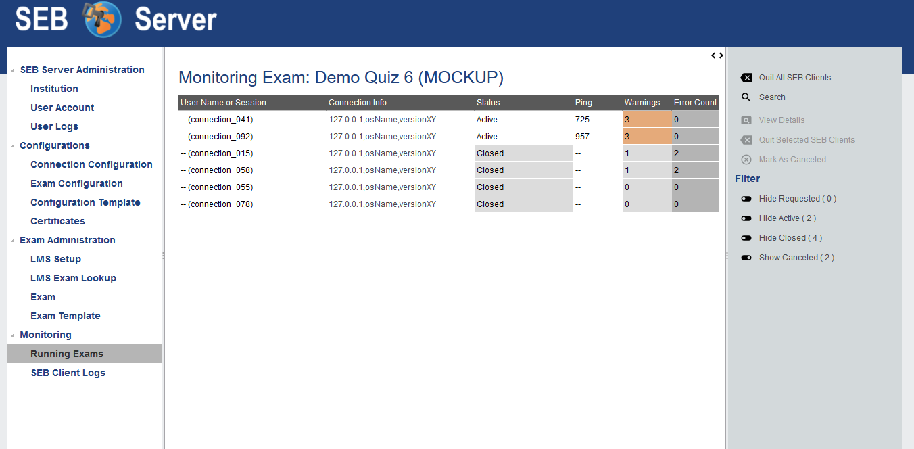
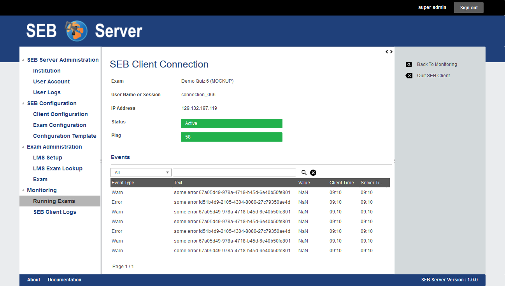
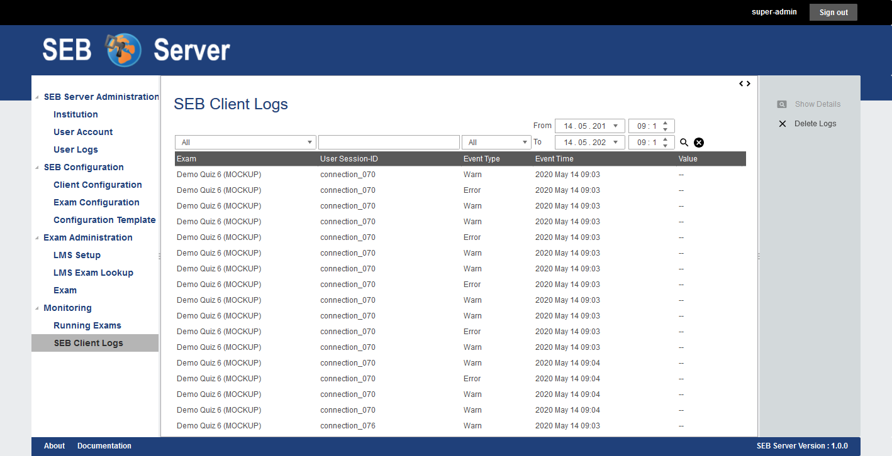

Exam Monitoring
===============

A key feature of the SEB Server is the ability to overview and monitor SEB clients that are connected to the SEB Server and participate in a running exam.
It is also possible to interact with individual SEB clients that are connected and send them instructions, e.g.: to quit and reload for example.
But the main focus lies on monitoring and the SEB Server don't take automated actions but always only shows incidents as they are defined by
indicators to a exam supporter. A exam supporter then can take action.

As an exam supporter you see all running exams where you have been assigned to by an exam administrator in a list. 

.. image:: images/monitoring/runningExams.png
    :align: center
    :target: https://raw.githubusercontent.com/SafeExamBrowser/seb-server/master/docs/images/monitoring/runningExams.png
    
To navigate to this list click on the "Running Exams" menu within the "Monitoring" category. And you will see the list with the name of the
exam, the type and start- and end-time of the exam. If the exam you looking for is not on the list, please check the start-time filter 
and make sure that it is set before the start-time of the exam. If not, use the filter to set the date before the exams start-date and
use the lens-symbol on the right to apply the new filter. If the exam you are looking for is still not on the list, please contact a 
exam administrator of your institution to get help and check if you are correctly assigned to the exam as an exam supporter.

To monitor an exam either double-click on the list entry of the exam or select the list entry and use the "Monitoring" action form the
right action pane to navigate into the main page of exam monitoring.

On the the main page of exam monitoring you find a list of all SEB client connections that has been connected to the exam since the
exam is running. There are some filter switches on the right action pane that may hide some canceled and/or closed SEB connections but
you should see at least all active connections instantly.

    
The list is automatically sorted in the way that SEB connections with incidents came to the top of the list and are then sorted by the 
"User Name or Session" identifier criteria. The general SEB client connection attributes are:

- **User Name or Session** The user account or user session identifier sent by the LMS to the SEB client and from SEB client to the SEB Server. This identifier may vary depending on the LMS that is involved. For Open edX it is the user account identifier (username). 
- **IP Address** The IP address of the device the connected SEB client is running.
- **Status** The status of the SEB client connection. 

This general attributes are followed by the indicator attributes of all indicator defined by the exam. The column name of an indicator is
the name of the indicator defines in the exam and the cell shows the measured value of the indicator for each SEB client connection and
the cell is tinted in the color of the reached threshold also defined for each indicator on the exam.

**Instructions**

Instructions are actions applied to one or more SEB client connections that also can apply a signal to a active SEB Client connection to
instruct the SEB client to do a particular action on client side. In the monitoring view you can select one ore more list entries
with usual list (multi)selection by holding Ctrl or Shift key plus right mouse click(s). Currently there are two instructions.

- **Quit SEB Client** Sends a quit instruction to the SEB Client to quit the session. This can be applied to all active SEB client connection with the "Quit all SEB Clients" action from the right action pane or to all selected SEB client connections with the "Quit Selected SEB Clients" action. 
- **Mark As Canceled** Can be applied to all inactive SEB client connections to enforce the inactive SEB client connection to "Canceled" state. This can be used to mark and remove inactive SEB client connection you don't want to have on the main monitoring board anymore when the filter for canceled SEB client connections is set to hide.

**Filter**

There are some filter to hide/show SEB client connection of in particular states. These are located in the right action pane has the name of the
filter action that will be performed on click and the name of the effected connection status. With this actions you are able to toggle between
hide and show SEB client connection of a particular state.

- **Show/Hide Closed** Use this to show or hide all SEB client connections that are currently in the "Closed" state.
- **Show/Hide Requested** Use this to show or hide all SEB client connections that are currently in the "Requested" state and are not responding anymore.
- **Show/Hide Canceled** Use this to show or hide all SEB client connections that are currently in the "Canceled" state.

.. note::
    When a certain state filter is set to hide and a particular SEB client connection switches into that state, it will automatically be hiding from the list.

Detailed View
-------------

To view more details of a particular SEB client connection either select the SEB client connection entry from the list and use the "View Details" action
from the right action pane or just double-click the SEB client connection entry from the list. In the details view you also see all the attributes
in a form and additional a list of all events and logs the SEB client has sent to the SEB Server for this session so far. 

The table shows the event type that for all log-events is the log-level, The text and a value that has been sent with the event. The Value may be empty
and marked as "Not a Number" (NaN). In this table we also have the client- and the server-time of the event. The client-time is the time the SEB client
sends along with the event to the SEB Server and the server time is the time the SEB Server got the event. With this it is also possible to see or 
overview temporary network latency or other irregularities, when this two time values differs much.

In the detail view you are also able to use the instructions "Quit SEB Client" and "Mark as Canceled" for the selected SEB client connection.

All SEB Client Logs
-------------------

As an exam administrator as well as an exam supporter, you are able to search SEB client events for all exams that have been run on the SEB Server and that
you have access to within your user-account privilege settings. As an exam supporter you will only see the SEB client logs of the exams you are assigned to.
To search all SEB client log events, go the the "Monitoring" section and click on the "SEB Client Logs" menu on the left menu pane. The SEB Server will show
you a list of all SEB client logs ever happen and you have access to. You can filter and sort the list as usual by using the filter above to find all logs
of an exam for example.

To show a detailed view of a specific SEB client log, just double click on the list entry or select the specific list entry and use the "Show Details"
action form the right action pane to open up a pop-up containing all related information about the SEB client log event.

.. image:: images/monitoring/sebClientLogDetail.png
    :align: center
    :target: https://raw.githubusercontent.com/SafeExamBrowser/seb-server/master/docs/images/monitoring/sebClientLogDetail.png

Currently there is no export functionality to export all interessting SEB client logs to a CSV table for example. But such a feature will probably come
with a next version of SEB Server.
 