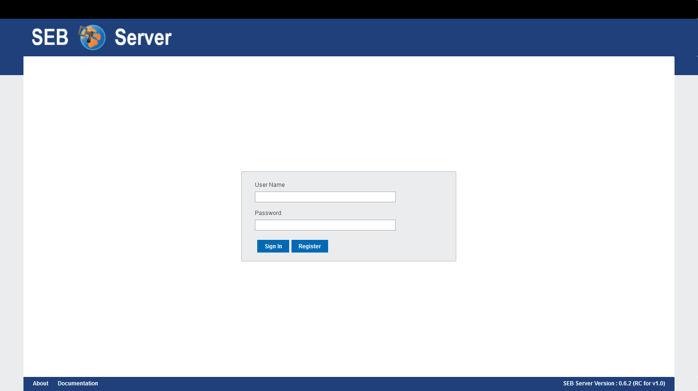
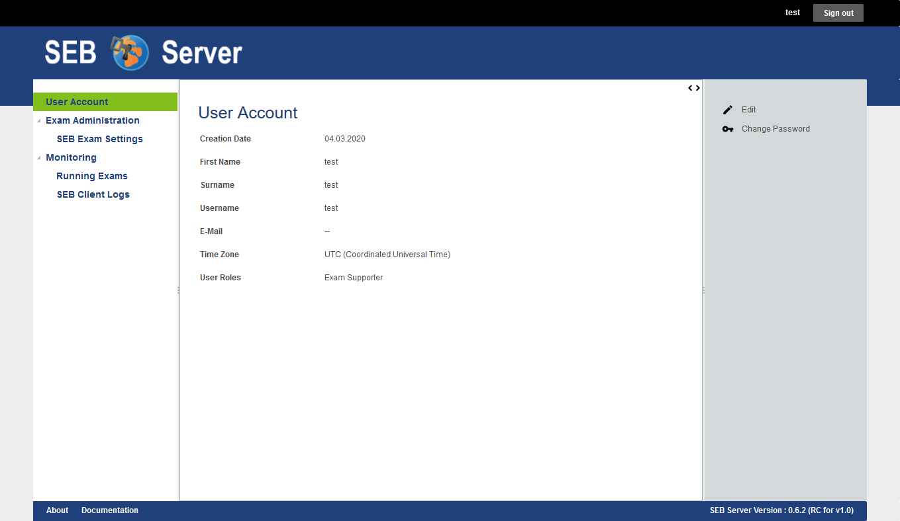
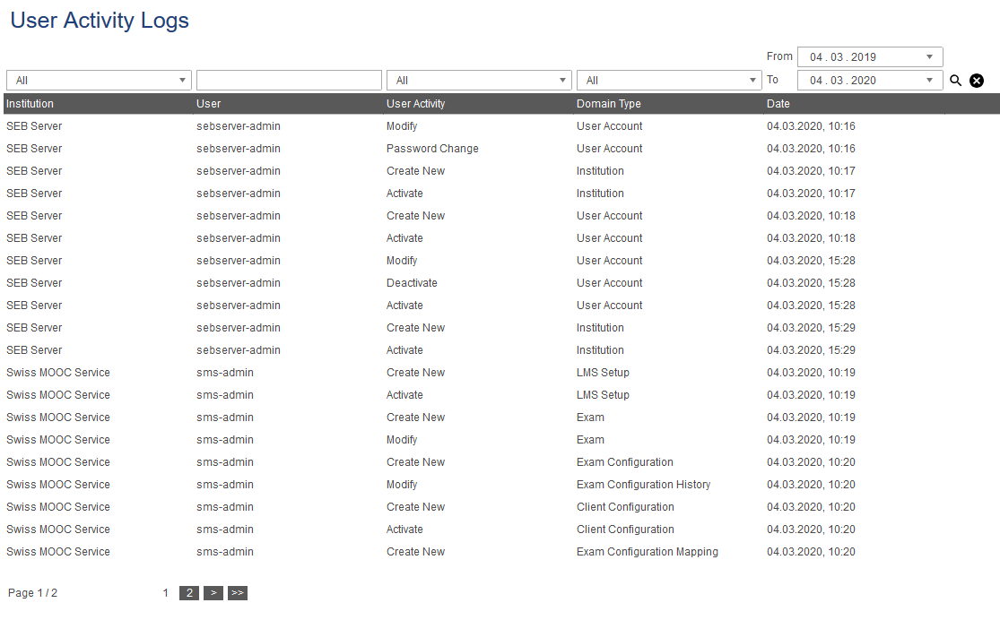
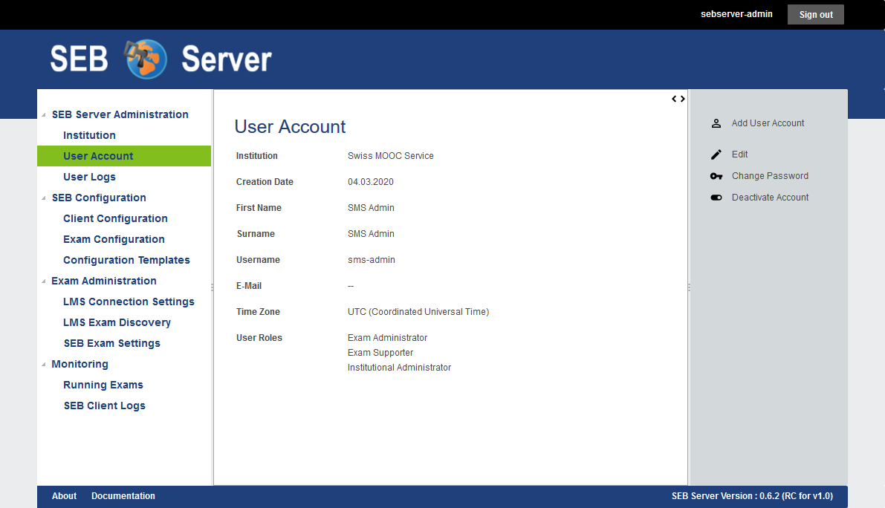
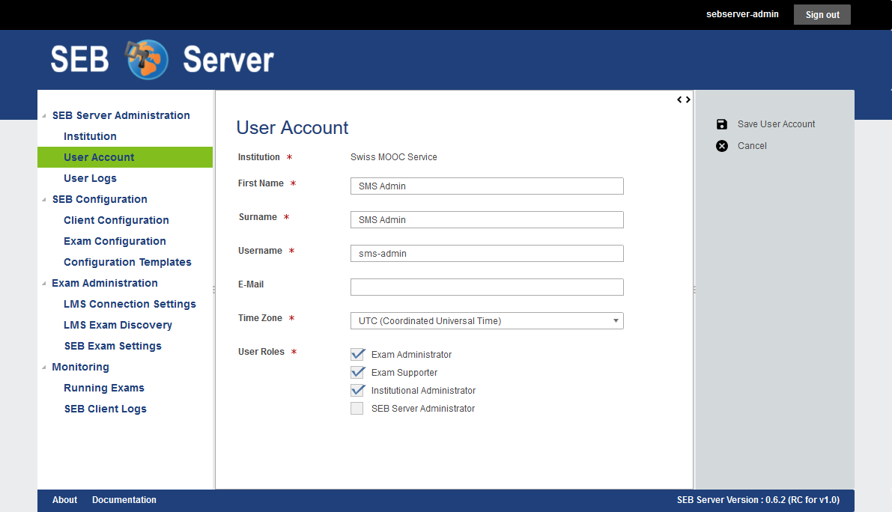

Overview
========

Safe Exam Browser Server (SEB Server) is a web-service application with the objective to help set up and maintain e-assessments with 
`Safe Exam Browser <https://safeexambrowser.org/>`_ (SEB) in a centralized and more efficient manner. The SEB Server application can be used 
by an institution or organization as a self-maintained, lightweight server application to organize and set up their e-assessments. 
For an organization or institution that wants to provide safe e-assessments with `Safe Exam Browser <https://safeexambrowser.org/>`_, 
SEB Server can help to organize these e-assessments more effectively, safely, and in one place.
Furthermore, SEB Server can be set up and run within a cloud infrastructure by a general service provider to offer e-assessments with
SEB and SEB Server as a service.

SEB Server comes with a built-in multi-tenancy functionality that allows to create and maintain institutions that are separated 
from each other. This is most convenient for smaller groups of organizations or institutions that want to have one self-maintained 
SEB Server instance but need internal separation of institutions.

Since SEB Server is generally an administration tool, meaning used to do administration work and tasks to set up and maintain e-assessments, 
there is yet just a built-in and lightweight user-account management where users can register themselves and get needed privileges assigned by already registered 
administrator users that has the privileges to maintain user accounts. Currently, there is no possibility to register with a third-party account and/or single sign-on.

SEB Server is written mainly in Java and uses Docker for installation and setup. For more information about the architecture and installation, 
please go to `SEB Server Installation Guide <https://seb-server-setup.readthedocs.io/en/latest/overview.html>`_

The key features of SEB Server are: 

- Built-in multi-tenancy capabilities. Create and manage institutions as separated clients.
- Lightweight user-account management where users can register themselves and get needed privileges assigned by already registered administrator users that has the privileges to maintain user accounts.
- Track user activities within user-activity logs for the whole SEB Server or a client.
- Create, export, and maintain SEB connection configurations. Those are needed to startup a Safe Exam Browser client with and contain all information to connect securely to the SEB Server.
- Create and maintain SEB exam configurations. Those are sent to a SEB client on connection setup and contain all SEB settings for a particular e-assessment.
- Setup and maintain Learning Management Systems (LMS) like Open edX or Moodle to be able to navigate and find courses or quizzes on the LMS and to push access restrictions to the LMS if supported by the LMS
- Import and maintain courses or quizzes from an LMS. Setup everything that is needed for an e-assessment that is based on a course or quiz from the LMS
- Apply indicators to the exams to indicate incidences while monitoring running e-assessments.
- Monitor running e-assessment and have an overview of all connected SEB clients. Manage SEB client connections and view logs sent by individual SEB clients.

.. _roles_and_usecases:

Roles and Use-Cases
-----------------------

The SEB Server supports a simple role-based privilege system where a role has read, modify and write privileges on certain domain entities. 
The privileges for a role are pre-defined and cannot be changed by a user. But roles can be combined for a user account. A user account for
example can have the "Exam Administrator" and the "Exam Supporter" roles active to be able to set up and support an exam (e-assessment) within 
one user account.

Privileges for domain objects are categorized in read, modify, and write rights. Write right includes creation and deletion grants, 
as well as activation grants, in addition to the more restricted modify right that only allows modifying already created entities. 
They are also categorized into overall, institutional, and owner privileges where overall means for all entities, over all available institutions 
and institutional means only the entities that belong to the own institution whereas owner-privilege means the creator or assigned owner of an entity.

There currently exist four different roles. This reflects a good separation of concern within the SEB Server application administration itself and the setup and 
maintenance work that has to be done for e-assessments with SEB. Below are the names and a short description of each role.

**SEB Server Administrator**

This role is primarily to administer the SEB Server application, to create new and maintain available institutions and user accounts. 
In addition to that, a SEB Server administrator also has overall read privileges for most domains to be able to analyze problems and help others to solve them.

A typical use-case for a SEB Server administrator would be to create a new institution and an institutional administrator for this institution.
Another use-case would be to maintain registered user accounts and to give more privileges. Or to entirely deactivate an existing user account.

**Institutional Administrator**

An institutional administrator has overall read access for its institution and can modify the institution properties as well as 
create new or maintain existing user accounts for the belonging institution. Furthermore, an institutional administrator can create and maintain 
learning management system (LMS) setups and SEB connection configurations for the belonging institution.

A typical use-case for an institutional administrator would be to give the appropriate roles and privileges to newly registered users of the institution.
Or another use-case would be to create and maintain SEB connection configurations for the institutions and set up and maintain learning management systems 
within the SEB Server and the belonging institution.

**Exam Administrator**

With this role, a user can prepare an exam for an e-assessment with SEB. An exam administrator can view all courses from all
learning management systems that are set up for the belonging institution and find a particular course to import this course as an exam
within SEB Server. This role is also able to create and maintain SEB exam configurations that can then be assigned to an imported exam.
After setting importing an exam, the role can set up all aspects of an exam like automated restrictions, allowed supporters and 
monitoring indicators, to name a few, and prepare the exam for an e-assessment.

A typical use-case for an exam administrator would be to create a SEB exam configuration within the templating and configuration section. 
Then to find a particular course or quiz from the learning management systems that is defined within the institution. This course or quiz 
can then be imported by the administrator as an exam. After import an exam administrator can prepare this exam for run and monitoring by attaching 
an exam configuration to it, preparing indicators to monitor incidences, and specifying the SEB access-restriction conditions for the course or quiz.

**Exam Supporter**

This role is to support a running exam within SEB Server. An exam supporter can see the running exams on that he/she has 
an assignment and can open them either for monitoring or editing some exam attributes during the exam.

A typical use-case for an exam supporter when an exam is running would be to overview the connecting SEB clients and manage them. 
While SEB Server shows incidences or irregularities, an exam supporter can act on them and take the appropriate actions if needed.

Sign Up / Sign In
-----------------

What one will see first when applying to a SEB Server application is the login-screen

If you are already registered you can use your username and password to log in. Or use the "Register" button to go to the registration 
page to create a new user account. The newly created user account will only have the Exam Supporter role assigned. If you need another 
role or more privileges, this must be given and granted by an institutional administrator of the belonging institution.

.. image:: images/overview/register.png
    :align: center
    :target: https://raw.githubusercontent.com/SafeExamBrowser/seb-server/master/docs/images/overview/register.png

Fill in the registration form and create a new account. After the user account has been successfully created, the application redirects to the login page for login. 
On the current version, an e-mail confirmation is not a feature of the SEB Server application and therefore the e-mail address is currently just informative.

With the "Time Zone", you can choose a specific time zone for your user account. All dates and times will then be shown within this time zone.

.. _gui-label:

Graphical User Interface
------------------------

After successful login, you will see the main graphical user interface of the SEB Server application. On the left hand are the activities 
that can be done, categorized within a few main sections with their relating activities underneath. By selecting an activity, 
the main content section will show the activity content and the action that are possible for this activity on the right-hand side.

In the header above on the right hand, we see the username of the currently logged-in user and an action button to sign out and go back to the login page.

The main content usually consists of a list or a form.

**Lists**

A list shows all the objects of a particular activity on a table page. A list has paging functionality and the list has more objects than fitting all on one page, 
a page navigation is shown at the bottom of the list with the information of the current page and the number of pages along with the page navigation 
that can be used to navigate forward and backward thought the list pages.

Almost all lists can filter the content by certain column filters that are right above the corresponding columns. 
You can use the column filter input to filter the list and narrow down a specific collection of content. Accordingly to the value type of the column, 
there are different types of filters:

- Selection, to select one instance of a defined collection of values (drop-down).

- Text input, to write some text that a value must contain.

- Date selection, to select a from-date from a date-picker. A date selection can also have an additional time selection within a separate input field

- Date range selection, to select a from- and a to-date within different inputs and a date-picker. A date range selection can also have an additional time range selection within separate input fields

A list can be sorted within a column by clicking on the column header. The order of sorting can be changed by clicking again on the same 
column header of the sorted column. If sorting functionality is available for a column depends on the column type. There are a few columns 
that do not have a sort functionality yet.
Most columns have a short tooltip description that pops up while the mouse pointer stays over the column header for a moment. 
A column tooltip usually also explains how to use the column-related filter.

**Forms**

Forms are used for domain entity-specific data input or presentation like HTML Forms usually do. Forms appear in three 
different ways within the SEB Server GUI:

- When a domain entity is first created in edit mode
- When a domain entity is modified also in edit mode
- And when a domain entity is just shown, in read-only mode

The following images show the same form, once in read-only mode and once in edit mode

There usually is a tooltip on a form field element for almost all attributes that can be activated by either going over and staying on the form 
field label or the input section. 
If a form field is mandatory to either create or save an entity, this is marked with a little red arrow just to the right of the form field label. 
There may also be more field validation taking place on saving the object. If an input needs a special form that is not given by the current input, the form field 
will be marked with a red border around the input field and a thin red explanation text is shown right below the input field. 
After correcting the missing or wrong input and saving the form again, the SEB Server will accept and process the changes. 

.. note::
    If you navigate away from a form in edit mode, the GUI will inform you about possible data loss on this action and will prompt you to 
    proceed or abort the action.
