Screen Proctoring
===========

Overview
---------

SEB Screen Proctoring is an integral component of the SEB Ecosystem, designed to monitor student screens during digital examinations.
This tool captures and displays screenshots taken by SEB, ensuring a secure and controlled testing environment.

Enable Screen Proctoring after an exam is created in the exam view.

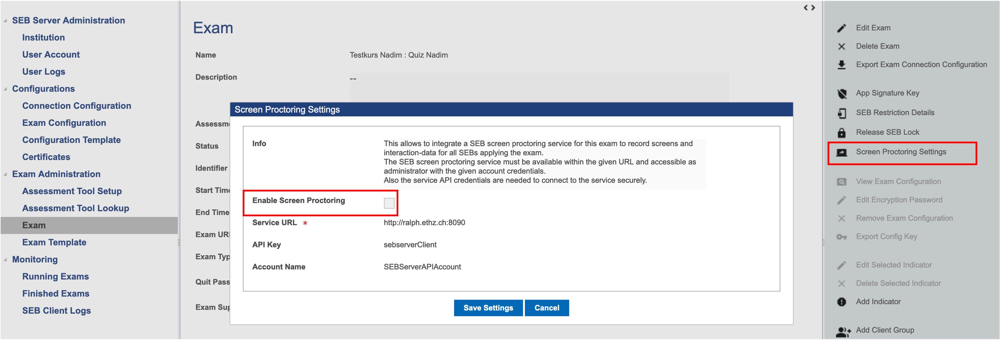

SEB Server needs to send an instruction to SEB to capture the screen and send the screenshot back to the server.
| To do this, enable screen proctoring in the SEB Settings.

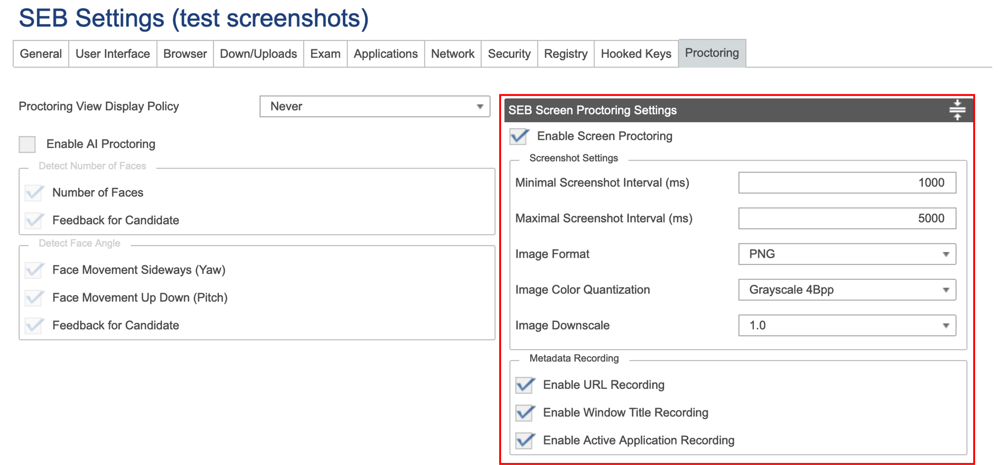

SEB-Server and SEB are now ready to capture and to display screenshots.
Navigate to exam monitoring and click the button in the Screen Proctoring section. A new tab will be opened.

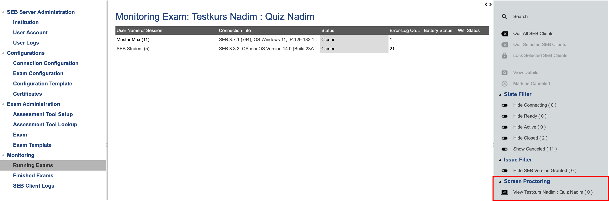

|
|

Gallery View
---------

- When a SEB is connected to SEB-Server and the user is logged into LMS, a tile with the latest screenshot will appear.
- Press the "Grid-Size" dropdown to change the displayable sessions per screen to 4, 9 or 16.

- Use the arrow buttons and the left and right on the screen to change windows. The current page and the number of live sessions / total sessions is display next to the grid selection.

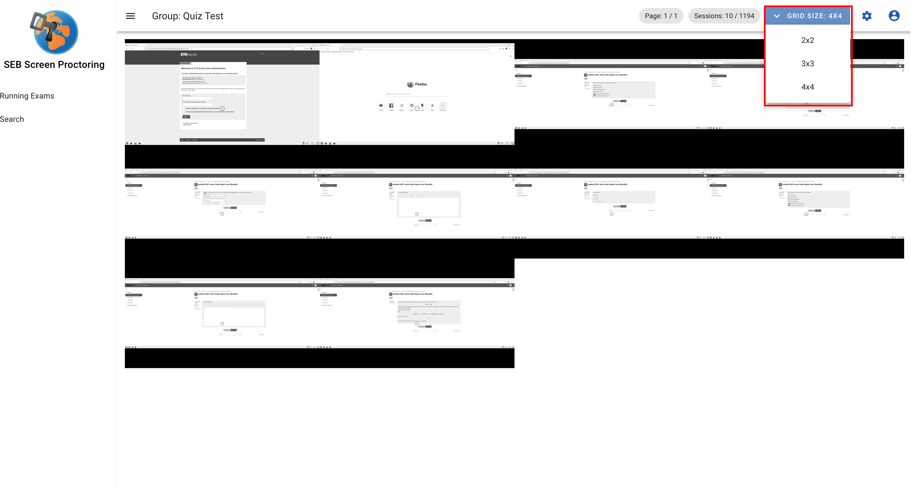

- Use your mouse to hover over a tile or press the tab key. A "selected" tile reveals information and actions for the session.
- To change view preferences press the settings icon in the top right corner.
- Toggling "Show Name" and "Show IP" reveals the the Name and IP of the selected session.
- By default, all the sessions are sorted by lastname in ascending order. To change this press the "Sort by Name" button.
- The camera icon opens the Proctoring View in a new tab. See chapter "Proctoring View" for more infos.
- Click on the "expand"-icon to enlarge the screenshot.

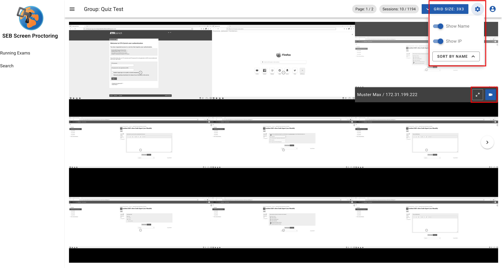

- The SEB-Client additionally sends metadata about the screenshot
- Metadata changes according to the content displayed on the screenshot
- Refer to the chapter "Metadata" for more details
- The camera icon opens the Proctoring View in a new tab. See chapter "Proctoring View" for more infos.
- Close the expanded view either by clicking on the collapse button or somewhere outside of the screenshot

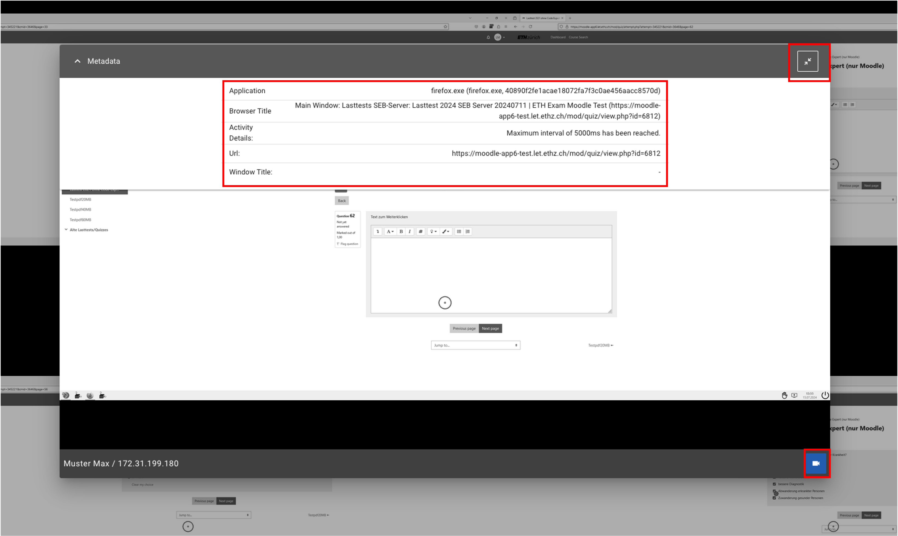

- A message box indicates that there are no live sessions available
- As soon as a sessions are connected the message box will disappear

|
|

Running Exams
---------

To get an overview of all running exams which your user has access to click on the "Running Exams" item in the navigation bar on the left side.

- By default, the exams are sorted by "Exam Start-Time" in ascending order
- Click on any table header to change the sorting according to your needs
- Click on the link the "Group" column to get to the gallery view of the group

.. image:: images/screen_proctoring/running_exam_no_selection.png
    :align: center
    :target: https://raw.githubusercontent.com/SafeExamBrowser/seb-server/docu/docs/images/screen_proctoring/running_exam_no_selection.png

By clicking on the settings icon in the menu bar two options are displayed.

- Select "Show past exams" to display all finished exams (red)
- Select "Show upcoming exams" to display all exams which are planned for the future (orange)

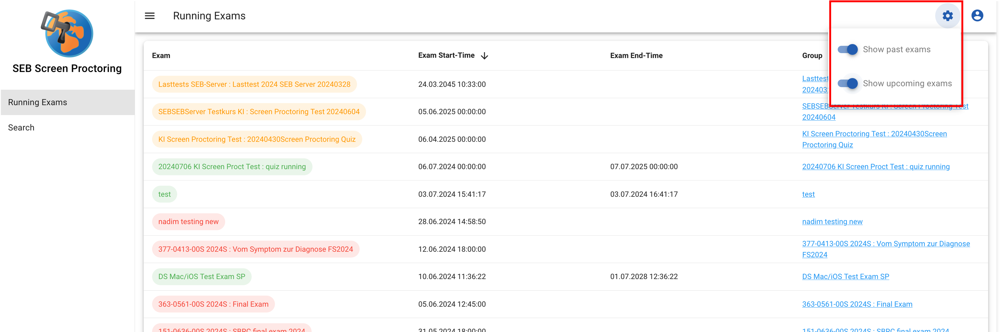

|
|

Proctoring View
---------

The proctoring view shows a recorded or live session in more detail.

To open a proctoring view of a sessions, either:

- Click on the camera icon in the gallery view
- Use the search feature
- Directly type in the url in the address bar: https://<your host>/recording/<sessionUuid>

A session can either be live or recorded.
- A live session is indicated by the "Live" button
- Navigating to the proctoring view during a live session always displays the latest screenshot and updates it accordingly
- Use the slider like any other video player
- This is also possible during a live session
- Click on the "Live" button to jump to the latest screenshot

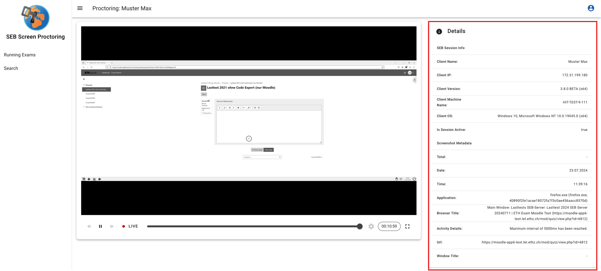

- The "Details"-Box on the right side displays information about the session and the current screenshot
- "SEB Session Info" is static
- "Screenshot Metadata" dynamically changes for every Screenshot
- Refer to the chapter "Metadata" for more details

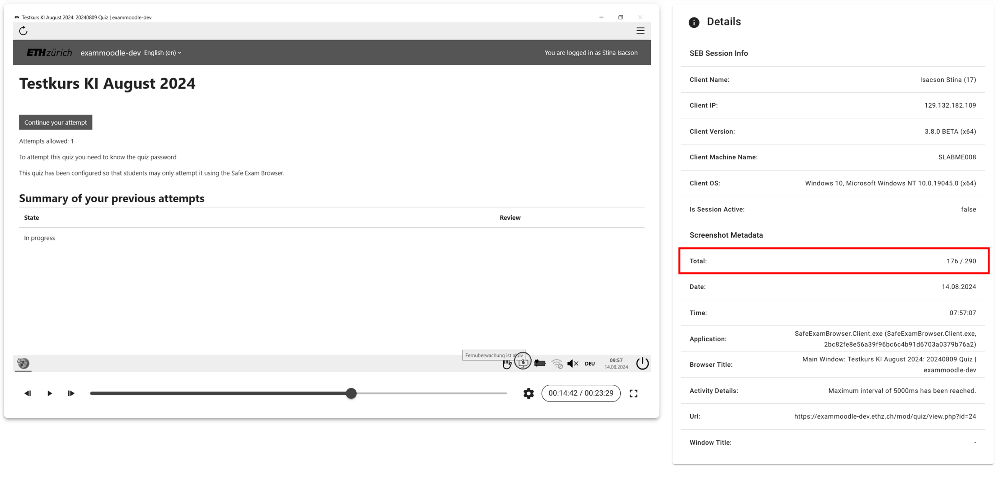

- The "Live" button disappears when the sessions disconnects from the server
- Set the playback speed with the "settings"-icon according to you preferences
- The current screenshot and the total amount of screenshot is display in the "Total"-Row

|
|

Search
---------

The search functionality is a powerful feature for finding sessions and screenshots.
Click on the "Search" item in the navigation bar on the left side.

**Form**

The upper part of the page is the search form.
There are four different categories of search criteria:

- Exam data
- Session / user data
- Screenshot metadata
- Time data

Use the form fields and the time / date selection to tailor the search result to your needs.

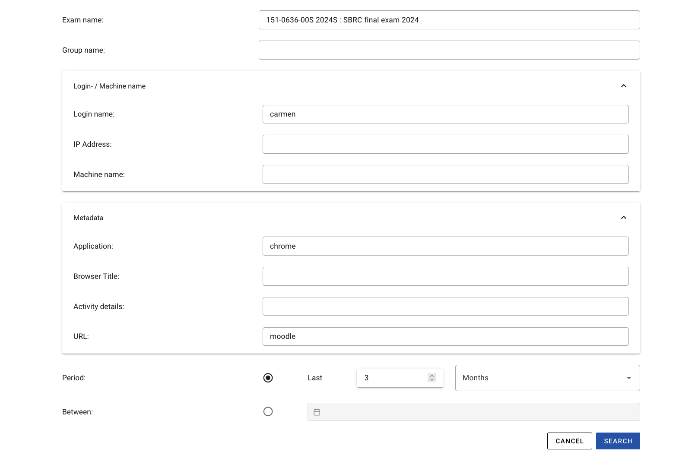

**Search Results**

The search results are grouped into days and sorted by date in descending order.
Use the "date" button on the right side to change the sort oder.

- Clicking on any date expands the panel and displays all sessions (a session is a student using SEB) with recordings on that day
- By default, the sessions are sorted by "Start-Time" in descending order
- Click on the table header to change the sorting according to your preferences
- A click on the down facing arrow on the right side lists all screenshots of the given student

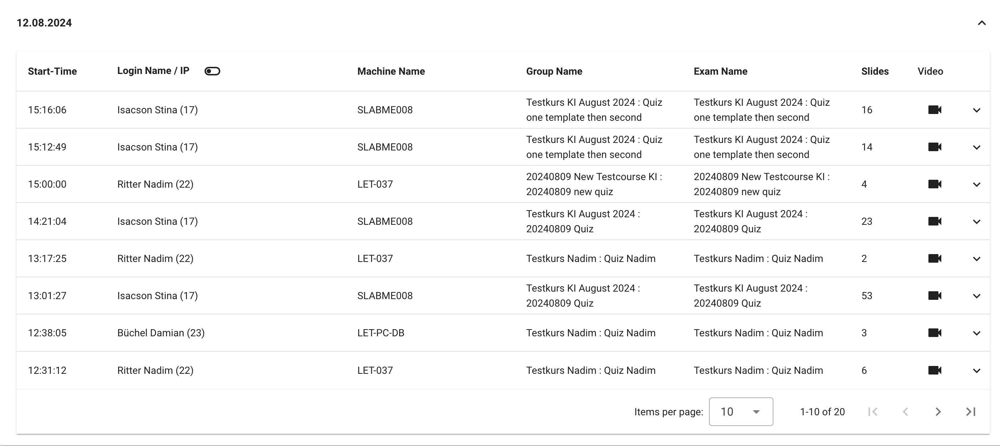

- By default, the screenshot are sorted by "Capture-Time" in ascending order
- The screenshots are grouped into the metadata "Application / Website"
- Grouping means that each successive screenshot that has the same "Application / Website" metadata is placed in the same group
- Click on the camera icon on the right side to open the proctoring view at this exact time

.. note::
      If the session is still live the proctoring view won't open at the given time but instead jumps to the latest image.

|
|

Metadata
---------

Metadata in context of the Screen Proctoring component are data which belong to a screenshot.
They describe the content of the captured screen.

Currently the SEB-Client captures the following 5 metadata (additional values might follow in future releases):

    - Focused Application: The name of the application that is currently in use and focused
        - e.g. "SafeExamBrowser.Client.exe", "calc.exe"

    - SEB-Browser-Title: The title of the SEB-Browser
        - e.g. "Exam Moodle 12", "Moodle Exam Mathematics 3"

    - Activity Details: The activity that triggered the screenshot
        - e.g. "A key has been pressed", "Left mouse button has been pressed"

    - SEB-Browser URL: The URL of the SEB-Browser
        - e.g. "http://google.com", "http://moodle.com/exam123"

    - Focused Window Title: The title of the focused window
        - e.g. "Google Homepage", "Moodle Exam 123", "Calculator"