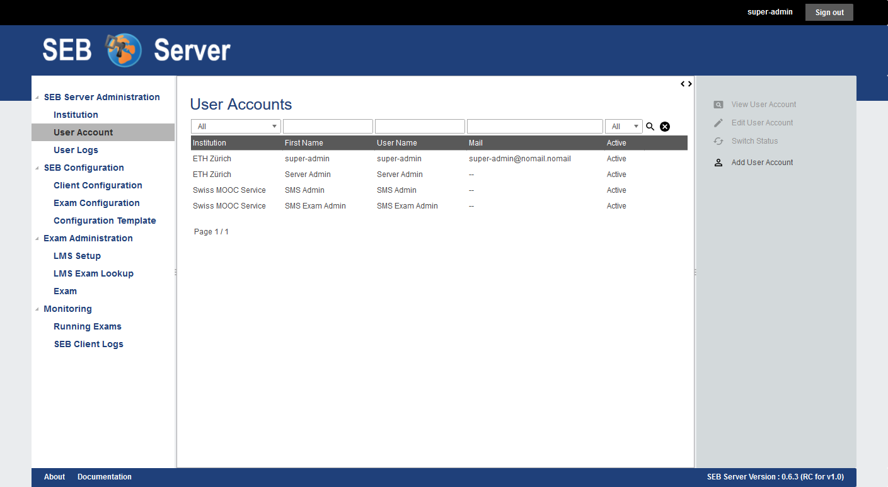

User Accounts
=============

The user-account section within SEB Server can be used to create new or modify user-accounts for other user or to modify the own
user account and changing the password. This section differs most for the different roles in SEB Server.

.. note:: 
      If a quick use-case based reference suites you better, just forward to the "Use Cases" section of this chapter below

A user account always belongs to one institution and has some basic attributes;

- Institution: A combo- or single-selection to choose the institution the user account belongs to. This is mandatory 
  and one user-account can only belong to one institution.
- First Name: The first name of the user
- Surname: The surname of the user
- Username: The username within SEB Server. This name is used to login.
- E-Mail: The E-Mail address for the user. This currently has only informational purpose and is neither used to confirm an account or to send automated mails.
- Time Zone: The time zone the user belongs to and to which the dates and times are converted to for display it to the user in the GUI. See also the note about time zone below.
- User Roles: A multi-selection input to define all roles a user account has. See also the note about roles below.
- Password: This password input field appears only while creating a new user-account or while self-register a user-account.
- Confirm Password: This password input field appears only while creating a new user-account or while self-register a user-account.

.. note:: 
      The date and time values within the SEB Server are always stored in universal time (UTC) and converted
      from and to the time zone a user account has defined. The time zone of the user account is usually labeled
      and the UTC time is shown below if possible.
      
.. note:: 
      The role selection is only displayed for user-accounts that has user-account modification privileges like
      SEB Server administrator and institutional administrator. Roles can be combined by selecting more then one role.
      For more information about roles and each role see the section :ref:`roles_and_usecases`

By selecting the "User Account" section on the left side menu, a SEB Server administrator will see a list of all user-accounts 
of all institution within a SEB Server instance. The filter above the list can be used to search a certain user account. Use the:

- "Institution" filter to select a certain institution and show only the user-accounts that belongs to this institution.
- "First Name" filter to search for user-accounts with the given occurrence of text in the First Name.
- "User Name" filter to search for user-accounts with the given occurrence of text in the Username.
- "Mail" filter to find an user-account by e-mail address
- "Status" filter to select the either and see either only active, only inactive or all user-accounts

    
To view all information of a user-account, double-click in a certain user-account entry from the list or select an entry from the list and
use the "View User Account" action on the right action pain. The user account form will be shown in read only mode with all account information.
To edit this user-account use the "Edit User Account" action on the right action pane. To change the password of the user

Use Cases
---------

**Register as a exam supporter**

Registering as a new user is possible only within the SEB Server form-registration yet. Since the SEB Server is mainly a service for administrative work, 
there is no third party registration and login in place so far. A self-registered user-account has the single role of an 
Exam Supporter and since this user-account is not applied to an exiting exam and running, the user is only able to see and edit its own account settings. 
Another user with Exam Administrator role can then assign the new user-account to an exam for support and monitoring. Or one other user-account with 
Institution Administrator role can edit the new user-account and give it more privileges.

To register a new user-account follow the steps below

- Use a Web-Browser and go to the SEB Server login page by entering the SEB Server URL.
- Click the "Register" action on the login page that is shown right after the "Sign In" action.
- The application will show the registration form. See the image below.
- Enter all mandatory account data within the form and use the "Register" action to confirm.
- If there is missing or wrong data, the registration form will highlight the concerned input fields with a red border and information text just below the field.
- If everything is accepted the user-account is created and the application forwards automatically to the login page.
- Sign in with the user credentials to check the account works correctly.

.. image:: images/overview/register.png
    :align: center
    :target: https://raw.githubusercontent.com/SafeExamBrowser/seb-server/master/docs/images/overview/register.png
    
Once signed in, the user can see all sections for a Exam Administrator as shown in the image below. Because the user is not assigned to any
Exam as a supporter yet, the "Exam Administration" and "Monitoring" sections are empty. The user is only able to change the account settings.

.. image:: images/account/registered.png
    :align: center
    :target: https://raw.githubusercontent.com/SafeExamBrowser/seb-server/master/docs/images/account/registered.png

**Create new user-account**

**Modify user-account**

**Change password**

**Activate / Deactivate user-account